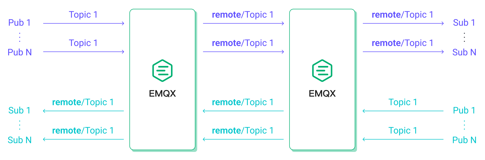

# Test Scenarios and Results for Reference

This page provides an in-depth analysis of the performance of the EMQX in various scenarios by following the steps in [Performance Testing with XMeter Cloud](./benchmark-xmeter) to conduct performance tests. We explore EMQX's capabilities under different conditions, including varying Quality of Service (QoS) levels, Payload sizes, publish-subscribe models, and the impact of MQTT message bridging. Through rigorous testing and measurement, we aim to offer insights into EMQX's behavior and help users optimize its deployment for IoT applications.

## Test Environment

All tests in this section are based on the open-source edition of **EMQX v5.1.6** deployed on a single node. EMQX and XMeter Cloud have created a peering connection to eliminate the interference of external network latency. The specifications of the server running EMQX are as follows.

- **CPU**: 4vCPUs (Intel Xeon Platinum 8378A CPU @ 3.00GHz)
- **Memory**: 8 GiB
- **System Disk**: General Purpose SSD | 40 GiB
- **Maximum Bandwidth**: 8 Gbit/s
- **Maximum Packets Per Second**: 800,000 PPS
- **OS**: CentOS 7.9

Except for the fan-in scenario where XMeter Cloud used 20 test clients to send and receive messages, the number of test clients in other scenarios was 10.

## Test Scenarios and Results

### Scenario 1: Performance of EMQX with Different QoS

The complexity of MQTT packet interactions increases with higher QoS levels, leading to greater system resource consumption during message delivery. Therefore, understanding the performance impact of various QoS levels is crucial.

In this scenario, we conducted one-to-one communication with 1,000 publishers and 1,000 subscribers, using 128-byte Payload messages. That is, there were a total of 1,000 topics, and each topic had one publisher and one subscriber.

We gradually increased the workload by increasing the message publishing rate, and EMQX ran for 5 minutes under each workload to ensure operational stability. We recorded the performance and resource consumption of EMQX under different QoS levels and different workloads, including but not limited to average message latency, P99 message latency, and average CPU usage.

The final test results are shown below:

> **Latency** is the time it takes for a message to be received from the time it is published. **Throughput** consists of message inbound throughput and outbound throughput.

These results reveal that higher QoS levels correspond to increased average CPU usage under equivalent workloads. Consequently, higher QoS levels generally result in relatively lower throughput with the same system resources.

ChatGPT

## Test Result Reference

As we follow the test procedures outlined in [Performance Testing with XMeter Cloud](https://chat.openai.com/c/benchmark-xmeter), we delve into the performance evolution of EMQX across various typical scenarios. These assessments provide a comprehensive view of EMQX's benchmark performance, revealing how factors such as QoS level and Payload size influence MQTT performance.

### Test Environment

The evaluations within this section are based on the open-source edition of **EMQX v5.1.6**, deployed on a single node. To eliminate external network latency interference, EMQX and XMeter Cloud have established a peering connection. The server specifications running EMQX are as follows:

- **CPU**: 4vCPUs (Intel Xeon Platinum 8378A CPU @ 3.00GHz)
- **Memory**: 8 GiB
- **System Disk**: General Purpose SSD | 40 GiB
- **Maximum Bandwidth**: 8 Gbit/s
- **Maximum Packets Per Second**: 800,000 PPS
- **OS**: CentOS 7.9

With the exception of the fan-in scenario, where XMeter Cloud utilized 20 test clients for message exchange, all other scenarios featured 10 test clients.

### Test Scenarios and Results

#### Scenario 1: EMQX Performance with Different QoS

The complexity of MQTT packet interactions increases with higher QoS levels, leading to greater system resource consumption during message delivery. Therefore, understanding the performance impact of various QoS levels is crucial.

In this scenario, we conducted one-to-one communication with 1,000 publishers and 1,000 subscribers, employing 128-byte Payload messages. That is, there were a total of 1,000 topics, and each topic had one publisher and one subscriber.

We progressively elevated the workload by increasing the message publishing rate and running EMQX for 5 minutes under each workload to ensure stability. Performance and resource consumption metrics were recorded for EMQX under different QoS levels and workloads, including average message latency, P99 message latency, and average CPU usage.

The final test results are outlined below:

 

> **Latency** denotes the time taken for a message to be received from the moment it is published. **Throughput** comprises inbound and outbound message throughput.

These results reveal that higher QoS levels correspond to increased average CPU usage under equivalent workloads. Consequently, higher QoS levels generally result in relatively lower throughput with the same system resources.

Assuming an average CPU usage of approximately 75% as the recommended daily load, we can conclude: under the provided hardware and testing scenarios, the recommended load for QoS 0 is approximately 57K TPS, for QoS 1 is approximately 40K TPS, and for QoS 2 is approximately 24K TPS. Here are the performance data for the test points that are closest to 75% CPU usage:

| **QoS Level** | **Recommended Workload, TPS (In + Out)** | **Average CPU Usage, % (1 - Idle)** | **Average Memory Usage, %** | **Average Letancy, ms** | **P99 Letancy, ms** |
| :------------ | :------------------------------ | :---------------------------------- | :-------------------------- | :---------------------- | :------------------ |
| QoS 0         | 60K                             | 78.13                               | 6.27                        | 2.079                   | 8.327               |
| QoS 1         | 40K                             | 75.56                               | 6.82                        | 2.356                   | 9.485               |
| QoS 2         | 20K                             | 69.06                               | 6.39                        | 2.025                   | 8.702               |

### Scenario 2: EMQX Performance with Different Payload Sizes

Larger message payloads necessitate more soft interruptions for OS to receive and send network packets, increasing computational resources required for packet serialization and deserialization. Although most MQTT messages are typically under 1KB, scenarios may demand the transmission of larger messages. Therefore, we examined the performance impact of varying Payload sizes.

Continuing with one-to-one communication between 1,000 publishers and 1,000 subscribers, we maintained a message QoS of 1 while fixing the publishing rate at 20K msg/s. We increased the Payload size to escalate the test workload, with EMQX running for 5 minutes under each load to verify stability. Performance and resource usage were recorded for EMQX under each load.

The results are shown below:

As the Payload increases, the CPU usage rate gradually rises, and the end-to-end latency of the messages also shows a relatively smooth increase. However, when the Payload size reaches 8KB, we can still obtain an average latency of less than 10 milliseconds and a P99 latency of less than 20 milliseconds.

| **Payload Size, KB** | **Recommended Workload, TPS (In + Out)** | **Average CPU Usage, % (1 - Idle)** | **Average Memory Usage, %** | **Average Letancy, ms** | **P99 Letancy, ms** |
| :------------------- | :---------------- | :---------------------------------- | :-------------------------- | :---------------------- | :------------------ |
| 1                    | 40K               | 75.9                                | 6.23                        | 3.282                   | 12.519              |
| 8                    | 40K               | 90.82                               | 9.38                        | 5.884                   | 17.435              |

Therefore, alongside the QoS level, Payload size is another critical consideration. If your specific use case involves much larger Payload sizes than those tested here, higher hardware configurations may be necessary.

### Scenario 3: EMQX Performance with Different Publish-Subscribe Models

MQTT's publish-subscribe mechanism allows for the flexibility to adjust the publish-subscribe model to meet specific business requirements. Scenarios include include fan-in, fan-out, and symmetric models.

- In the fan-in model, a large number of sensor devices act as publishers and a small number of back-end applications or even a single back-end application acts as a subscriber to store and analyze the sensor data.
- In the fan-out scenarios, there are a small number of publishers and a large number of subscribers for message broadcasting.
- In symmetric scenarios, publishers and subscribers need to communicate one-on-one.

The performance of the MQTT Broker in different publish-subscribe scenarios is often slightly different, as we will see in the following tests.

In the fan-in scenario, we set up 2,000 publishers and 100 subscribers. Every 100 publisher’s messages are consumed by 5 subscribers in a shared subscription.

In the fan-out scenario, 10 publishers and 2,000 subscribers were set up, with each publisher's messages received by 200 subscribers in a normal subscription. The symmetric scenario remained unchanged from previous testing.

Since the fan-out scenario had fewer inbound messages than the other two scenarios, we ensured an equivalent or nearly equivalent load to compare them effectively. For example, the fan-out scenario with 100 msg/s inbound and 20K msg/s outbound is equivalent to the symmetric scenario with 10K msgs/s inbound and 10K msgs/s outbound.

Keeping the QoS level of the message at 1 and the Payload size at 128 bytes, the final test results are as follows:

If we only consider message latency, the performance of the three scenarios is actually very close. Furthermore, under the same load, the fan-out scenario consistently exhibits lower CPU consumption. Hence, if we designate 75% CPU usage as the threshold, it's evident that the fan-out scenario can achieve higher throughput compared to the other two scenarios.

| **Scene** | **Recommended Workload, TPS (In + Out)** | **Average CPU Usage, % (1 - Idle)** | **Average Memory Usage, %** | **Average Letancy, ms** | **P99 Letancy, ms** |
| :-------- | :------------------------------ | :---------------------------------- | :-------------------------- | :---------------------- | :------------------ |
| Fan-In    | 30K                             | 74.96                               | 6.71                        | 1.75                    | 7.651               |
| Fan-Out   | 50K                             | 71.25                               | 6.41                        | 3.493                   | 8.614               |
| Symmetric | 40K                             | 75.56                               | 6.82                        | 2.356                   | 9.485               |

### Scenario 4: EMQX Performance with Bridging

MQTT bridging facilitates the forwarding of messages from one MQTT server to another, serving various use cases such as aggregating messages from edge gateways to cloud servers or interconnecting messages between two MQTT clusters.

In this test scenario, messages published by 500 publishers connected to MQTT server 1 were bridged to MQTT server 2 and received by 500 subscribers connected to MQTT server 2. Meanwhile, messages published by additional 500 publishers connected to MQTT server 2 were received by 500 subscribers connected to MQTT server 1.

This setup ensured that with identical client message publishing rates, the inbound and outbound message rates in EMQX would closely resemble the symmetric scenario without bridging, enabling a performance comparison between the two scenarios.

Keeping the QoS level of the message as 1 and the Payload size as 128 bytes, the final test results are as follows:

Bridging introduces an additional relay in the process of message delivery, thereby increasing end-to-end message latency. In addition, bridging also brings additional CPU consumption. Our test results have confirmed these observations. Based on the hardware specifications used in this test, a recommended load for the bridging scenario, where average CPU usage is approximately 75%, is approximately 25K TPS. The test results for the data point with the smallest difference in CPU usage are as follows:

| **Recommended Workload, TPS (In + Out)** | **Average CPU Usage, % (1 - Idle)** | **Average Memory Usage, %** | **Average Letancy, ms** | **P99 Letancy, ms** |
| :------------------------- | :---------------------------------- | :-------------------------- | :---------------------- | :------------------ |
| 30K                        | 82.09                               | 5.6                         | 5.547                   | 17.004              |
