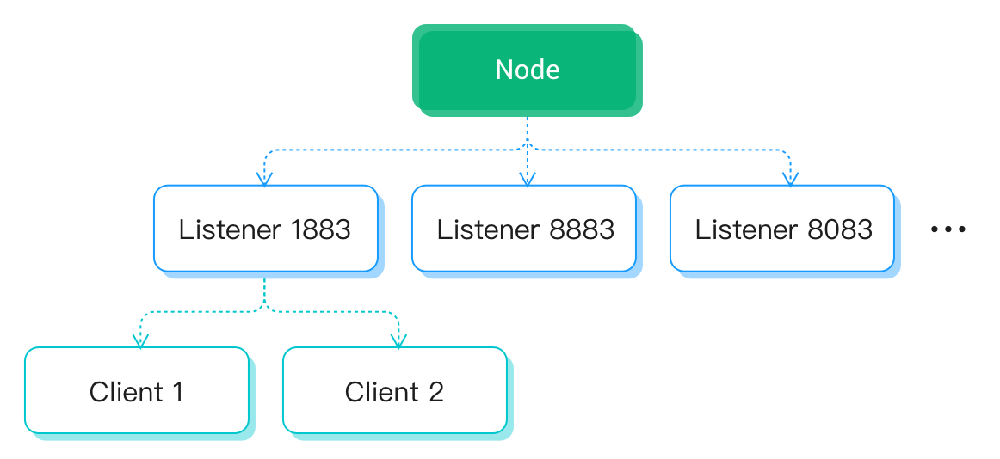

# Rate limit

EMQX broker can specifies the limit on access speed and message speed, this is a backpressure scheme that avoids system overload from the entrance and guarantees system stability and predictable throughput.

In 5.0 we introduced a new rate limiter which based on the hierarchical token bucket algorithm, it can flexibly and accurately control the usage rate of the corresponding resources in the EMQX node.

## Terminologies

### Resource

The system currently supports rate control services for the following resources:

| Type            | Description                                           | Post-Overload Behavior          |
|:----------------|:------------------------------------------------------|:--------------------------------|
| bytes_in        | Incoming message size in bytes per second             | Pause receiving client messages |
| message_in      | Incoming messages per second                          | Pause receiving client messages |
| connection      | Connections per second                                | Pause for new connections       |
| message_routing | The number of messages deliver by the session per second | Pause session delivery       |

### Rate Control Hierarchy

- **Node level:** resource rate control on the current EMQX node
- **Listener level:** The aggregate rate limit of all connections (sessions) coming in through a same listener
- **Connection level:** rate control of resources on a single connection (session)

### Hierarchy

The hierarchical relationship is shown in the figure:

 

### Wooden Barrel Effect
  No matter how much the rate of the lower layer is configured, it is limited by the actual rate of the upper layer, and it is guaranteed that it will never exceed the actual rate limit of the upper layer

## Useage

### Connection Level
  The connection-level rate limit is for a single connection. Assuming that the inflow rate of each session accessed through port 1883 needs to be limited to 100 messages per second, you only need to modify the configuration of port 1883 in emqx.conf as follows:

````
listeners.tcp.default {
  bind = "0.0.0.0:1883"
  max_connections = 1024000
  limiter.client.message_in {
  rate = "100/s"
  capacity = 100
  }
}
````

All options supported at this level are as follows:

| Options        | Type     | Default  | Description                                                                                                                                             |
|:---------------|:---------|:---------|:--------------------------------------------------------------------------------------------------------------------------------------------------------|
| rate           | int      | infinity | token generation rate                                                                                                                                   |
| initial        | int      | 0        | initial number of tokens                                                                                                                                |
| capacity       | int      | infinity | maximum number of tokens                                                                                                                                |
| low_watermark  | int      | 0        | The low water mark, when the number of tokens is lower than this number, even if the token request is successful, the rate also will be slightly limited |
| divisible      | bool     | false    | Whether the token request can be split into multiple requests when the number of tokens is not enough                                                   |
| max_retry_time | duration | 10s      | The maximum attempt time for token request, if no token is obtained after this time, the request fails                                                  |

### Listener Level
  The listener-level  limite  the total rate limit of all sessions connected through a same listener. For example, if you want the sum of  messages in  per second does not exceed 100 of all sessions that connected through port 1883,  you can modify the configuration as follows:

````
listeners.tcp.default {
  bind = "0.0.0.0:1883"
  max_connections = 1024000
  limiter.message_in {
  rate = "100/s"
  capacity = 100
  }
}
````

All options supported at this level are as follows:

| Options  | Type | Default  | Description              |
|:---------|:-----|:---------|:-------------------------|
| rate     | int  | infinity | token generation rate    |
| initial  | int  | 0        | initial number of tokens |
| capacity | int  | infinity | maximum number of tokens |

### Node level

The node-level limit  the resource consumption speed of the current node. If you want to limit the number of messages flowing in the current node per second to no more than 100, you can add the following configuration to emqx.conf:


````
limiter.message_in.rate = "100/s"
````

**Note:** Only listeners with rate limiting configured will be affected by node-level settings

All options supported at this level are as follows:

| Options | Type | Default  | Description                                                                                                                                                    |
|:--------|:-----|:---------|:---------------------------------------------------------------------------------------------------------------------------------------------------------------|
| rate    | int  | infinity | token generation rate                                                                                                                                          |
| burst   | int  | 0        | When overloaded (the consumption rate of tokens is greater than the generation rate), burst will be used as an additional generation rate to supplement tokens |
