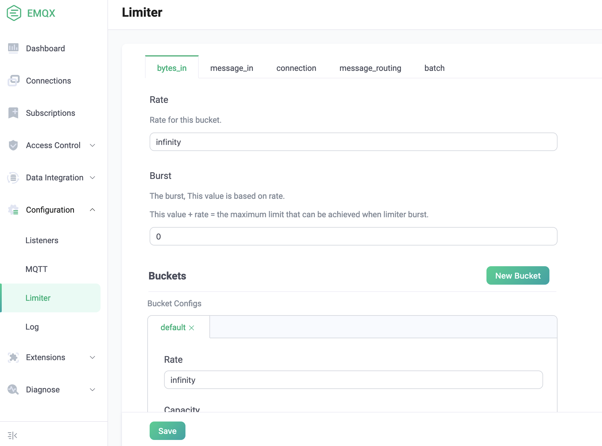
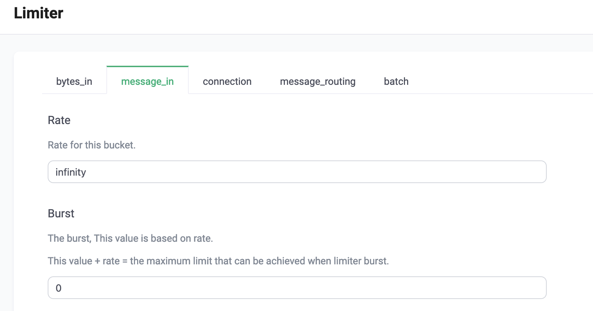
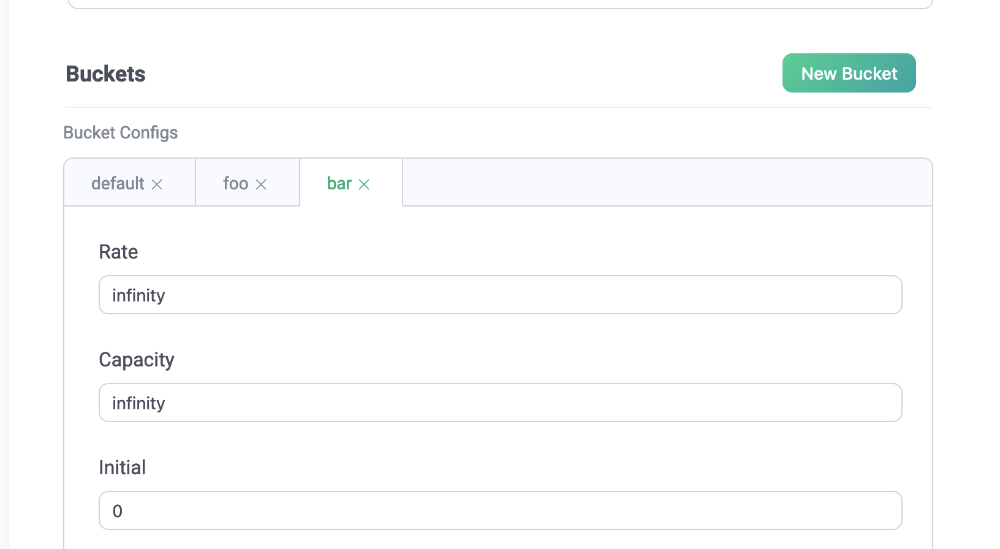
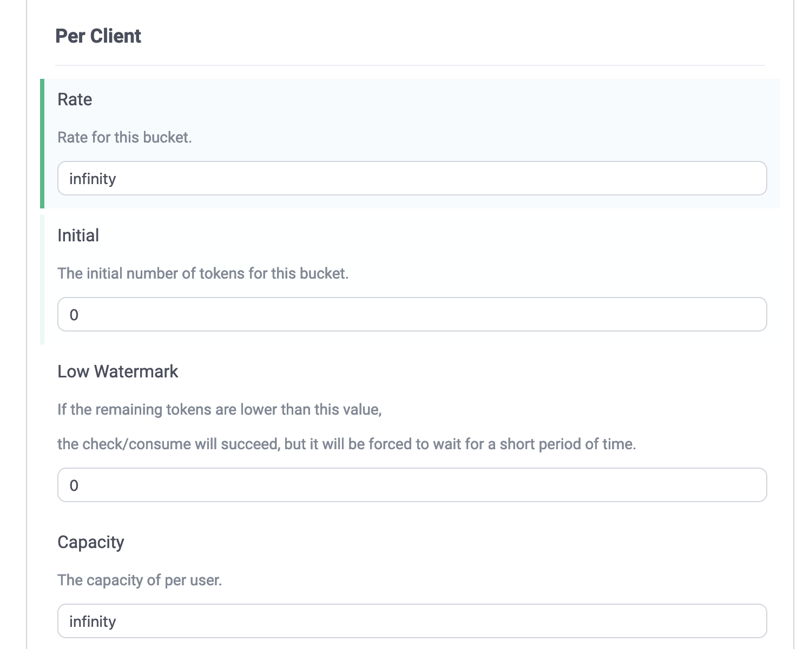
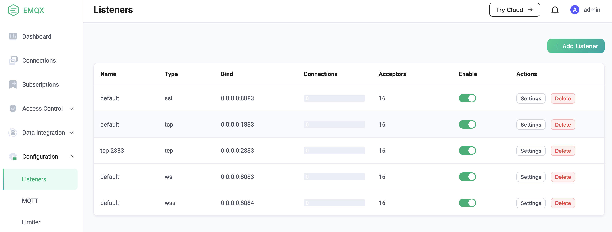
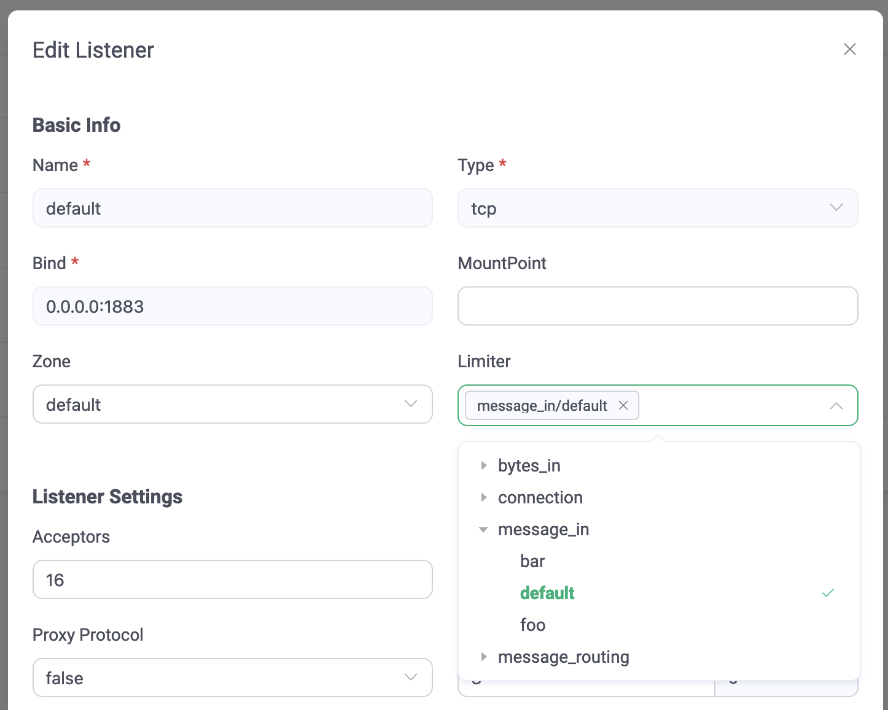
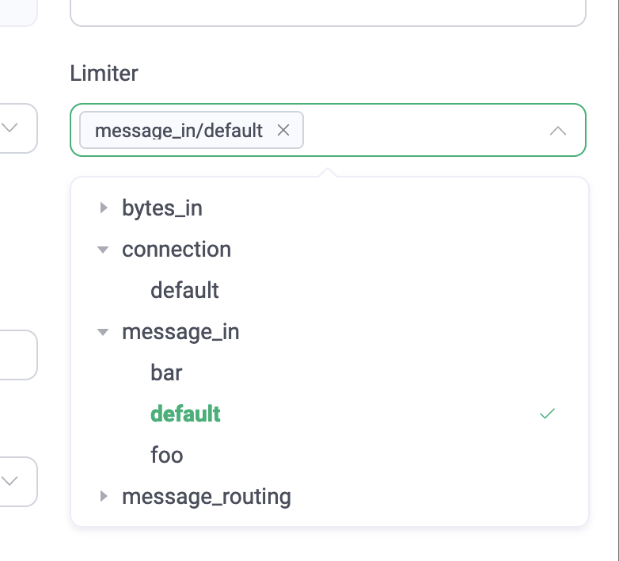
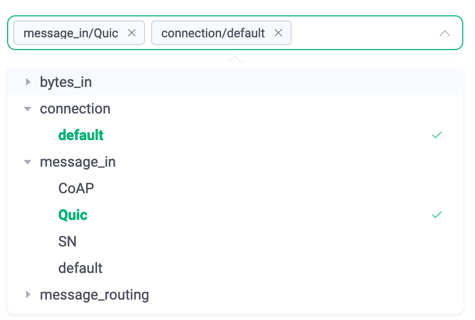
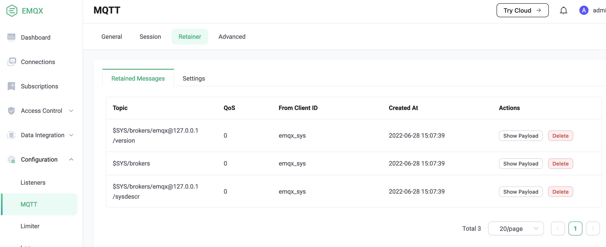
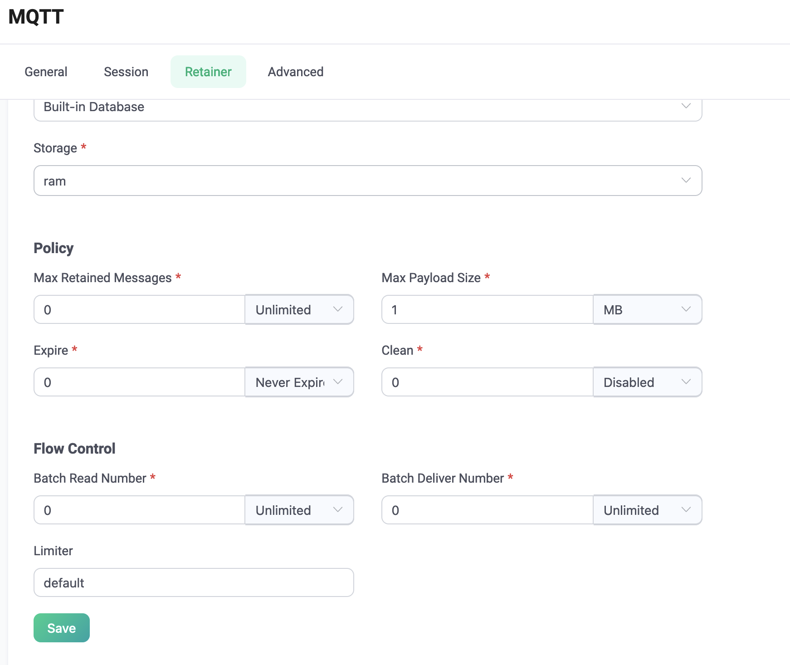

# Hierarchical rate limiter

The hierarchical rate limiter is a multi-level rate and flow control system based on the producer/consumer model, which can flexibly and accurately control the usage rate of the corresponding resources in the EMQX node.

# Terminologies

## Resource

The system currently supports rate control services for the following resources:

- **bytes\_in:** the incoming byte rate of the message
- **message\_in:** the incoming rate of messages
- **connection:** connection rate
- **message\_routing:** rate of message routing
- **batch:** rate of batch operations within the node
    
    Note: Currently only `retainer` uses this feature

## Producer/Consumer model

The whole system is divided into two parts: `producer` and `consumer`

### Producer

The producer is the `rate control service` in the system, which is used to manage and control the generation and allocation of resource tokens

### Consumer

Consumers are entities that consume resources. Before consuming resources, they must apply for the same amount of tokens.

The system provides three `rate control levels` for resource consumption

## Rate control levels

- **Node level:** resource rate control on the current EMQX node
- **Service level:** rate control for resources on a certain type of service/module

    There are currently two types of services: `listener` and `retainer`

    Among them, `listener` supports the following resources:

    - bytes\_in
    - message\_in
    - connection
    - message\_routing

    `retainer` only supports `batch` resources
- **User level:** rate control of resources on each user
    - **User:** User refers to any entity that consumes resources under a `service`, such as a connection or process, etc.

# Useage

## Setting

1. Open the setting interface on Dashboard and select the type to be set
2. Set the settings as required, then click `Save`

### Levels Correspondence

Each resource has three levels of rate control. Use `message_in` as an example, the correspondence between levels and settings is as follows:

- **Node:** The rate-setting at the top of the interface controls the inflow rate of messages on the current node

- **Service level:** The `bucket` in the setting interface corresponds to the `service level`, which is used to control the total message inflow rate of all connections under a listener

    Note: The number of `buckets` is not fixed, you can set multiple `buckets` according to required, and each `bucket` can be used to control the total rate limit of all connections under different listeners
- **User level:** The `Per Client` in the `bucket` corresponds to the `user level`, which is used to control the message inflow rate of each connection under the listener

## Use

After the rate control service is set, it will not affect other functions. If a service (listener, retainer, etc.) wants to use the rate control service, it needs to be set in the corresponding place.

### Listener

1. Open the `Listener` interface on the dashboard

    

    Select the listener that needs to use the rate control service, click `Settings`
2. In the `Basic Info` field, click `Rate Limiter`

    

3. Select the corresponding bucket under the resource that needs to be rate controlled

    

    Note: Multiple selections are supported here, as shown in the figure
    

### Retainer

1. Open the `retainer` interface on the dashboard

    

2. Fill in the `Limiter` in the `Flow Control` column with the bucket corresponding to the `batch` rate control service, and then update it

    