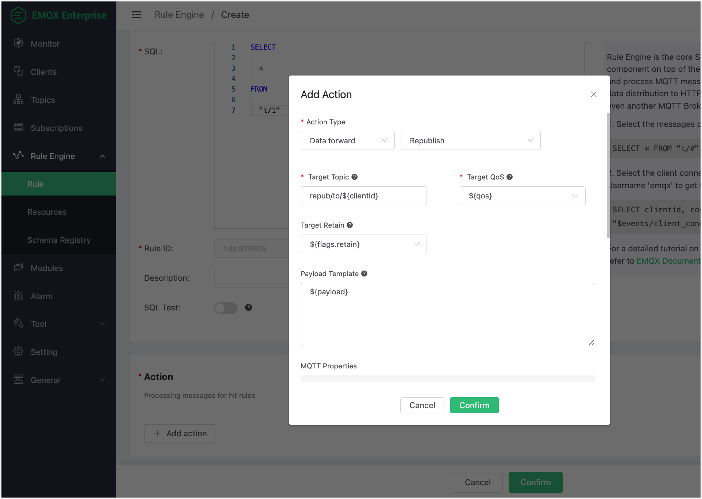
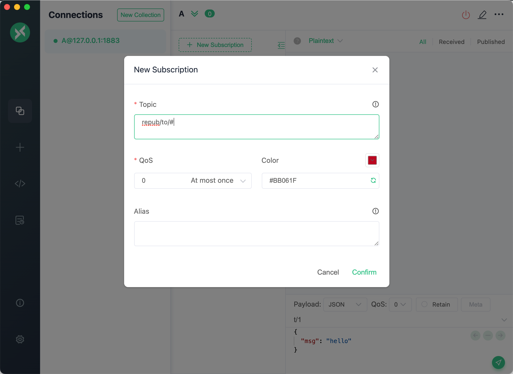

# Republish Action

The republish action is used to reissue a new MQTT message. The `Topic`, `QoS`, `Retain`, and `Payload` of the new message can be specified by parameters.

Note that the message republish action does not terminate the delivery of the original messages. For example, if a message "t/1" is received by the republish action and then a new "t/2" message is published per this rule, the delivery of the "t/1" message is not terminated, and clients subscribed to the "t/1" topic can still receive the original message.

## Create Rule

Click on Rules Engine - Rules - Create, and enter SQL.

```SQL
SELECT

    *

FROM

  "t/1"
```

## Create Action

Click Add Action, select Data Forwarding, Message Redistribution, enter the destination subject and other parameters, and refer to the following table for parameter definitions.

| Parameter | Definition | Type |
| --- | --- | --- |
| Target Topic | The topic of the `republish` message can be used as a placeholder variable. The use of `${repub/to/${clientid}}` in the documentation, when used in conjunction with the rule SQL, indicates the use of the publisher's clientid as a suffix. For custom business rules SQL, other variables can be used instead | String |
| Target QoS | The QoS level of the `republish` message, using 0, 1 or 2, or a placeholder variable can be used. The `${qos}` used in the documentation, when used in conjunction with the rule SQL, indicates that the QoS level of the original message is used. Custom business rule SQL, other Integer type variables can be used instead | Integer or placeholder variable |
| Target Retain | The Retain message identifier of the `republish` message can be used as a placeholder variable. The `${flags.retain}` used in the documentation, when used in conjunction with the rule SQL, indicates that the Retain identifier of the original message is used. For custom business rules SQL, you can use other Boolean type variables instead | Boolean or placeholder variable |
| Payload Template | The message content of the `republish` message can use placeholder variables. The `${payload}` used in the documentation, when used in conjunction with the rule SQL, indicates that the Payload content of the original message is used. Custom business rules SQL, you can use other variables instead | String |

Note that when the QoS and Retain use placeholder variables and the parameters obtained from the message information are not legal (i.e. QoS is not 0, 1 or 2, Retain is not true or false), the message is discarded and the action is marked as failed.



## Usage

Using the desktop MQTT client MQTTX, set the clientid to `123456`, connect to the device and subscribe to `repub/to/#`.



Post a message and you can see that client received a message with topic `repub/to/123456`.


