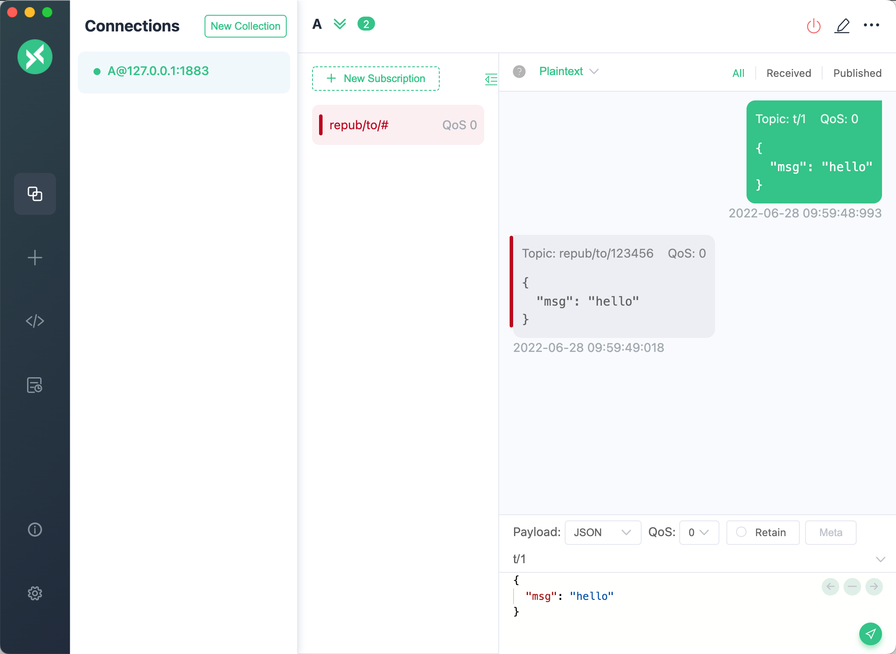

# Republish Action

The republish action is used to resend a new MQTT message. The `Topic`, `QoS`, `Retain`, and `Payload` of the new message can be specified by parameters.

Note that the message republish action does not terminate the delivery of the original messages. For example, if a message "t/1" is received by the republish action, and a new "t/2" message is republished, the delivery of "t/1" will not be terminated. Clients subscribed to the "t/1" topic will still receive the original message.

## Create Rule and Action

1. Click on the **Rule Engine** -> **Rules** in the left navigation menu of the Dashboard.
2. Click the **+ Create** button on the page and enter the following SQL example in the **SQL** text box:

```SQL
SELECT

  *

FROM

  "t/1"
```

3. In the **Action** area, click **+ Add action** and choose `Data Forward` -> `Republish` from the **Action Type** dropdown. Configure the following parameters:

   - **Target Topic**: The topic name to which the message is forwarded, with a default value of `repub/to/${clientid}`. The parameter type is String. You can use placeholder variables like `${repub/to/${clientid}}`, which, when used in conjunction with rule SQL, represents using the publisher's clientid as a suffix. If you choose a custom business rule SQL, you can use other variables to replace it.

   - **Target QoS**: The QoS level of forwarded messages, with a default value of `0`. The parameter type is an Integer or placeholder variable. You can use 0, 1, or 2, or placeholder variables like `${qos}`, which, when used in conjunction with rule SQL, represents the original message's QoS level. If you choose a custom business rule SQL, you can use other Integer type variables to replace it.

   - **Target Retain**: The retain flag of the forwarded message. The parameter type is Boolean or placeholder variable. The optional values are `false`, `true`, or `${flags.retain}`, with a default value of `false`. When used in conjunction with rule SQL, `${flags.retain}` represents using the original message's Retain flag. For custom business rule SQL, you can use other Boolean-type variables as substitutes.

     ::: tip Note

     When QoS and Retain are set using placeholder variables, if the parameters obtained from the message information are invalid (i.e., QoS is not `0`, `1`, or `2`, and Retain is not `true` or `false`), the message will be discarded, and this action will be marked as failed.

     :::

   - **Payload Template**: The content of the forwarded message with the type as String. You can use placeholder variables like `${payload}` to represent the original message's payload when used in conjunction with rule SQL. If you choose a custom business rule SQL, you can use other variables to replace it.

   - **MQTT Properties**: You can add predefined key-value pairs to configure the MQTT properties of the forwarded message. Optional keys include `Payload-Format-Indicator`, `Message-Expiry-Interval`, `Content-Type`, `Response-Topic`, `Correlation-Data`, `Subscription-Identifier`, `Topic-Alias`, and others, used to represent Payload format, message expiry time, content MIME type, request-response topic, message correlation, and more. For definitions, refer to the [MQTT 5.0](https://www.emqx.com/en/blog/mqtt5-new-features-properties-and-loads) specification.

   - **User Properties**: You can add custom key-value pairs to configure the [user properties](https://www.emqx.com/en/blog/mqtt5-user-properties) of the forwarded message, which represent custom message metadata.

     ::: tip

     MQTT properties and user properties provide richer message descriptions than topics and payloads, enabling the extension of MQTT's application scenarios with more semantic information.

     :::

   Once the configuration is complete, click the **Confirm** button. You will see that the action has been added.

4. Return to the Create Rule page and click the **Create** button at the bottom of the page.

   

## Test Rule and Action

1. Use the desktop MQTT client [MQTTX](https://mqttx.app/). Set the clientid to `123456`, connect to the device, and subscribe to `repub/to/#`.


2. Post a message and you can see that the client received a message with the topic `repub/to/123456`.


