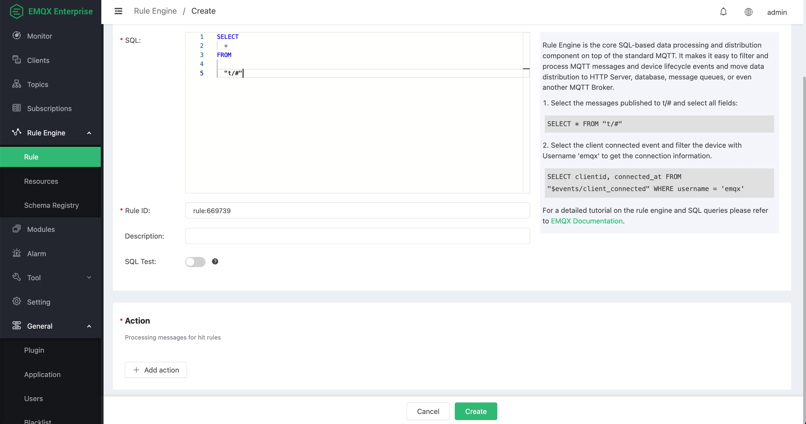
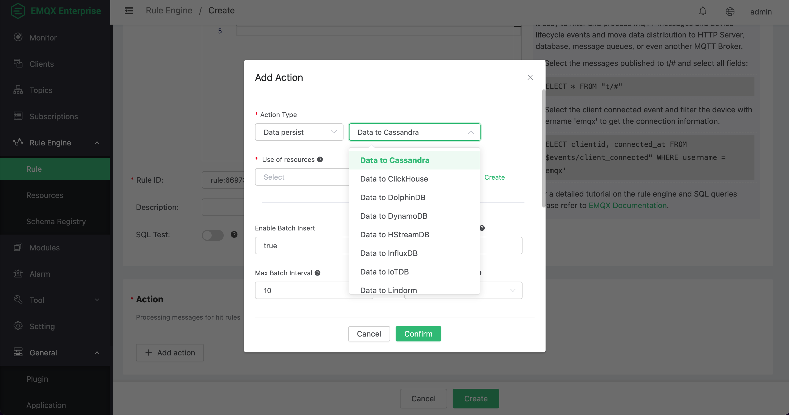
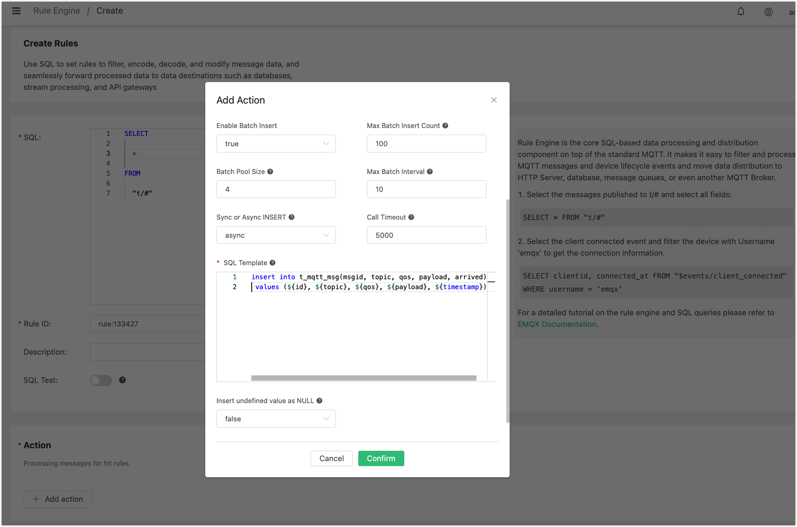
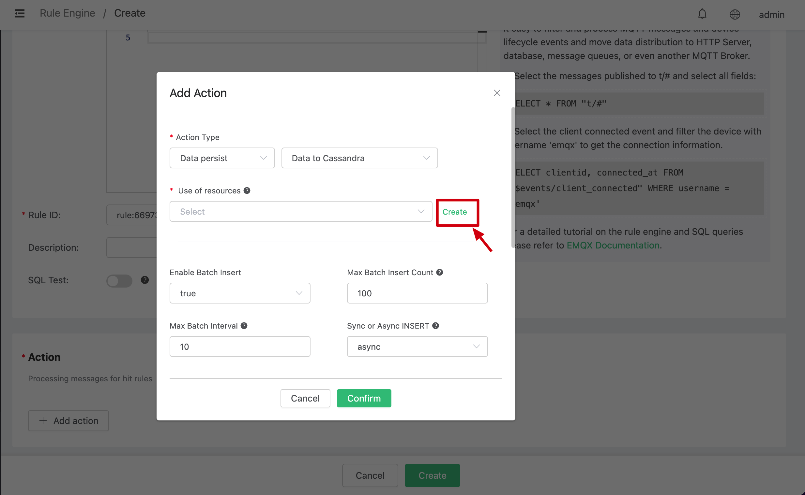
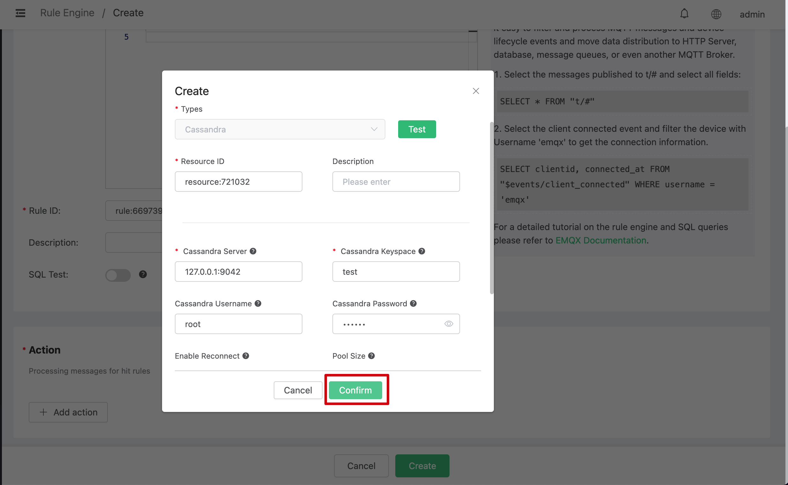
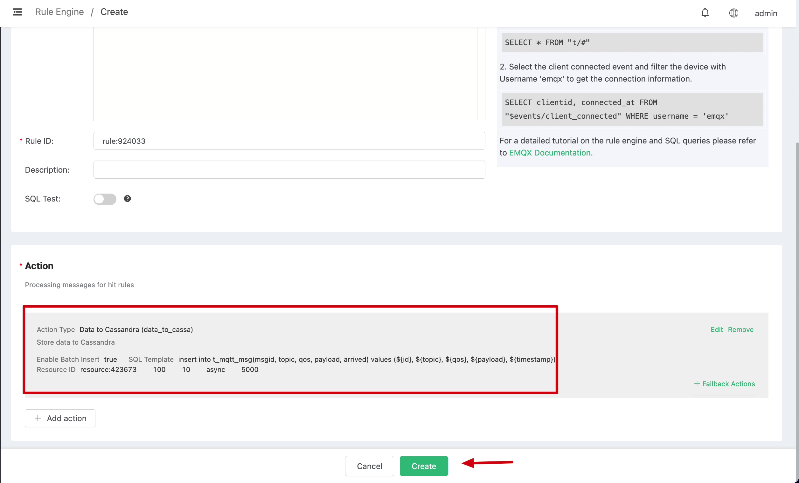
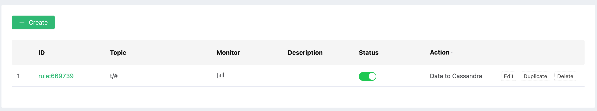
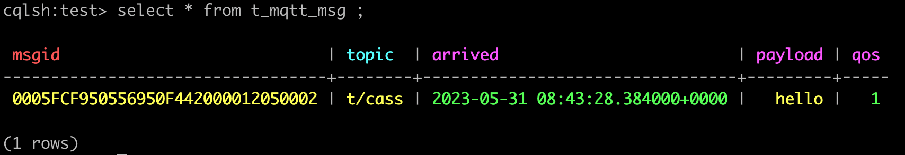
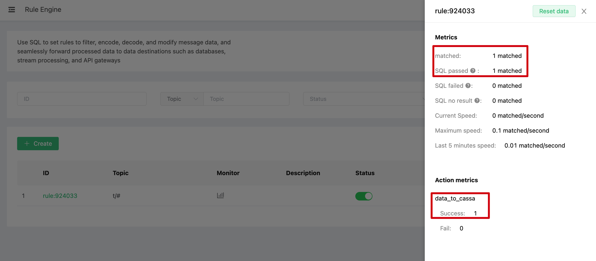

# Ingest Data into Cassandra

Setup a Cassandra database, and changes the root/password to root/public, taking Mac OSX for instance:

```bash
$ brew install cassandra

## change the config file to enable authentication
$  vim /usr/local/etc/cassandra/cassandra.yaml

    authenticator: PasswordAuthenticator
    authorizer: CassandraAuthorizer

$ brew services start cassandra

## login to cql shell and then create the root user
$ cqlsh -ucassandra -pcassandra

cassandra@cqlsh> create user root with password 'public' superuser;
```

Initiate Cassandra Table:

```bash
$ cqlsh -uroot -ppublic
```

Create Keyspace "test":

```sql
CREATE KEYSPACE test WITH replication = {'class': 'SimpleStrategy', 'replication_factor': '1'}  AND durable_writes = true;
```

Create "t_mqtt_msg" table:

```bash
USE test;

CREATE TABLE t_mqtt_msg (
    msgid text,
    topic text,
    qos int,
    payload text,
    arrived timestamp,
    PRIMARY KEY (msgid, topic)
);
```

Create a rule:

Go to [EMQX Dashboard](http://127.0.0.1:18083/#/rules), select the
"rule" tab on the menu to the left.

Select "message.publish", then type in the following SQL:

```sql
SELECT
    *
FROM
    "t/#"
```



Bind an action:

Click on the "+ Add action" button under "Action", and then select "Action Type" to "Data persist" and
"Data to Cassandra" in the pop-up dialog window.



Fill in the parameters required by the action:

Two parameters is required by action "Data to Cassandra":

1). SQL template. SQL template is the sql command you'd like to run
when the action is triggered. In this example we'll insert a message
into Cassandra, so type in the following sql
template:

```sql
insert into t_mqtt_msg(msgid, topic, qos, payload, arrived) values (${id}, ${topic}, ${qos}, ${payload}, ${timestamp})
```

Before data is inserted into the table, placeholders like \${key} will
be replaced by the corresponding values.



2). Bind a resource to the action. Since the dropdown list "Resource"
is empty for now, we create a new resource by clicking on the "Create" to the top right:



Configure the resource:

Set "Cassandra Keyspace" to "test", "Cassandra Username" to "root",
"Cassandra Password" to "public", and keep all other configs as
default, and click on the "Testing Connection" button to make sure the
connection can be created successfully.



Then click on the "Confirm" button.

Back to the "Actions" dialog, and then click on the "Confirm" button.



Back to the creating rule page, then click on "Create" button. The rule we created will be show in the rule list:



We have finished, testing the rule by sending an MQTT message to emqx:

```bash
> Topic: "t/cass"
> QoS: 1
> Retained: true
> Payload: "hello"
```
Then inspect the Cassandra table, verify a new record has been
inserted:



And from the rule list, verify that the "Matched" column has increased
to 1:


