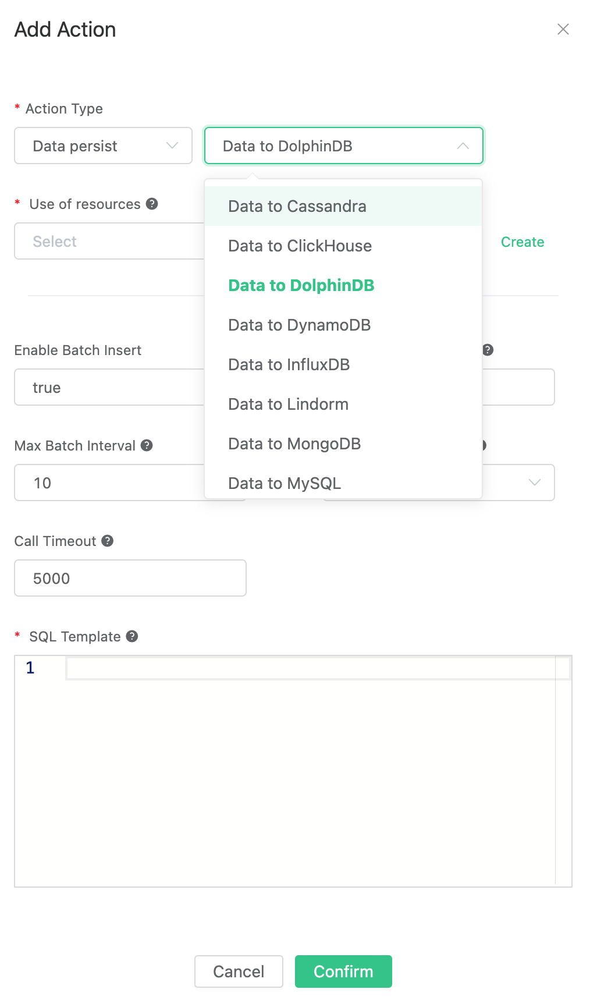
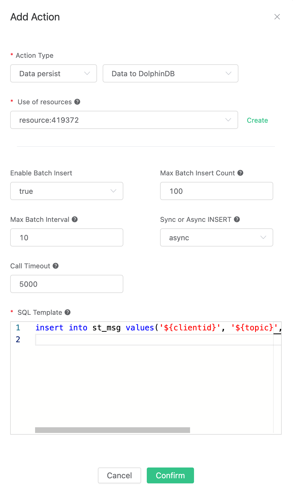
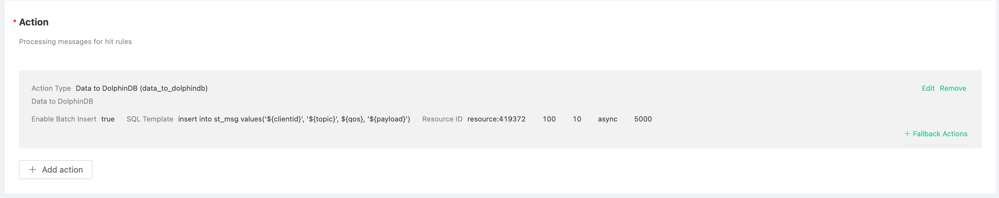

# Save data to DolphinDB

[DolphinDB](https://www.dolphindb.cn) is a high-performance distributed time series database developed by Zhejiang  DolphinDB Co., Ltd, which integrates powerful programming language and high-capacity and high-speed flow data analysis system, providing a one-stop solution for rapid storage, retrieval, analysis and calculation of massive structured data. It is suitable for the area of quantitative finance and industrial Internet of things.

EMQX uses Erlang to implement DolphinDB's client API, which transmits data to DolphinDB for storage through TCP.

## Set up DolphinDB

Currently, EMQX only adapts to DolphinDB 1.20.7 version.

Taking the Linux version as an example, you can go to the official website to download the latest version of the Linux64 installation package from the community: https://www.dolphindb.cn/downloads.html

Upload the server directory of the installation package to the server directory `/opts/app/dolphindb`, and test whether the startup is normal:

```bash
chmod +x ./dolphindb
./dolphindb
## If the startup is successful, you will enter the dolphindb command line and execute 1+1
>1+1
2
```

If the startup is successful and the correct output is obtained, it indicates that DolphinDB is successfully installed. Then use `<CRTL+D>` to close DolphinDB.

Now, we need to open the publish / subscribe function of streamtable in dolphin dB and create relevant data tables to realize the function of EMQ x message storage and persistence:

1. Modify the DolphinDB's configuration file `vim dolphindb.cfg` and add the following configuration items to enable the publish/subscribe function:
``` properties
## Publisher for streaming
maxPubConnections=10
persistenceDir=/ddb/pubdata/
#persistenceWorkerNum=
#maxPersistenceQueueDepth=
#maxMsgNumPerBlock=
#maxPubQueueDepthPerSite=
## Subscriber for streaming
subPort=8000
#subExecutors=
#maxSubConnections=
#subExecutorPooling=
#maxSubQueueDepth=
```

2. Start the dolphin DB service from the background:
```bash
## After startup, dolphin DB will listen to port 8848 for client.
nohup ./dolphindb -console 0 &
```

3. Go to the official website of DolphinDB and download a suitable GUI client to connect to the DolphinDB service:
    - Go to [download page](http://www.dolphindb.cn/alone/alone.php?id=10) to download `DolphinDB GUI`
    - DolphinDB GUI client depends on the Java environment, therefore, make sure that Java is installed at first
    - Go to the DolphinDB GUI directory and execute `sh gui.sh` to start the client
    - Add Server in the client and create a Project with script files.

4. Create a distributed database and a streamtable table, and persist the data of streamtable into the distributed table
```ruby
// Create a distributed file database named emqx
// And create a table named `msg`, partition by the hash values of `clientid` and `topic`:
schema = table(1:0, `clientid`topic`qos`payload, [STRING, STRING, INT, STRING])
db1 = database("", HASH, [STRING, 8])
db2 = database("", HASH, [STRING, 8])
db = database("dfs://emqx", COMPO, [db1, db2])
db.createPartitionedTable(schema, "msg",`clientid`topic)
// Create a StreamTable table named `st_msg` and persist the data to the `msg` table.
share streamTable(10000:0,`clientid`topic`qos`payload, [STRING,STRING,INT,STRING]) as st_msg
msg_ref= loadTable("dfs://emqx", "msg")
subscribeTable(, "st_msg", "save_msg_to_dfs", 0, msg_ref, true)
// Query msg_ref to check whether the creation is successful
select * from msg_ref;
```
After that, you can see that an empty `msg_ref` has been created successfully:


So far, the configuration of DolphinDB has been completed.

For detailed DolphinDB usage documentation, please refer to:
- User Guide: https://github.com/dolphindb/Tutorials_CN/blob/master/dolphindb_user_guide.md
- Examples of IoT scenarios: https://gitee.com/dolphindb/Tutorials_CN/blob/master/iot_examples.md
- Stream processing guidelines: https://github.com/dolphindb/Tutorials_CN/blob/master/streaming_tutorial.md
- Programming manual: https://www.dolphindb.cn/cn/help/index.html

## Configure the rules engine

Create rules:

Open [EMQX Dashboard](http://127.0.0.1:18083/#/rules) and select the "Rules" tab on the left.

Fill in the rule SQL:

```sql
SELECT * FROM "t/#"
```


Related actions:

On the "Response Action" interface, select "Add", and then select "Save Data to DolphinDB" in the "Action" drop-down box.



Fill in the action parameters:

The "Save data to DolphinDB" action requires two parameters:

1). SQL template. In this example, we insert a piece of data into the stream table `st_msg`, and the SQL template is:

```sql
insert into st_msg values(${clientid}, ${topic}, ${qos}, ${payload})
```

2). The ID of the associated resource. Now that the resource drop-down box is empty, and you can click "New Resource" in the upper right corner to create a DolphinDB resource:

Fill in the server address corresponding to the DolphinDB server deployed above. The user name is `admin` and the password is `123456`


Click the "OK" button.

Return to the response action interface and click "OK".



Return to the rule creation interface and click "Create".



In the rule list, click the "View" button or the rule ID connection to preview the rule just created:


The rule has been created. Now, send a piece of data:

```bash
Topic: "t/a"
QoS: 1
Payload: "hello"
```

Then check the persistent `msg_dfs` table to see whether the new data is added successfully:


