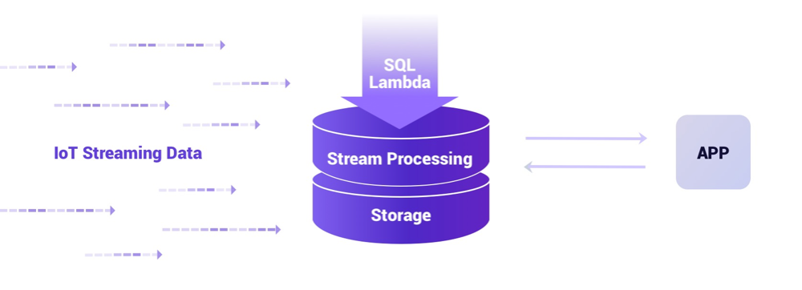
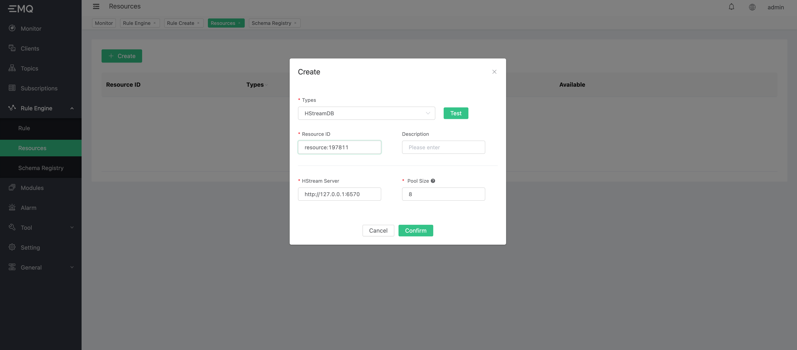
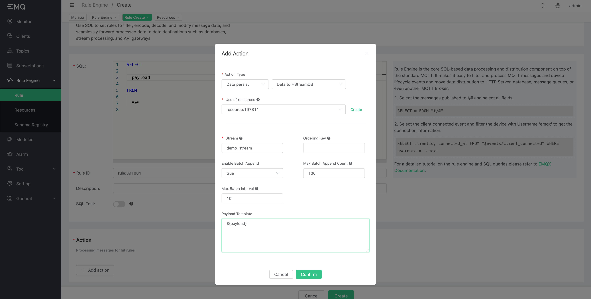
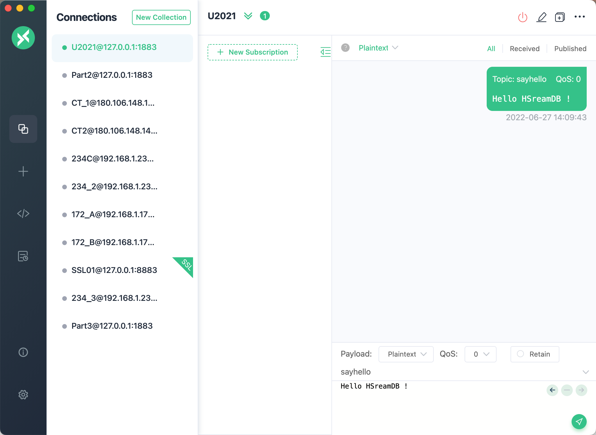
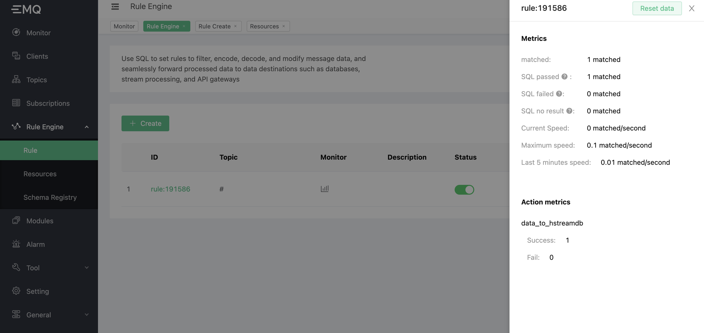

# Data to HStreamDB

HStreamDB is a streaming database designed for streaming data, with complete lifecycle management for accessing, storing, processing, and distributing large-scale real-time data streams. It uses standard SQL (and its stream extensions) as the primary interface language, with real-time as the main feature, and aims to simplify the operation and management of data streams and the development of real-time applications.



For more details, please refer to [HStream official website](https://hstream.io/)。

## Create HStreamDB Server

[Deployment reference document](https://hstream.io/docs/en/latest/start/quickstart-with-docker.html). Can use docker local deployment, or cloud hosting deployment.
Use the command to create hstream-client:

```bash
docker run -it --rm --name some-hstream-cli --network host hstreamdb/hstream:v0.8.0 hstream-client --port 6570 --client-id 1
```

Access to the console:

```bash
      __  _________________  _________    __  ___
     / / / / ___/_  __/ __ \/ ____/   |  /  |/  /
    / /_/ /\__ \ / / / /_/ / __/ / /| | / /|_/ /
   / __  /___/ // / / _, _/ /___/ ___ |/ /  / /
  /_/ /_//____//_/ /_/ |_/_____/_/  |_/_/  /_/


Command
  :h                           To show these help info
  :q                           To exit command line interface
  :help [sql_operation]        To show full usage of sql statement

```

Create stream:

```SQL
> CREATE STREAM demo_stream;
demo_stream
> SHOW STREAMS;
demo_stream
>
```

## Create HStreamDB resource

Access EMQX Dashboard，Click on Rules Engine, Resources, Create, select HStreamDB Resources, enter the resource address and link pool.



## Create Rule

Click, Rules Engine, Rules, Create.
Edit rule SQL.

```SQL
SELECT

  payload

FROM

  "#"
```

The SQL rules in the document are for example only, please write the SQL according to the business design.

Click Add Action and select Data Persistence to save the data to HSTreamDB.
Select the resource created in the previous step and enter the parameters, which are defined in the following table.

| Parameter | Definition | Type |
| ---- | ---- | ---- |
| Stream | Stream Name, Cannot be placeholders | String |
| Ordering Key | Cannot be placeholders | String |
| Enable Batch Append | Enable or disable batch appending, default is true | Boolean |
| Max Batch Append Count | Maximum number of message entries in a batch | Integer |
| Max Batch Interval(ms) | Batch maximum interval, in milliseconds | Integer |
| Payload Template | Content of the data message written | Binary |

Click `Confirm` to create it.



Now use the state-of-the-art MQTT desktop client `MQTTX` to connect to EMQX and send a message.



See rule monitor.



At this point the data is written to HStreamDB and the message is consumed using any consumption method. The documentation uses a simple consumption tool based on the HStream golang SDK, and the reader is free to write the consumption side according to a familiar programming language. The consumption log can be seen as follows.

```shell
{"level":"info","ts":1656311005.5250711,"msg":"[f1]","recordId":"[BatchId: 8589934593, BatchIndex: 0, ShardId: 1317059070792293]","payload":"Hello HSreamDB !"}
```

The message has been written successfully and is consumed to completion.
