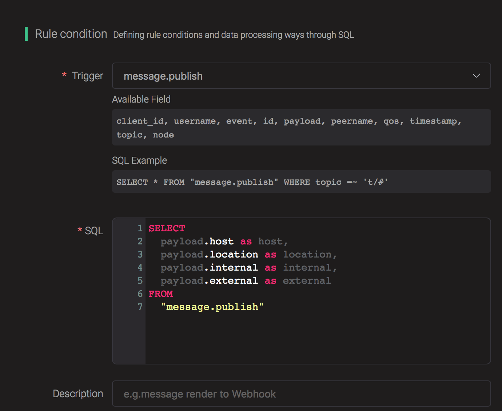
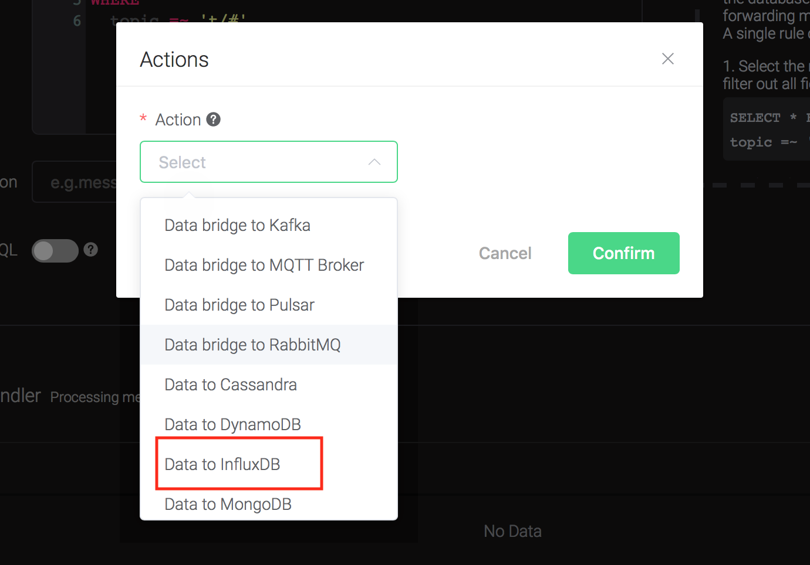
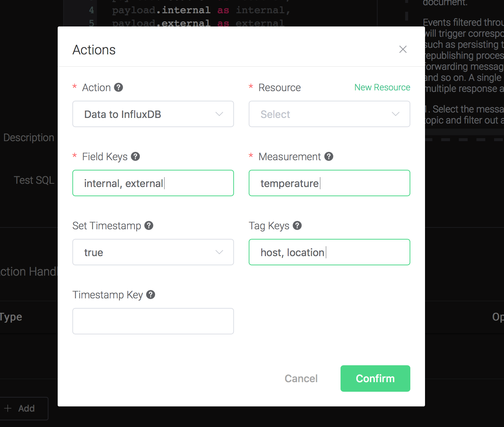
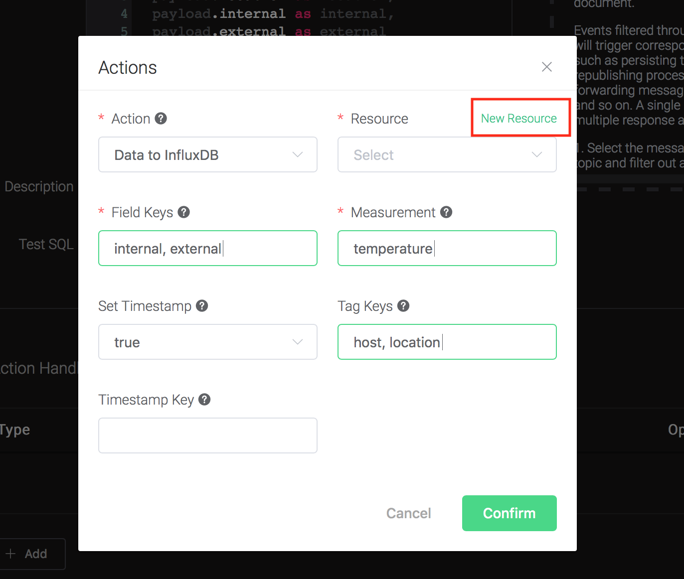
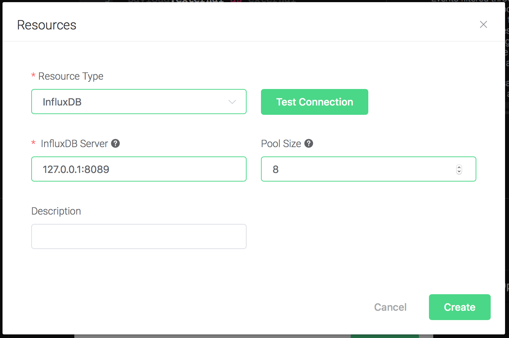
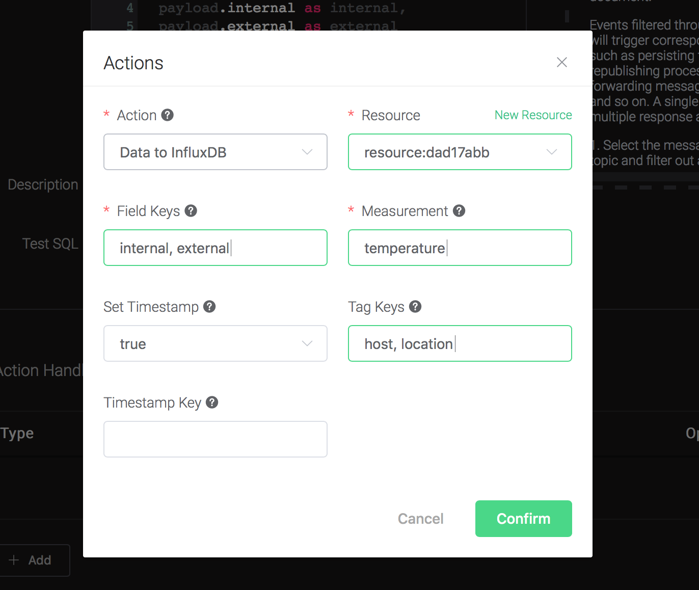
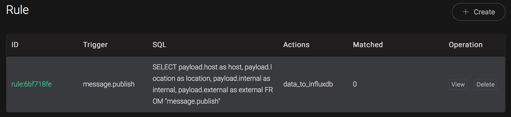
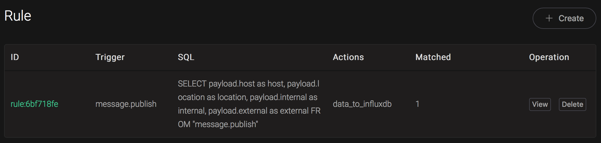

# Integrate with InfluxDB

Setup a InfluxDB database, taking Mac OSX for instance:

```bash
$ docker pull influxdb

$ git clone -b v1.0.0 https://github.com/palkan/influx_udp.git

$ cd influx_udp

$ docker run --name=influxdb --rm -d -p 8086:8086 -p 8089:8089/udp -v ${PWD}/files/influxdb.conf:/etc/influxdb/influxdb.conf:ro -e INFLUXDB_DB=db influxdb:latest
```

Create a rule:

Go to [EMQX Dashboard](http://127.0.0.1:18083/#/rules), select the
"rule" tab on the menu to the left.

Select "message.publish", then type in the following SQL:

```sql
SELECT
    payload.host as host,
    payload.location as location,
    payload.internal as internal,
    payload.external as external
FROM
    "message.publish"
```



Bind an action:

Click on the "+ Add" button under "Action Handler", and then select
"Data to InfluxDB" in the pop-up dialog window.



Fill in the parameters required by the action:

Six parameters is required by action "Data to InfluxDB" :

1). Measurement: Measurement of the data point.

2). Field Keys: Which fields can be used as fields of data point.

3). Tags Keys. Which fields can be used as tags of data point.

4). Timestamp Key. Which fields can be used as timestamp of data
point.

5). Set Timestamp. Whether to generate a timestamp if 'Timestamp Key'
is not configured.



6). Bind a resource to the action. Since the dropdown list "Resource"
is empty for now, we create a new resource by clicking on the "New
Resource" to the top right, and then select "InfluxDB":



Configure the resource:

Keep all the configs as default, and click on the "Testing Connection"
button to make sure the connection can be created successfully, and
then click on the "Create" button.



Back to the "Actions" dialog, and then click on the "Confirm" button.



Back to the creating rule page, then click on "Create" button. The rule we created will be show in the rule list:



We have finished, testing the rule by sending an MQTT message to
    emqx:

```bash
> Topic: "t/1"
>
> QoS: 0
>
> Retained: false
>
> Payload:
> {"host":"serverA","location":"roomA","internal":25,"external":37}
```

Then inspect the InfluxDB table, verify a new record has been
inserted:

```bash
$ docker exec -it influxdb influx

> use db
Using database db
> select * from "temperature"
name: temperature
time                external host    internal location
----                -------- ----    -------- --------
1561535778444457348 35       serverA 25       roomA
```

And from the rule list, verify that the "Matched" column has increased
to 1:


