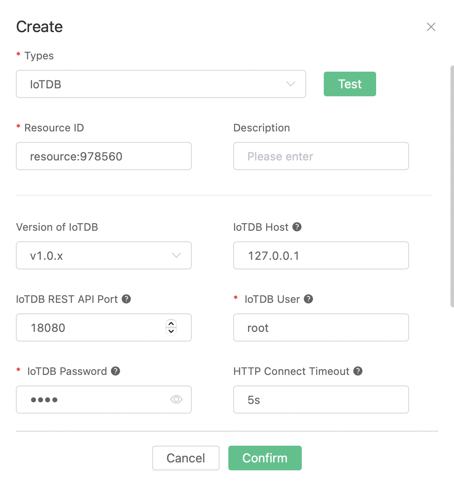
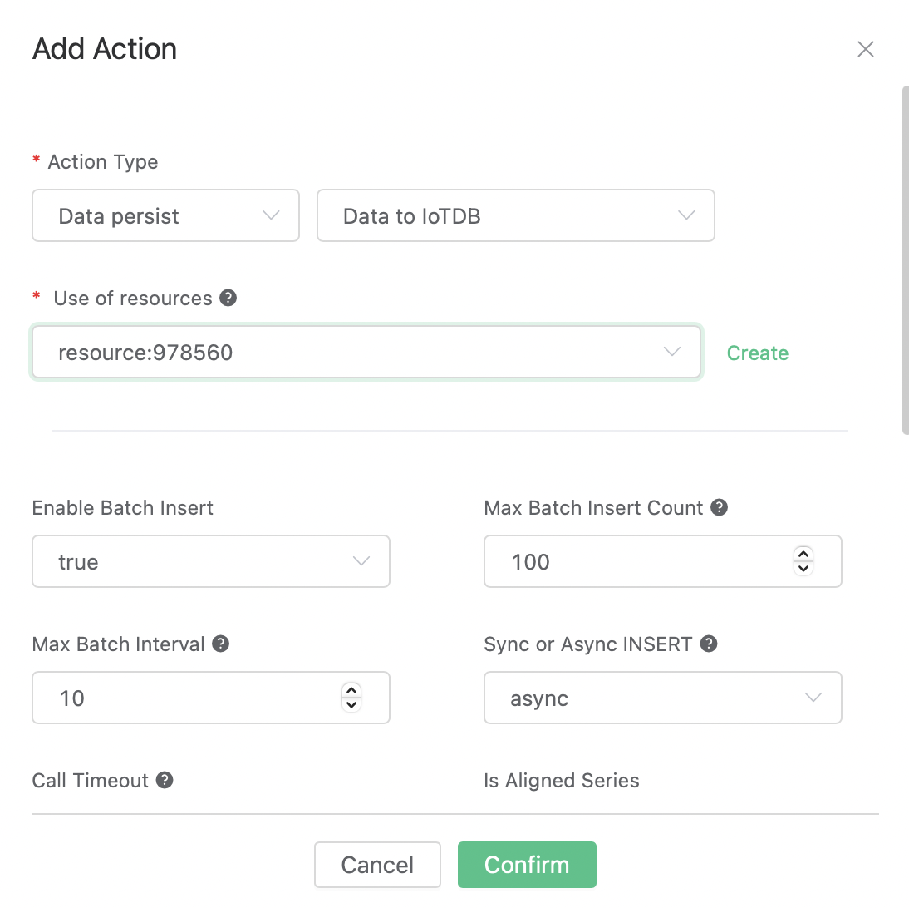

# Integrate with IoTDB

## Prepare the Environment

Download and install IoTDB according to the doc: [IoTDB QuickStart](https://iotdb.apache.org/UserGuide/Master/QuickStart/QuickStart.html).

### Start IoTDB (take Unix/OS X as example):

```
bash sbin/start-standalone.sh
```

Attach to the IoTDB terminal using the CLI tool:

```
bash sbin/start-cli.sh -h 127.0.0.1 -p 6667 -u root -pw root
```

### Create Database and Time Series:

```
IoTDB> CREATE DATABASE root.ln

IoTDB> CREATE TIMESERIES root.ln.status WITH DATATYPE=BOOLEAN, ENCODING=PLAIN
IoTDB> CREATE TIMESERIES root.ln.temperature WITH DATATYPE=FLOAT, ENCODING=RLE
```

## Create the Resource

Go to the [EMQX Dashboard](http://127.0.0.1:18083/#/resources), select the "Resources" tab on the left, click "Create", and select "IoTDB" as the resource type.

Fill in the following parameters:

- Version of IoTDB: select according to the IoTDB version you downloaded
- IoTDB User: the user for authentication.
- IoTDB Password: the password for authentication.

Remain all other parameters at default values.



Click the "Test" button for connectivity test, and then click the "Confirm" button to create the resource.

## Create the Rule

Go to the [EMQX Dashboard](http://127.0.0.1:18083/#/rules), select the "Rule" tab on the left.

Fill in the following SQL:

```SQL
SELECT
  payload.st as st,
  payload.tmp as tmp
FROM
  "t/#"
```

## Add a Action:

At the bottom of the rule creation page, select "Add action" in the "Action" section, and then select "Data persist" - "Data to IoTDB" in the "Action Type" drop-down box.



Fill in the following parameters:

- Use of resources: Select the resource we created just now.
- Device: `root.ln`
- Data to insert: To insert rows of data to IoTDB. The `Timestamp` field can be empty, and the `Measurement` and `Value` can use placeholders in the format of '${var}'.
  |  Timestamp   | Measurement  | Data Type  | Value  |
  |  ----        |  ----        | ----       | ----   |
  |              | status       | BOOLEAN    | ${st}  |
  |              | temperature  | FLOAT      | ${tmp} |

Keep all other parameters unchanged with default values.


Finally, click the "Confirm" button to complete the creation of the action, and return to the rule creation page and click "Create".

The rule has been created. Now we can test it by sending a message:

- Topic: `t/1`

- QoS: `0`

- Payload: `{"st": true, "tmp": 36.5}`

Query results in IoTDB terminal:

```
IoTDB> select * from root.ln;
+-----------------------------+-------------------+--------------+
|                         Time|root.ln.temperature|root.ln.status|
+-----------------------------+-------------------+--------------+
|2023-03-04T13:53:45.804+08:00|               36.5|          true|
+-----------------------------+-------------------+--------------+
```
