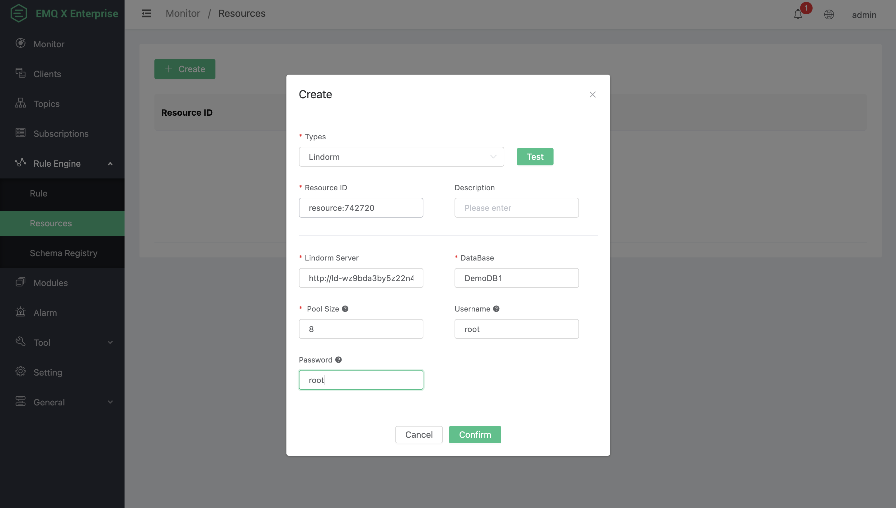
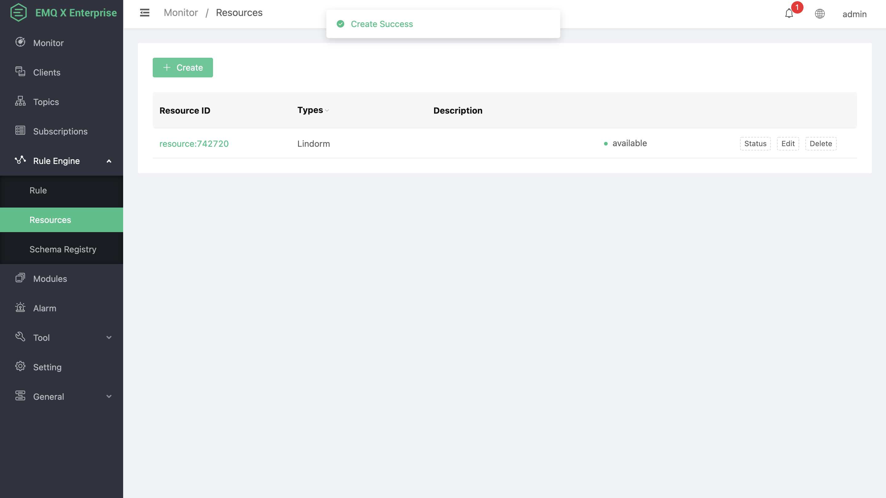
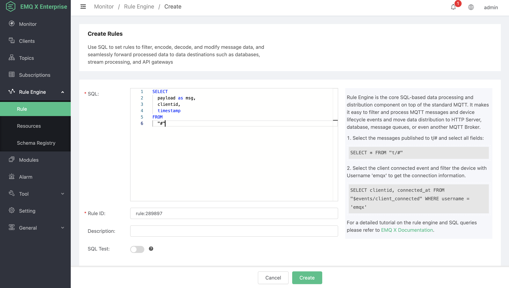
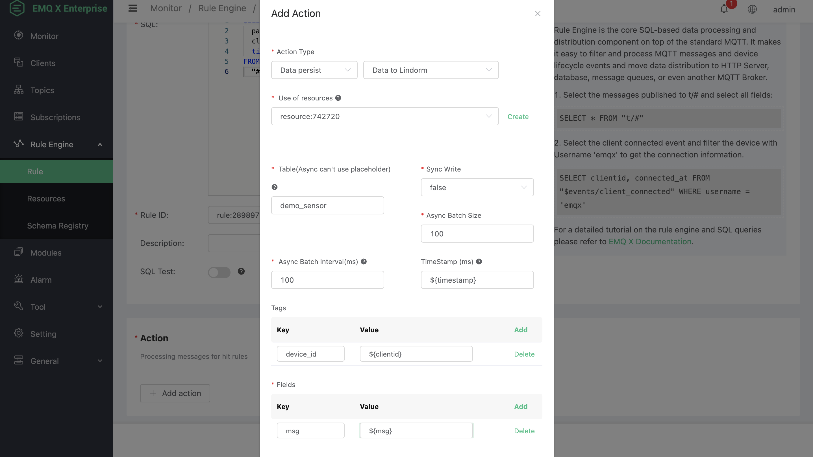
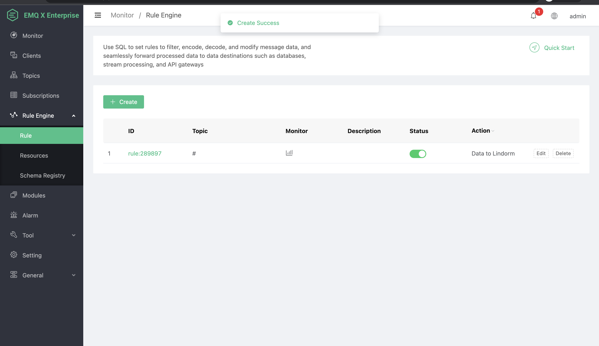
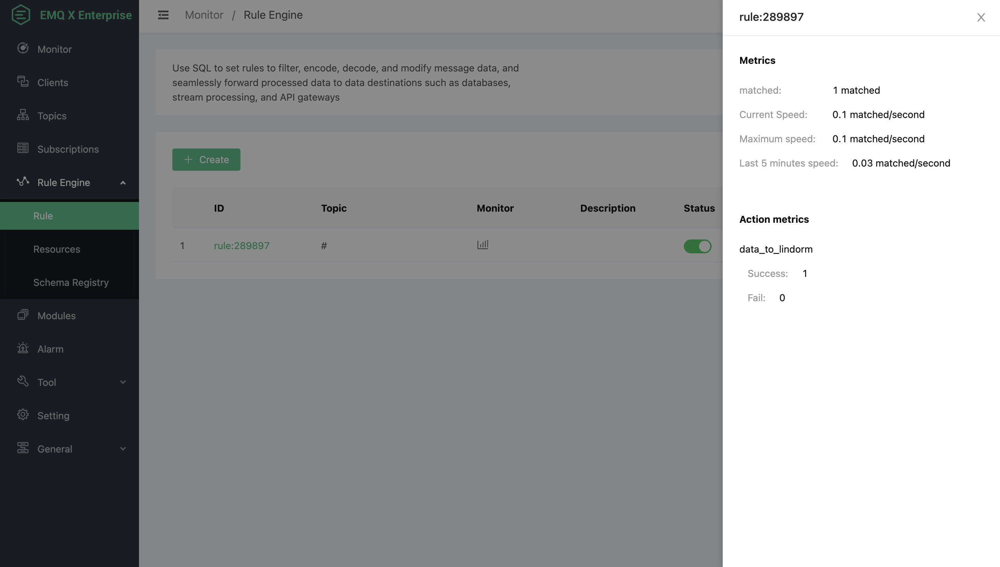

# Save data to Lindorm database

First, make sure that the Lindorm database service is enabled.
</br>
For the condition that the database is not deployed in Alibaba Cloud, open the access control whitelist, ensure that the IP of the deployed machine is in the access whitelist, and open the public network access address. For detailed operation steps, please refer to the Ali Lindorm operations documentation.

Ensure that the IP of the host where EMQ X is deployed is in the access whitelist. If EMQ X is deployed in Alibaba Cloud, it can access Lindorm through the cloud host intranet. For other types of deployment, the Lindorm Internet access function should be enabled for access. For detailed operation steps, please refer to the Ali Lindorm operation documentation.

</br>
Create database

```SQL
CREATE DATABASE DemoDB1
```

Create table

```SQL
CREATE TABLE demo_sensor(
    device_id VARCHAR TAG,
    time BIGINT,
    msg VARCHAR)
```

The resource requires the following startup parameters:

- Lindorm server: Lindorm access address. Lindorm provides domain name access. For Alibaba Cloud host, please fill in the intra-net access address. The default port is `8242`. When filling according to the actual situation, you need to add the prefix `http://`;
- Database: The name of the database for data storage, which is filled in according to the created service;
- Connection pool size: The process pool where the database writes data. It is filled in according to the business volume. The writing is a blocking request. For high-concurrency services, it is recommended to be `CPU cores * 4` or `CPU cores * 8` or more;
- User name: It is not required to fill in if the authentication is disabled. Otherwise, please fill in according to the actual situation;
- Password: It is not required to fill in if the authentication is disabled. Otherwise, please fill in according to the actual situation;



Ensure that the resource status is available (for non-Alibaba Cloud deployments, there may be an unavailable status due to the slow link for the first time after creation. Click the status button to refresh the status).



Create rule

```SQL
SELECT
  payload as msg,
  clientid,
  timestamp
FROM
  "#"
```



Add action

- Action type: data persistence; save data to Lindorm;
- Using resource: select the created resource ID;
- Table name: placeholder dynamic programming can be used in synchronous mode. For asynchronous batch writing, please strictly use the table name which cannot be changed dynamically;
- Synchronous writing: synchronous means that each piece of data is stored in the database immediately. The batch function is enabled in asynchronous mode, and the data will be written according to the batch size and interval rules;
- Batch size in asynchronous mode: 100 by default, 100-400 is recommended. It can be changed according to business planning, which is ignored in synchronization mode;
- Batch interval in asynchronous mode: 100 by default, in milliseconds, 10-200 is recommended;
- Timestamp: in milliseconds. It is recommended to use the message time. For empty data, it will be calculated according to the timestamp hit by the rule;
- Tags: data tag key-value pairs, which is filled in according to the created table structure;
- Fields: data key-value pairs, which is filled in according to the created table structure;



Click OK. Then, click Create and view the rules:



Use the MQTT client to publish messages and view the counts of successes and failures of rule hits;



Use API to query database and write results:

```shell
# Replace
# ${LINDORM_SERVER}： Server address
# ${DB_NAME}： Database name
# ${LINDORM_TABLE}： Table name
curl -X POST http://${LINDORM_SERVER}:8242/api/v2/sql?database=${DB_NAME} -H "Content-Type: text/plain" -d 'SELECT count(*) FROM ${LINDORM_TABLE}'
```
