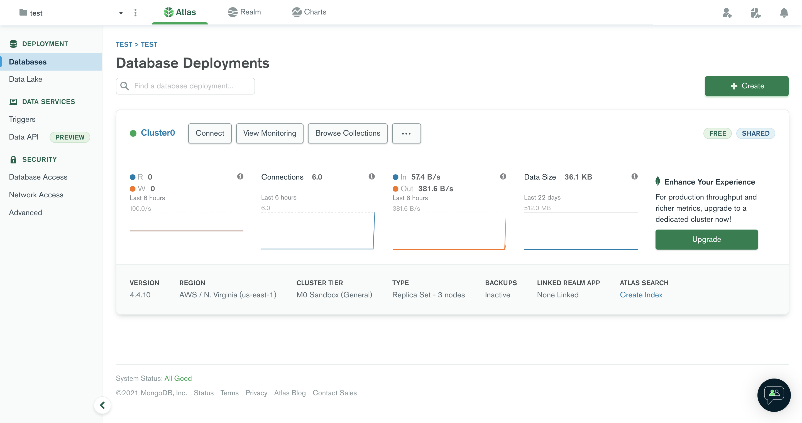
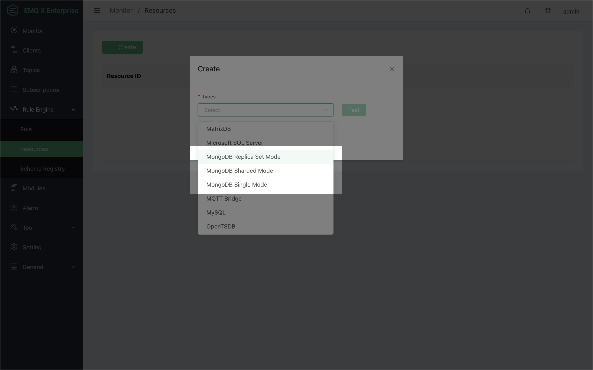
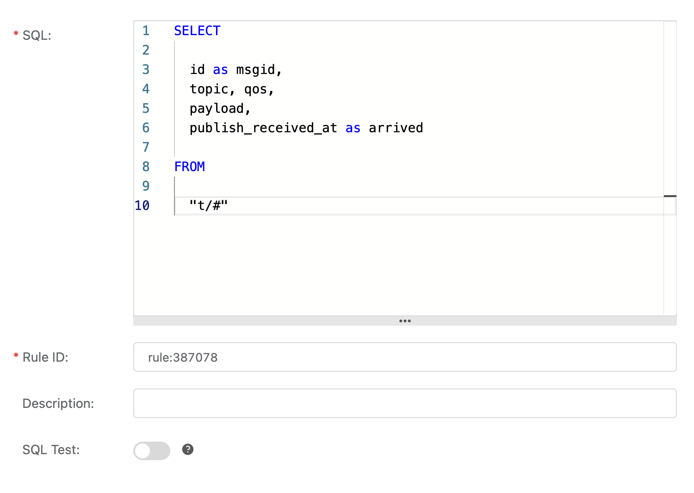
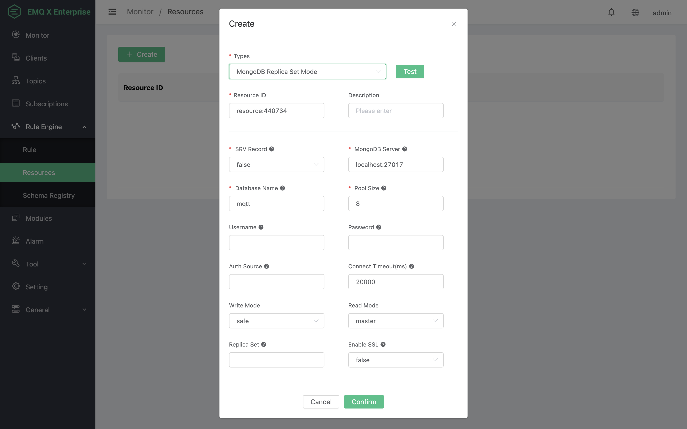
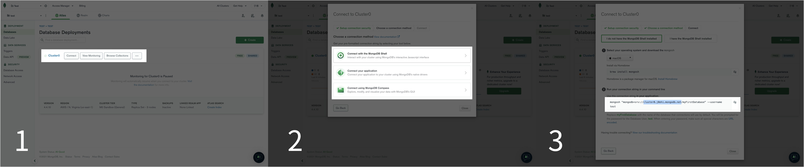
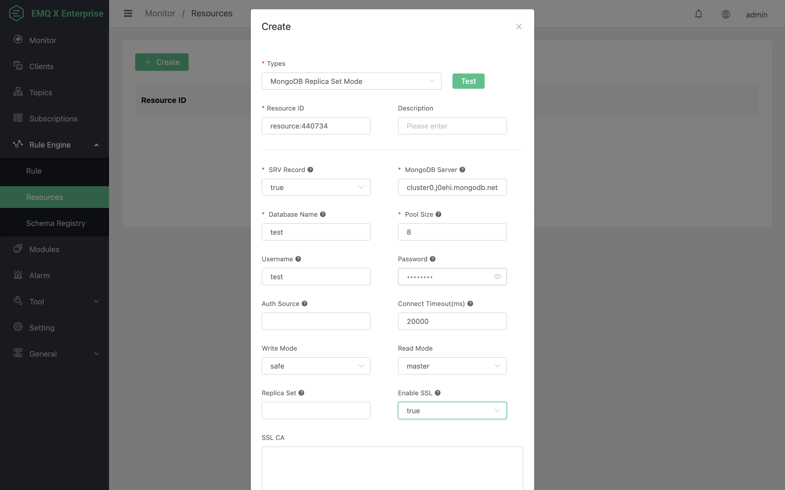
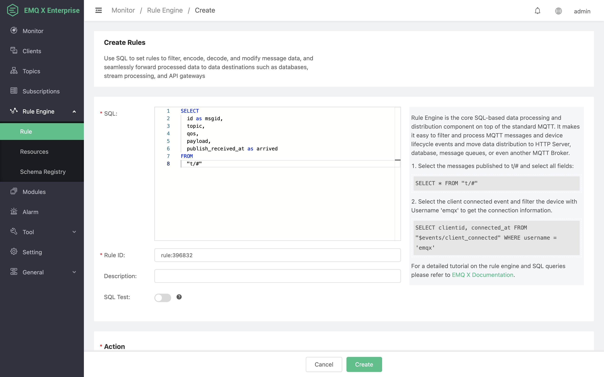
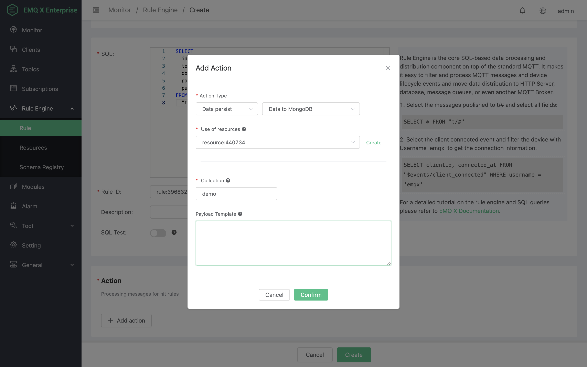
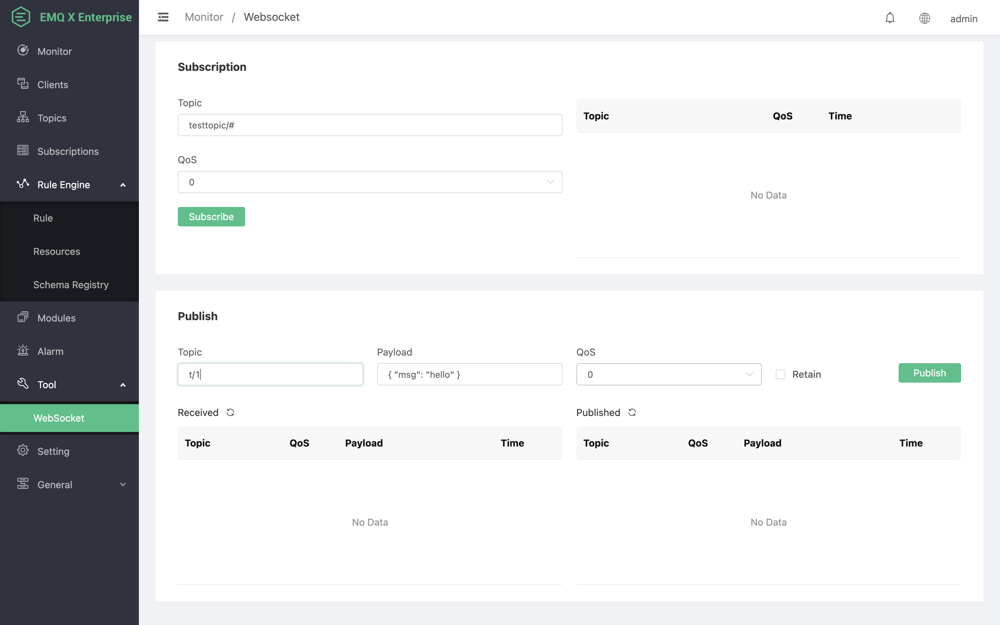
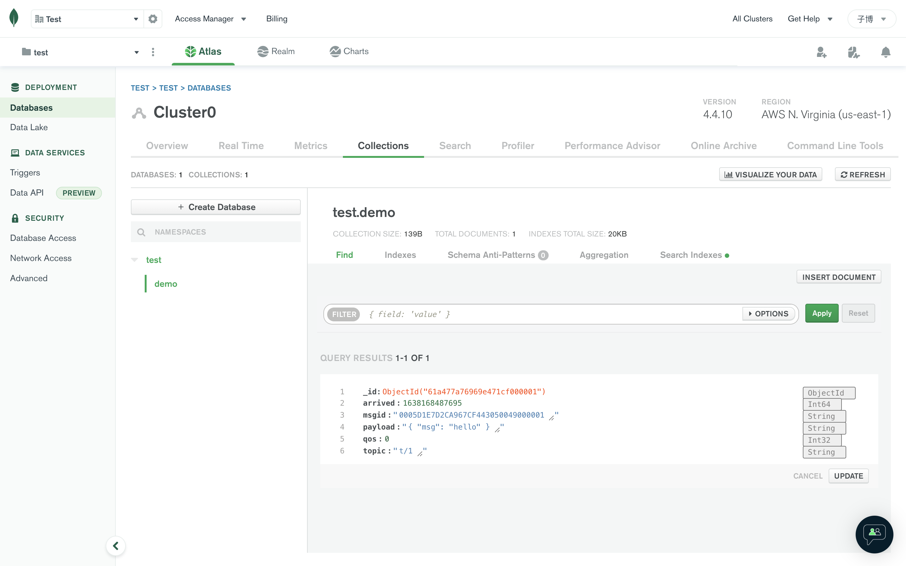

# Ingest Data into MongoDB
Setup a MongoDB database, and changes the username/password to root/public, taking Mac OSX for instance:

In order to facilitate the demonstration of some functions, the follow-up content will be introduced based on MongoDB Cloud. However, users who deploy MongoDB in other ways still can use this document to learn how to use MongoDB resources and actions.

We first deploy a cluster instance named Cluster0 on MongoDB Cloud as a replica set :



In this example, the cluster instance contains a master node and two slave nodes:


Before entering the next step, we also need to configure the user password and IP access whitelist on the `Database Access` and `Network Access` pages to ensure normal access.

## Create resources

After completing the above work, we will create MongoDB resources and rules in EMQX Dashboard.

First, open the EMQX Dashboard, enter the resource page of the rule engine, click the **Create** button in the upper left corner, and the **Create Resource** form will pop up. In the **Resource Type** drop-down box in the form, we can see three resource types of **MongoDB Single node mode**, **MongoDB Replica Set mode** and **MongoDB Sharded mode**, which correspond to the three deployment methods of MongoDB.



Here we select the **MongoDB Replica Set mode**, and then complete the configuration of the relevant parameters according to the actual situation of the MongoDB Server.

The following is a description of some parameters of MongoDB resources:

- **SRV Record**. it determines whether to query SRV and TXT records to obtain the server list and authSource and replicaSet options.
- **MongoDB Server**. It specifies the server list or the domain name with DNS SRV and TXT records added.
- **Database Name**, MongoDB database name.
- **Pool Size**, the connection process pool size, which can help obtain the best performance with reasonable configuration.
- **Username, Password**, authentication credentials.
- **Auth Source**. It specifies the database used for authorization, and the default is admin. If SRV records are enabled and a DNS TXT record containing the authSource option is added to your MongoDB server domain name, the authSource option in this record will be used first.
- **Write mode** It can be set to unsafe or safe. When set to safe, it will wait for the response of MongoDB Server and return it to the caller. If not specified, the default value safe will be used.
- **Read mode**. It can be set to master or slave_ok. When set to master, it means that the latest data will be read from the master node for each query. If not specified, the default value of master will be used.
- **Replica Set**. If your MongoDB is deployed in replica set mode, you need to specify the corresponding replica set name. However, if the **SRV record** is set to true, and your MongoDB server domain name has a DNS TXT record with the replicaSet option, you can ignore this configuration item.
- **Enable SSL**, whether to enable TLS connection. When set to true, more TLS related configurations will appear, please configure as needed. Note: SSL must be enabled when connecting to MongoDB Cloud.


Go to [EMQX Dashboard](http://127.0.0.1:18083/#/rules), select the "rule" tab on the menu to the left. Then type in the following SQL:

```sql
SELECT id as msgid, topic, qos, payload, publish_received_at as arrived FROM "t/#"
```





According to the status of SRV Record, we can configure MongoDB resources in the following two ways:

### Enable SRV Record

By default, MongoDB Cloud provides a domain name with SRV and TXT records added for connection.

We can click the Connect button of the Cluster0 instance on the Databases page of MongoDB Cloud, and select one of the three connection methods. Then, we can see the connection string to be used by the current instance. The selected part of the cursor is the content of the **MongoDB Server**  field that we need to configure to the MongoDB resource of the EMQX rule engine later.



Now, we continue to complete the configuration of MongoDB resources. Here we mainly made the following changes:

1. Set **SRV Record** to true, and then set **MongoDB Server** to the domain name we just obtained.
2. Set **Database Name** to test, which is the default database of MongoDB Cloud. You can configure it as needed.

3. Configure **Username** and **Password**. You need to configure them according to the actual situation.

4. **Auth Source** and **Replica Set** remain empty. EMQX will automatically query DNS TXT records.
5. Set **Enable SSL** to true. This is the connection requirement of MongoDB Cloud. Please configure as needed when deploying in other ways.



Finally, we click the **OK** button at the bottom of the **Create Resource** form to complete the creation. At this time, a new MongoDB resource instance is successfully created in EMQX:
::: tip
From EMQX Enterprise 4.4.11 and 4.3.17, we can use placeholders in `${var}` format for the collections.
:::

2). Payload template. Payload template is the keys and values you'd
like to insert into mongodb when the action is triggered. In this
example we'll insert all the available fields we got from the rule SQL in JSON format, so we just leave the payload template as empty.

:::
MongoDB requires a JSON string when writing, so please ensure your template is a valid JSON format after all the placeholders are placed with the values. For example, you could write this in your template:

```
{"client": "${clientid}"}
```
:::


### Disable SRV Record

If we choose not to enable SRV Record, then in the replica set and sharded mode, we need to fill in all the node addresses of the MongoDB cluster in the **MongoDB Server** option. In the replica set mode, we must also specify the replica set name.

In order to quickly obtain the configuration information, we can use the `nslookup` command to query DNS records:

```
$ nslookup
> set type=SRV 
> _mongodb._tcp.cluster0.j0ehi.mongodb.net
Server:         26.26.26.53
Address:        26.26.26.53#53

Non-authoritative answer:
_mongodb._tcp.cluster0.j0ehi.mongodb.net        service = 0 0 27017 cluster0-shard-00-01.j0ehi.mongodb.net.
_mongodb._tcp.cluster0.j0ehi.mongodb.net        service = 0 0 27017 cluster0-shard-00-02.j0ehi.mongodb.net.
_mongodb._tcp.cluster0.j0ehi.mongodb.net        service = 0 0 27017 cluster0-shard-00-00.j0ehi.mongodb.net.

Authoritative answers can be found from:
> set type=TXT 
> cluster0.j0ehi.mongodb.net
Server:         26.26.26.53
Address:        26.26.26.53#53

Non-authoritative answer:
cluster0.j0ehi.mongodb.net      text = "authSource=admin&replicaSet=atlas-r36spx-shard-0"
```

Then fill in the queried server list in the **MongoDB Server** option in the format of `host[:port][,...hostN[:portN]]`, and configure **Auth Source**  and **Replica Set** according to the queried TXT record content:


Finally, we also click the **OK** button at the bottom of the **Create Resource** form to complete the creation.

## Create rules

### 1. Configure SQL
Back to the creating rule page, then click on "Create" button. The rule we created will be show in the rule list.

After the resource is created, we need to create the corresponding rules. Click the **Create** button at the upper left corner of the rule page to enter the **Create Rule** page, and enter the following SQL:

```
SELECT
	id as msgid,
	topic,
	qos,
	payload,
	publish_received_at as arrived
FROM
	"t/#"
```

This SQL means that all messages that match the topic filter `t/#` will trigger this rule, such as `t/1`, `t/1/2`, etc. The filtered data, such as msgid and topic, can be used to perform subsequent actions.



### 2. Add response action

Click the **Add Action** button. For **Action Type**, select data persistence and data to MongoDB. Then, select a resource we just created in the **Use Resource** drop-down list. Configure **Collection** on demand, here I configure it as demo. **Message content template** remains empty, which means that the data filtered by SQL is converted into Json data in the form of a Key-Value list and is written to MongoDB. Multiple response actions can be added to each rule. Here we only need one response action. Therefore, after adding the following actions, we can click the **Create** button at the bottom of the page to complete the creation of the rule.



## Test and Verification

We directly use the MQTT client tool in Dashboard to publish a message. In this example, we change the message topic to `t/1` to hit the rules we set. The Payload and QoS remain unchanged. Then, click **publish**.



After the message is successfully published, we can see the data just written on the Collections page of the Cluster0 cluster instance of MongoDB Cloud:


