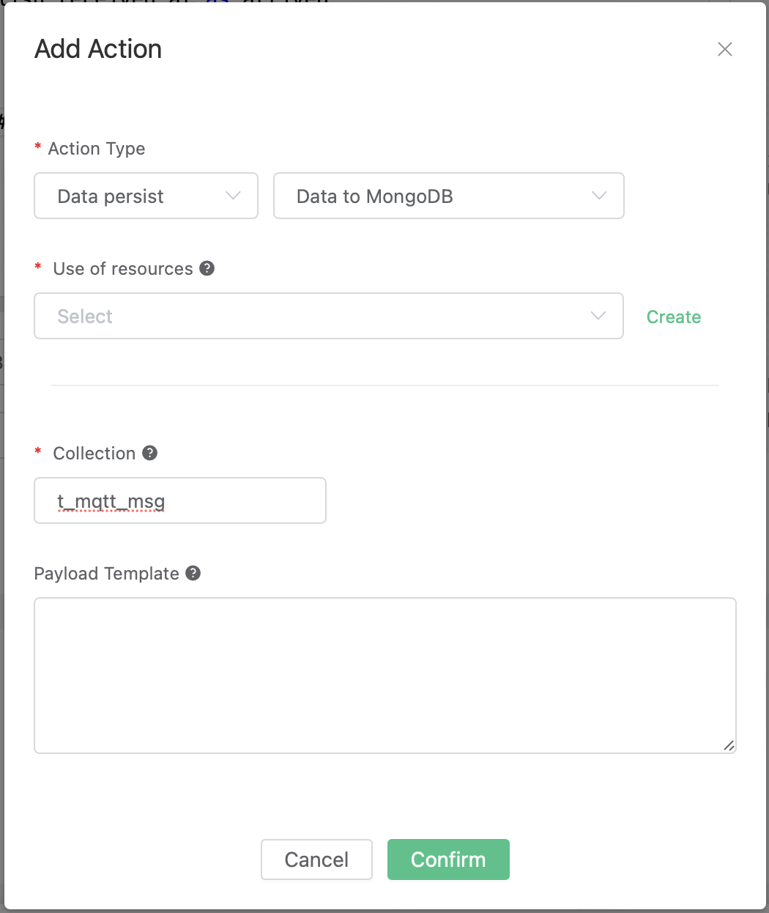

# Save data to MongoDB
Setup a MongoDB database, and changes the username/password to root/public, taking Mac OSX for instance:

```bash
$ brew install mongodb
$ brew services start mongodb

## add user root
$ use mqtt;
$ db.createUser({user: "root", pwd: "public", roles: [{role: "readWrite", db: "mqtt"}]});

## change the config file to enable authentication
$ vim /usr/local/etc/mongod.conf

    security:
        authorization: enabled

$ brew services restart mongodb
```

Initiate the MongoDB table:

```bash
$ mongo 127.0.0.1/mqtt -uroot -ppublic

db.createCollection("t_mqtt_msg");
```

Create a rule:

Go to [EMQX Dashboard](http://127.0.0.1:18083/#/rules), select the "rule" tab on the menu to the left.

Select "message.publish", then type in the following SQL:

```sql
SELECT
    *
FROM
    "message.publish"
```


Bind an action:

Click on the "+ Add" button under "Action Handler", and then select
"Data to MongoDB" in the pop-up dialog window.



Fill in the parameters required by the action:

Two parameters is required by action "Data to MongoDB":

1). The mongodb collection. Set it to "t_mqtt_msg" we just created.

2). Selector template. Selector template is the keys and values you'd
like to insert into mongodb when the action is triggered. In this
example we'll insert a message into mongodb, so type in the following
sql
template:

```sql
msgid=${id},topic=${topic},qos=${qos},payload=${payload},retain=${retain},arrived=${timestamp}
```

Before data is inserted into the table, placeholders like \${key} will
be replaced by the corresponding values.


3). Bind a resource to the action. Since the dropdown list "Resource"
is empty for now, we create a new resource by clicking on the "New
Resource" to the top right, and then select "MongoDB Single Mode":


Configure the resource:

Set "Database Name" to "mqtt", "Username" to "root", "Password" to
"public", "Auth Source" to "mqtt", and keep all other configs as
default, and click on the "Testing Connection" button to make sure the
connection can be created successfully, and then click on the "Create"
button..


Back to the "Actions" dialog, and then click on the "Confirm" button.


Back to the creating rule page, then click on "Create" button. The rule we created will be show in the rule list:


We have finished, testing the rule by sending an MQTT message to emqx:

```bash
Topic: "t/mongo"
QoS: 1
Retained: true
Payload: "hello"
```

Then inspect the MongoDB table, verify a new record has been inserted:


And from the rule list, verify that the "Matched" column has increased
to 1:


