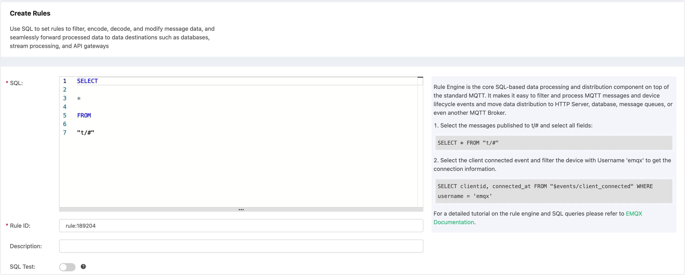
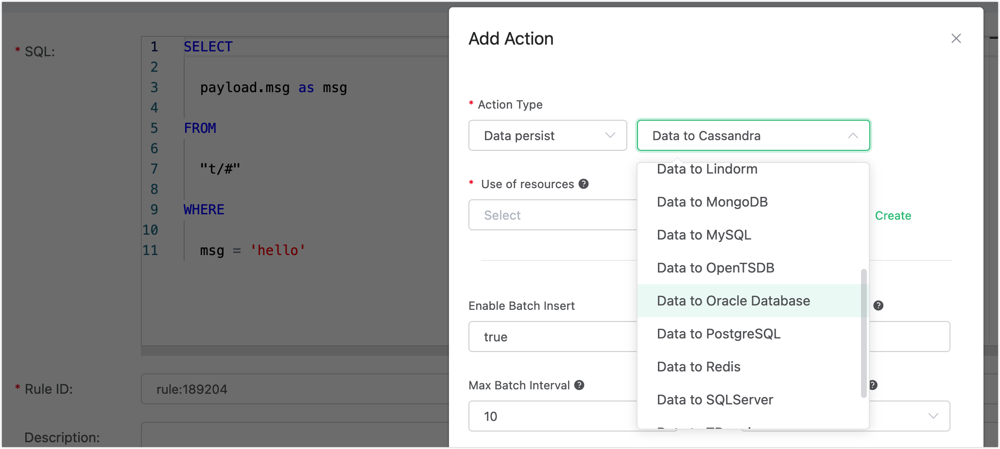
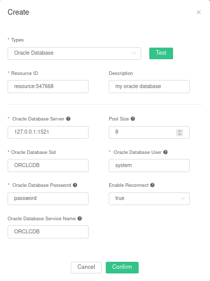
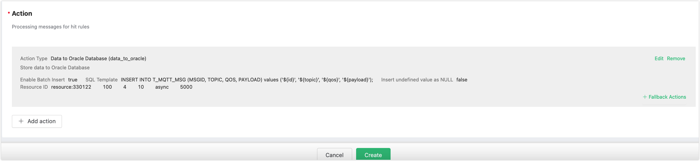
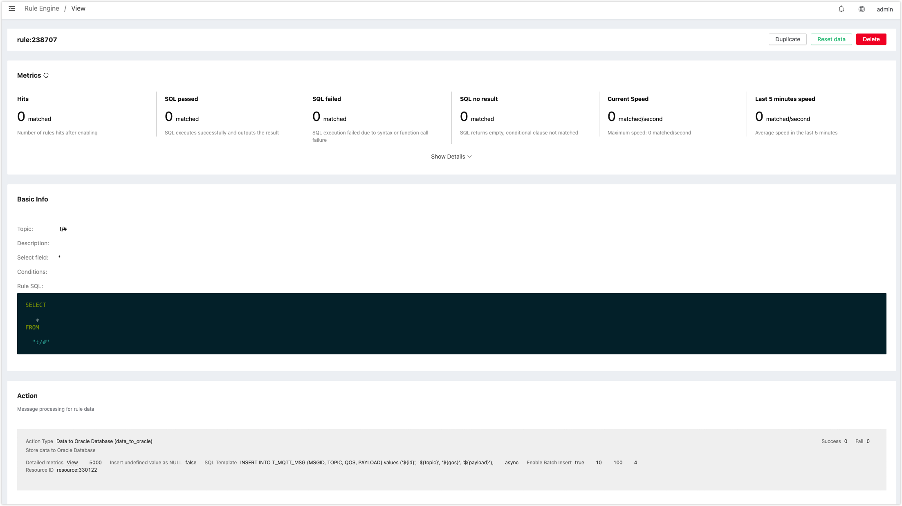

# 保存数据到 Oracle DB

创建 t_mqtt_msg 表:

```sql
CREATE TABLE t_mqtt_msg (msgid VARCHAR2(64),topic VARCHAR2(255), qos NUMBER(1), payload NCLOB)
```


创建规则:

打开 [EMQ X Dashboard](http://127.0.0.1:18083/#/rules)，选择左侧的 “规则” 选项卡。

填写规则 SQL:

```sql
SELECT * FROM "t/#"
```



关联动作:

在 “响应动作” 界面选择 “添加”，然后在 “动作” 下拉框里选择 “保存数据到 Oracle Database”。



填写动作参数:

“保存数据到 Oracle Database” 动作需要两个参数：

1). SQL 模板。这个例子里我们向 Oracle Database 插入一条数据，SQL 模板为:

```sql
INSERT INTO T_MQTT_MSG (MSGID, TOPIC, QOS, PAYLOAD) values ('${id}', '${topic}', '${qos}', '${payload}');
```

2). 关联资源的 ID。现在资源下拉框为空，可以点击右上角的 “新建资源” 来创建一个 Oracle Database  资源:

填写资源配置:



点击 “新建” 按钮。

返回响应动作界面，点击 “确认”。


返回规则创建界面，点击 “创建”。



在规则列表里，点击 “查看” 按钮或规则 ID 连接，可以预览刚才创建的规则:



规则已经创建完成，现在发一条数据:

```bash
Topic: "t/a"
QoS: 1
Payload: "hello"
```

查看规则命中次数


