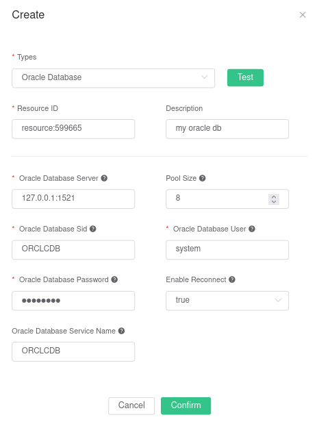

# Save data to Oracle DB

Create t_mqtt_msg table:

```sql
CREATE TABLE t_mqtt_msg (msgid VARCHAR2(64),topic VARCHAR2(255), qos NUMBER(1), payload NCLOB)
```


Create rules:

Open [EMQ X Dashboard](http://127.0.0.1:18083/#/rules) and select the "Rules" tab on the left.

Fill in the rule SQL:

```sql
SELECT * FROM "t/#"
```


Related actions:

In the "Response Action" interface, select "Add", and then select "Save Data to Oracle Database" in the "Action" drop-down box.


Fill in the action parameters:

The "Save data to Oracle Database" action requires two parameters:

1). SQL template. In this example, we insert a piece of data into Oracle Database. The SQL template is:

```sql
INSERT INTO T_MQTT_MSG (MSGID, TOPIC, QOS, PAYLOAD) values ('${id}', '${topic}', '${qos}', '${payload}');
```

2). The ID of the associated resource. Now that the resource drop-down box is empty, and you can click "New Resource" in the upper right corner to create an Oracle Database resource:

Fill in the resource configuration:



Click the "New" button.

Return to the response action interface and click "OK".


Return to the rule creation interface and click "Create".


In the rule list, click the "View" button or the rule ID connection to preview the rule just created:


The rule has been created. Now, send a piece of data:

```bash
Topic: "t/a"
QoS: 1
Payload: "hello"
```

View the number of rule hits

