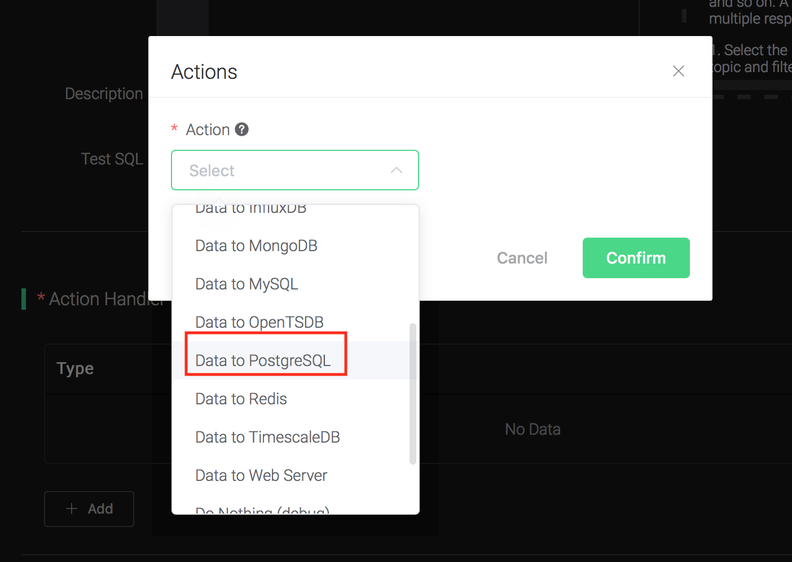
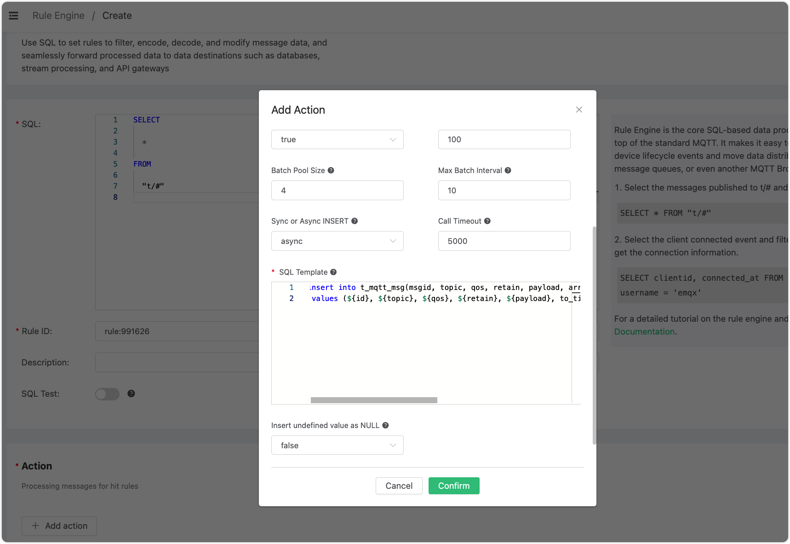
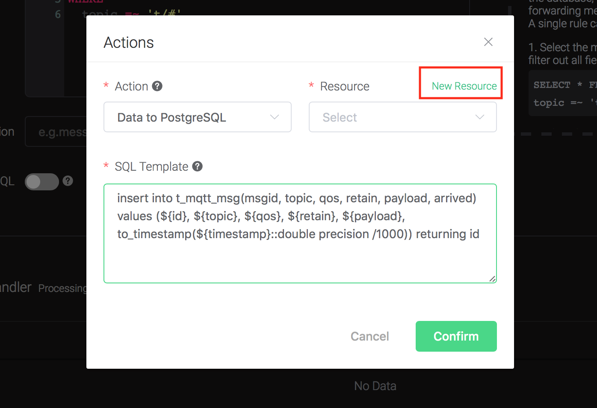
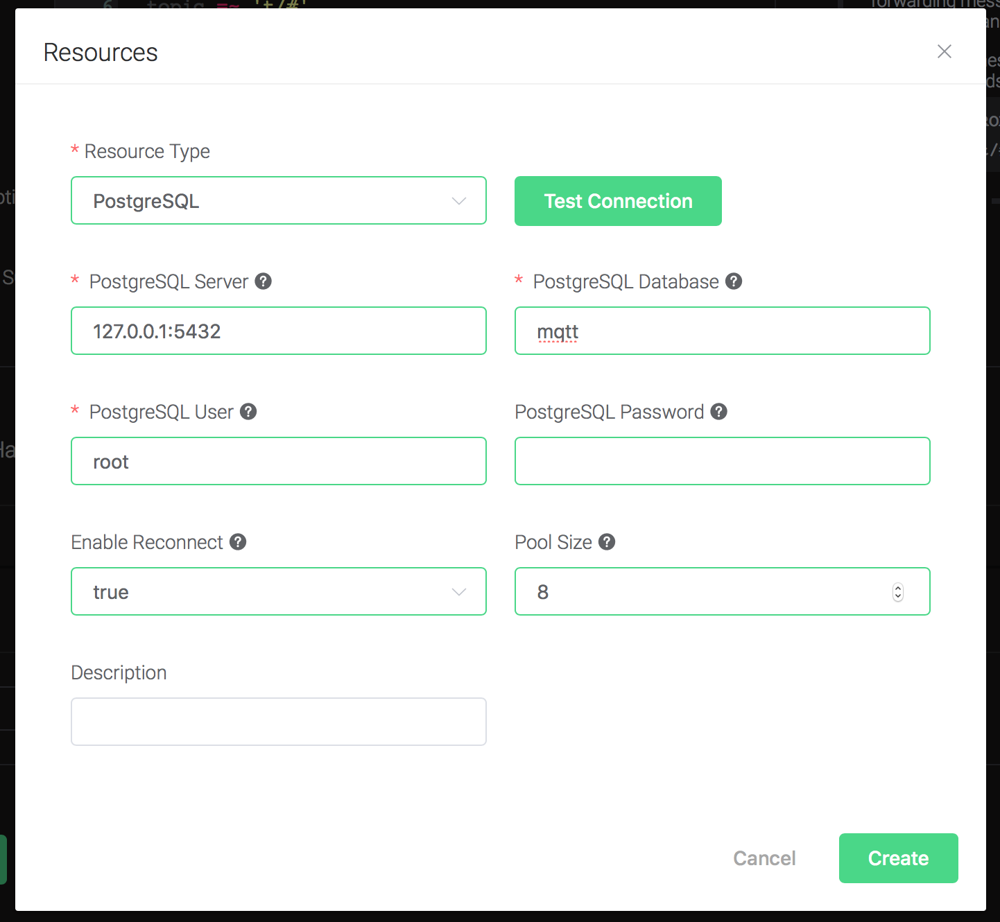
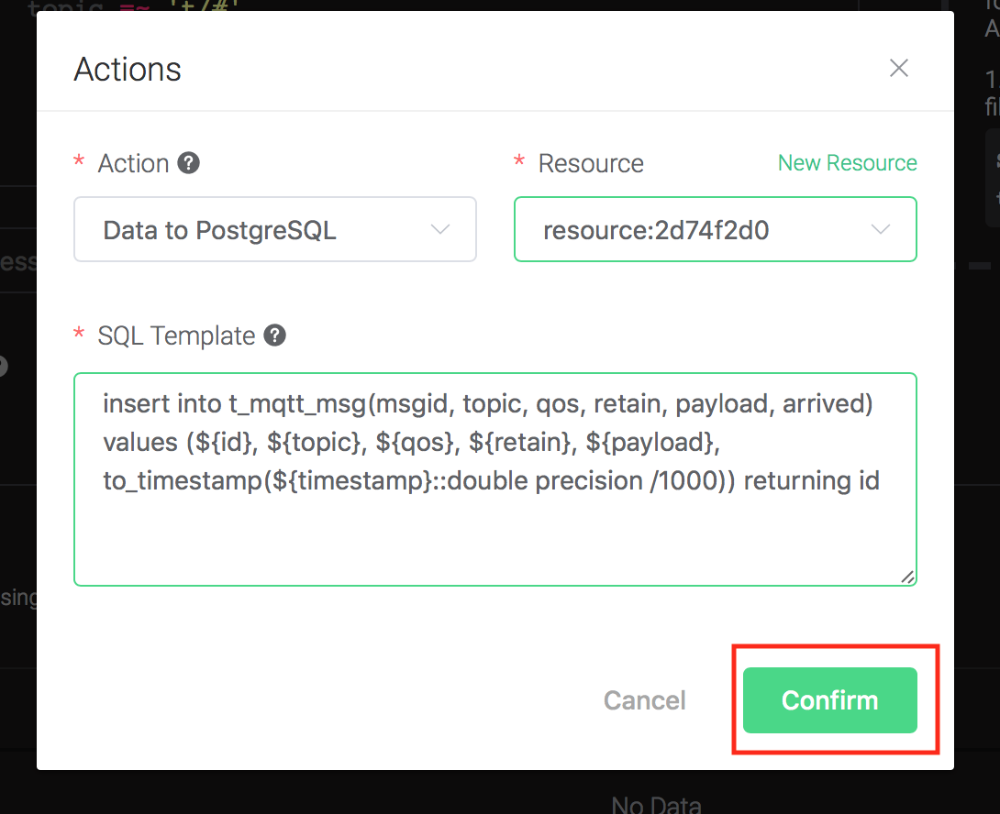
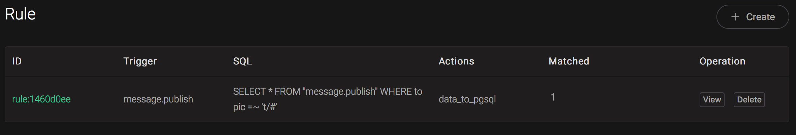

# Ingest Data into PostgreSQL

Setup a PostgreSQL database, taking Mac OSX for instance:

```bash
$ brew install postgresql

$ brew services start postgresql

## create root user
$ createuser --interactive --pwprompt
Enter name of role to add: root
Enter password for new role: public
Enter it again: public
Shall the new role be a superuser? (y/n) y

## create database named 'mqtt' using root
$ createdb -U root mqtt

$ psql -U root mqtt

mqtt=> \dn;
List of schemas
Name  | Owner
--------+-------
public | shawn
(1 row)
```

Initiate PgSQL table:

```bash
\$ psql -U root mqtt
```

create `t_mqtt_msg` table:

```sql
CREATE TABLE t_mqtt_msg (
    id SERIAL primary key,
    msgid character varying(64),
    sender character varying(64),
    topic character varying(255),
    qos integer,
    retain integer,
    payload text,
    arrived timestamp without time zone
);
```

Create a rule:

Go to [EMQX Dashboard](http://127.0.0.1:18083/#/rules), select the "Rule" tab on the menu to the left.

Select "message.publish", then type in the following SQL:

```sql
SELECT
 *
FROM
 "message.publish"
```


Bind an action:

Click on the "+ Add" button under "Action Handler", and then select
"Data to PostgreSQL" in the pop-up dialog window.



Fill in the parameters required by the action:

Two parameters is required by action "Data to PostgreSQL":

1). SQL template. SQL template is the sql command you'd like to run
when the action is triggered. In this example we'll insert a message
into pgsql, so type in the following sql
template:

```sql
insert into t_mqtt_msg(msgid, topic, qos, retain, payload, arrived) values (${id}, ${topic}, ${qos}, ${retain}, ${payload}, to_timestamp(${timestamp}::double precision /1000)) returning id
```

Before data is inserted into the table, placeholders like \${key} will
be replaced by the corresponding values.



2). Bind a resource to the action. Since the dropdown list "Resource"
is empty for now, we create a new resource by clicking on the "New
Resource" to the top right, and then select "PostgreSQL":



Select "PostgreSQL Resource".

Configure the resource:

Set "PostgreSQL Database" to "mqtt", "PostgreSQL User" to "root", and
keep all other configs as default, and click on the "Testing
Connection" button to make sure the connection can be created
successfully.

Finally click on the "Create" button.



Back to the "Actions" dialog, and then click on the "Confirm"
    button.



Back to the creating rule page, then click on "Create" button. The
    rule we created will be show in the rule list:


We have finished, testing the rule by sending an MQTT message to
    emqx:

```bash
> Topic: "t/1"
>
> QoS: 0
>
> Retained: false
>
> Payload: "hello1"
```

Then inspect the PgSQL table, verify a new record has been inserted:


And from the rule list, verify that the "Matched" column has increased
to 1:


