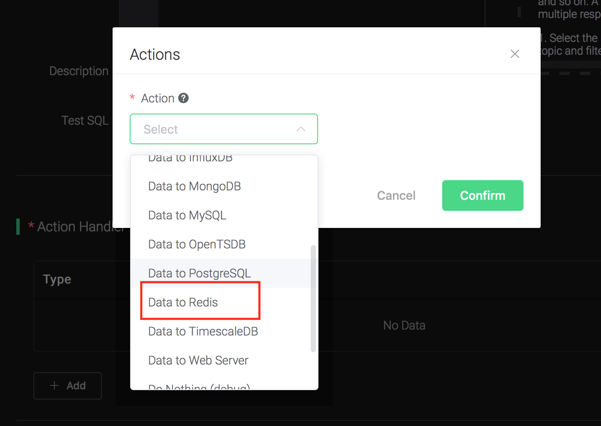
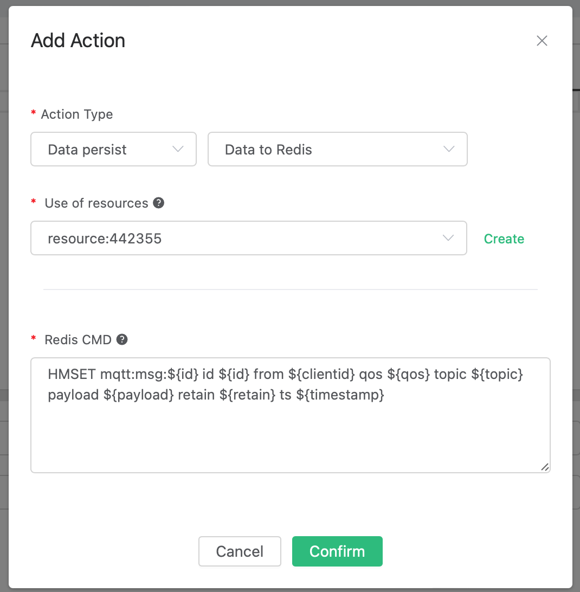
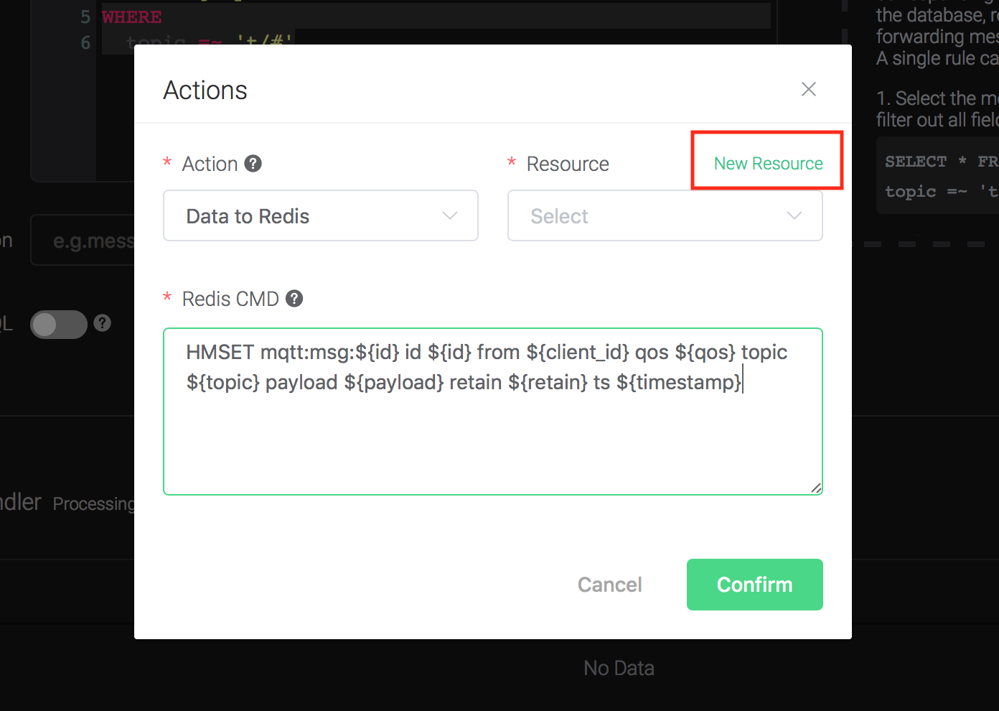
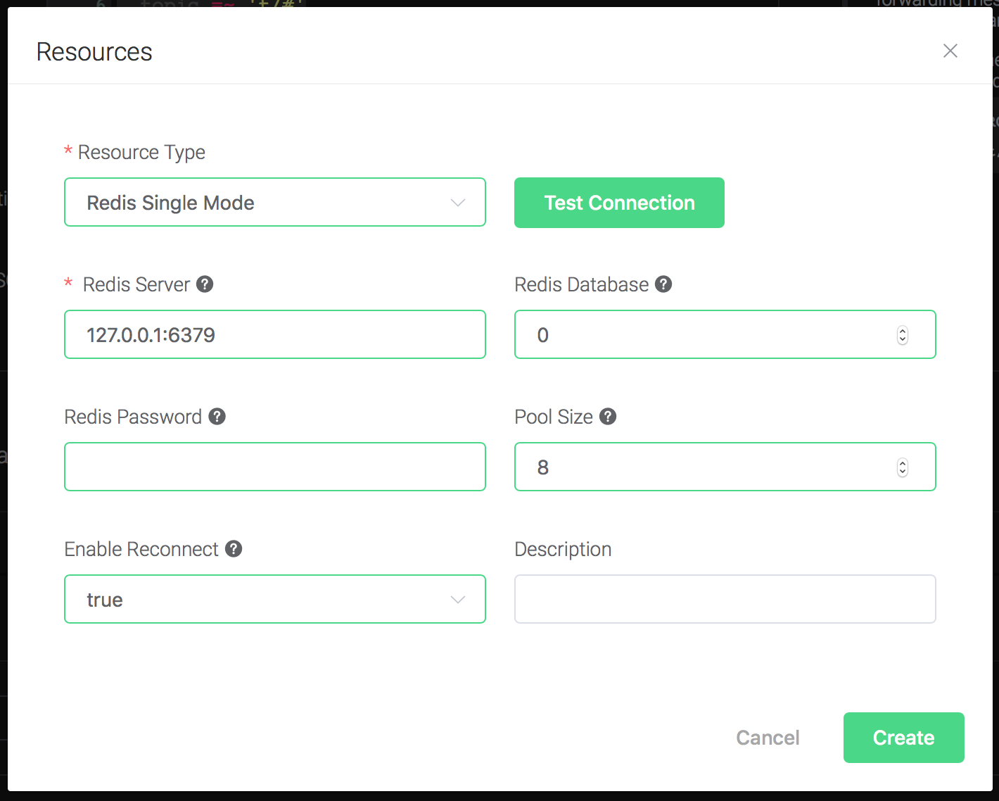
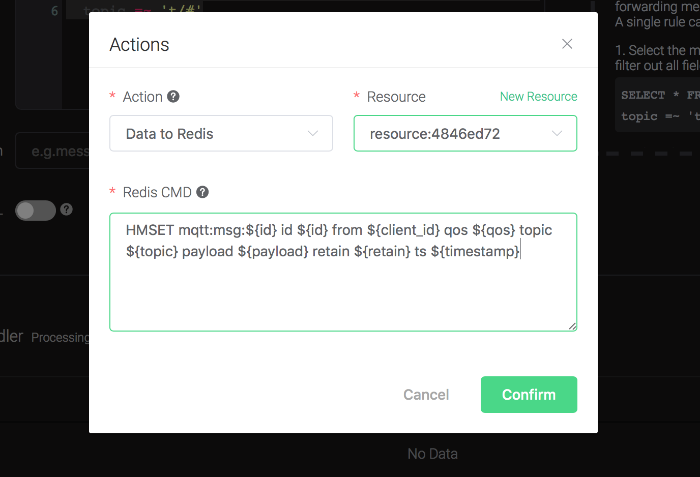
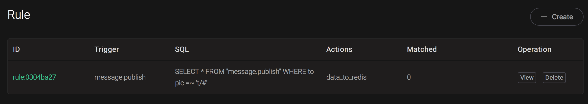
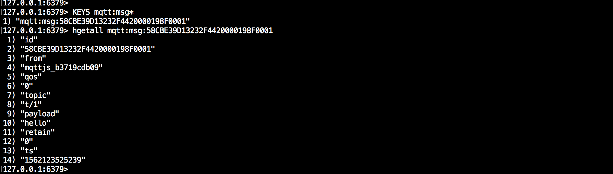
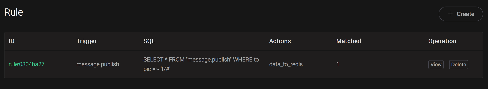

# Save data to Redis

Setup a Redis database, taking Mac OSX for instance:

```bash
$ wget http://download.redis.io/releases/redis-4.0.14.tar.gz
$ tar xzf redis-4.0.14.tar.gz
$ cd redis-4.0.14
$ make && make install

# start redis
$ redis-server
```

Create a rule:

Go to [EMQ X Dashboard](http://127.0.0.1:18083/#/rules), select the "rule" tab on the menu to the left.

Select "message.publish", then type in the following SQL:

```sql
SELECT
    *
FROM
    "message.publish"
```


Bind an action:
```
Click on the "+ Add" button under "Action Handler", and then select
"Data to MySQL" in the pop-up dialog window.
```


Fill in the parameters required by the action:

Two parameters is required by action "Data to Redis":

1). Redis CMD. The redis command you'd like to run when the action is
triggered. In this example we'll insert a message into redis, so type in the following command:

```bash
HMSET mqtt:msg:${id} id ${id} from ${client_id} qos ${qos} topic ${topic} payload ${payload} retain ${retain} ts ${timestamp}
```



2). Bind a resource to the action. Since the dropdown list "Resource"
is empty for now, we create a new resource by clicking on the "New
Resource" to the top right, and then select "Redis Single Mode":



Configure the resource:
```
Fill in the "Redis Server", and keep all other configs as default,
and click on the "Testing Connection" button to make sure the
connection can be created successfully, and then click on the
"Create" button.
```


Back to the "Actions" dialog, and then click on the "Confirm" button.



Back to the creating rule page, then click on "Create" button. The
    rule we created will be show in the rule list:



We have finished, testing the rule by sending an MQTT message to
    emqx:

```bash
Topic: "t/1"

QoS: 0

Retained: false

Payload: "hello"
```

Then inspect the Redis table, verify a new record has been inserted:

```bash
\$ redis-cli

127.0.0.1:6379\> KEYS mqtt:msg\*

127.0.0.1:6379\> hgetall <key\>
```



And from the rule list, verify that the "Matched" column has increased
to 1:


