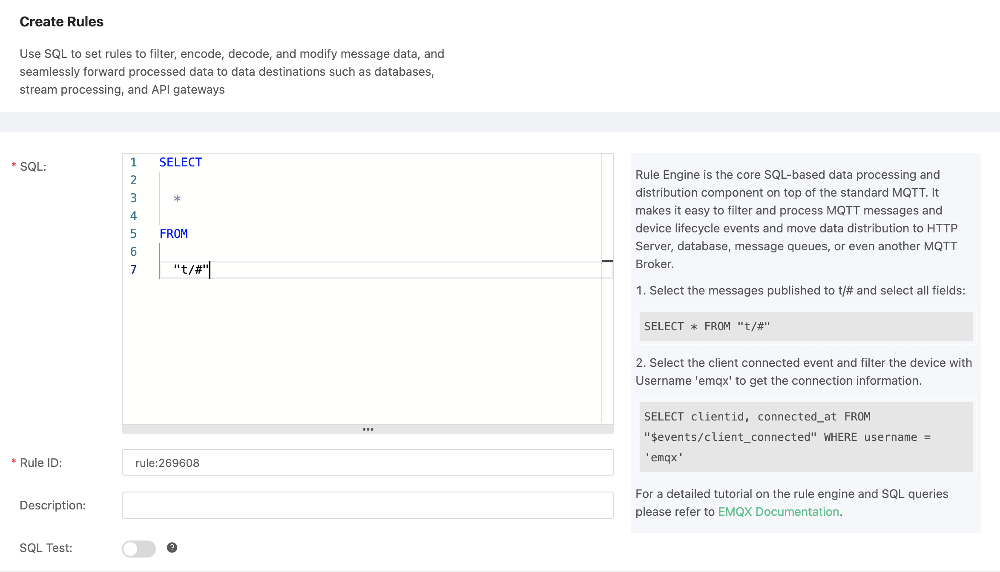
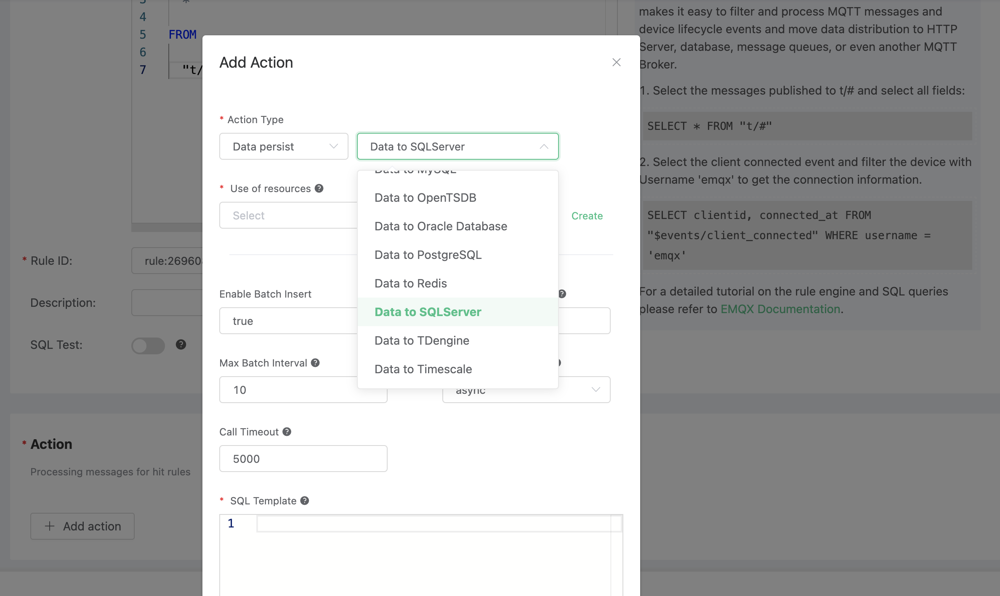
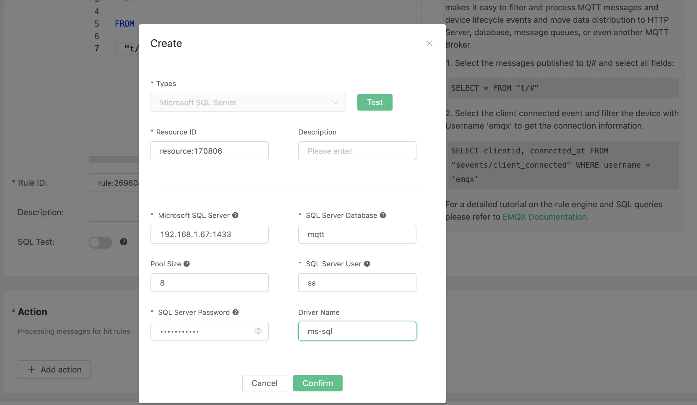
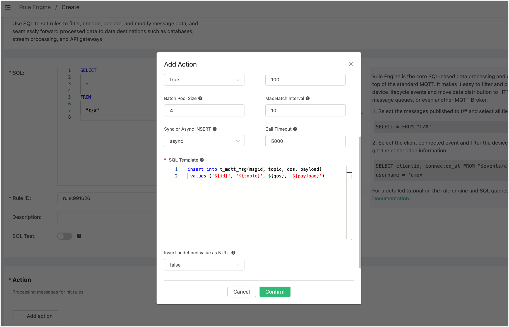
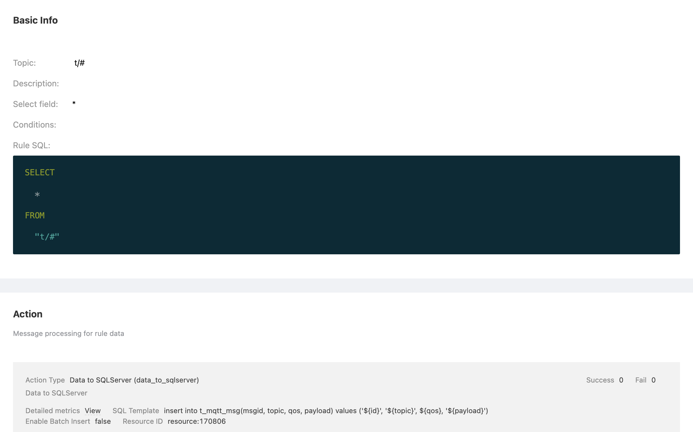
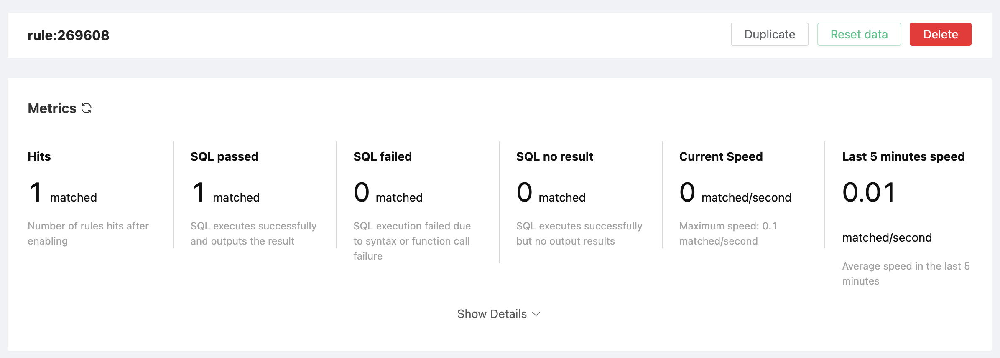
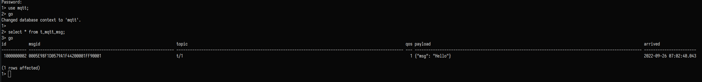

# 保存数据到 SQLServer

搭建 SQLServer 数据库，并设置用户名密码为 sa/mqtt_public，以 MacOS X 为例:

```bash
docker run -e 'ACCEPT_EULA=Y' -e 'SA_PASSWORD=mqtt_public' -p 1433:1433 -d mcr.microsoft.com/mssql/server:2017-latest
```

进入SQLServer容器， 初始化 SQLServer 表:

```bash
$ /opt/mssql-tools/bin/sqlcmd -S localhost -U sa -P mqtt_public -d master
$ mysql -u root -h localhost -ppublic
```

创建 “test” 数据库:
```bash
CREATE DATABASE test;
go;
```
创建 t_mqtt_msg 表:

```sql
USE test;
go;
CREATE TABLE t_mqtt_msg (id int PRIMARY KEY IDENTITY(1000000001,1) NOT NULL,
                         msgid   VARCHAR(64) NULL,
                         topic   VARCHAR(100) NULL,
                         qos     tinyint NOT NULL DEFAULT 0,
                         payload NVARCHAR(100) NULL,
                         arrived DATETIME NOT NULL DEFAULT CURRENT_TIMESTAMP);
go;
```

配置 odbc 驱动:
```
$ brew install unixodbc freetds
$ vim /usr/local/etc/odbcinst.ini

[ms-sql]
Description = ODBC for FreeTDS
Driver      = /usr/local/lib/libtdsodbc.so
Setup       = /usr/local/lib/libtdsodbc.so
FileUsage   = 1
```

创建规则:

打开 [EMQ X Dashboard](http://127.0.0.1:18083/#/rules)，选择左侧的 “规则” 选项卡。

填写规则 SQL:

```sql
SELECT * FROM "t/#"
```



关联动作:

在 “响应动作” 界面选择 “添加”，然后在 “动作” 下拉框里选择 “保存数据到 SQLServer”。



填写动作参数:

“保存数据到 SQLServer” 动作需要两个参数：
4
2). SQL 模板。这个例子里我们向 SQLServer 插入一条数据，SQL
​    模板为:

```sql
insert into t_mqtt_msg(msgid, topic, qos, payload) values ('${id}', '${topic}', ${qos}, '${payload}')
```



1). 关联资源的 ID。现在资源下拉框为空，可以点击右上角的 “新建资源” 来创建一个 SQLServer 资源:

填写资源配置:
数据库名填写 “mqtt”，用户名填写 “sa”，密码填写 “mqtt_public”



点击 “新建” 按钮。

返回响应动作界面，点击 “确认”。


返回规则创建界面，点击 “创建”。



在规则列表里，点击 “查看” 按钮或规则 ID 连接，可以预览刚才创建的规则:



规则已经创建完成，现在发一条数据:

```bash
Topic: "t/a"
QoS: 1
Payload: "hello"
```

然后检查 SQLServer 表，新的 record 是否添加成功:


