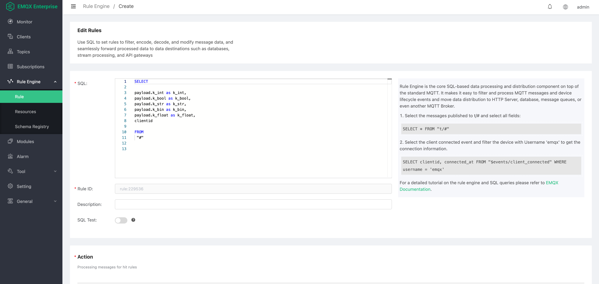

# 保存数据到 Alibaba Tablestore 数据库

Create a database instance (please refer to the official Tablestore documentation for the steps to create an instance).

</br>Click `Instances` . `Time Series Table`. `Create Time Series Table`.


## Manage Time Series Table

Click on the `Time Series Table` created in the previous step to enter the timeline management UI.
Click `Data Management`, `Query Data`, and `Add Time Series` according to the business design.
(This step can be skipped, Tablestore will automatically create a new `Time Series` when writing data that does not exist. The example does not operate on `Time Series`)


## Create rule engine resources

Click `Rule Engine` `Resources` `Create`. Find the `Tablestore(Time Series)`.


Using the created instance properties, fill in the corresponding `Tablestore server` and `Instance` names.

</br>
AccessKey & Secret need to use Alibaba Cloud account application, detailed application steps, please refer to the official documentation of Tablestore.
</br>
Please fill in different domain names according to the deployment method for the server address.


## Create Rule



Rule SQL used in the example:

```SQL
SELECT

payload.k_int as k_int,
payload.k_bool as k_bool,
payload.k_str as k_str,
payload.k_bin as k_bin,
payload.k_float as k_float,
clientid

FROM
 "#"
```

### Create Action

`Table Name` and `Data Source` name, please fill in the `Table Name` and `Data Source` name as created (`Data Source` name can be empty string).


Parameter List
| Parameter | Definition |
| --- | --- |
| Measurement | Tablestore Measurement |
| Data Source | Tablestore Data Source, default is empty string |
| TimeStamp(microsecond) |In microsecondMQTT messages in EMQX are timestamped with millisecond precision by default and cannot be used directly. Fill in the blank value,the default value is the microsecond timestamp of the message arriving at EMQX |
| TimeSeries Cache | Tablestore identifies whether the current data needs to be created or updated with timeline metadata. Enabled by default |
| Sync Write | Enable batch writing, or single simultaneous writing. The fallback actions is not triggered when batch writing |
| Async Batch Size | Maximum number of data entries for batch writing, only effective when `Sync Write` is false |
| Async Batch Interval(millisecond) | Maximum interval of data entries for batch writing, only effective when `Sync Write` is false |
| Tags | Data tags, all tags are handled as string |
| Fields | Data key-value pairs, with automatic data type recognition. String data is processed as binary data by default to ensure optimal character set compatibility |
| String Fields | String key-value pairs, data will be treated as string types |

Tablestore supported data types:

- int
- float
- boolean
- string
- binary

These types can be automatically recognized and classified by the rules engine. String data, however, is handled as a binary by default to ensure the best compatibility. If you need to specify a field value as a string, you can fill the field into the `String Fields` when you create the action. After that, the engine will handle the field value as a string.


### Test Data

Use the advanced desktop MQTT client, `MQTT X`, to log into the device and send a piece of data.


Enter the metric name (the demo uses `m_re2`), the client ID is `123456`, we use `client=123456` as the query condition and click `Search`.


You can see that the data has been written successfully.
