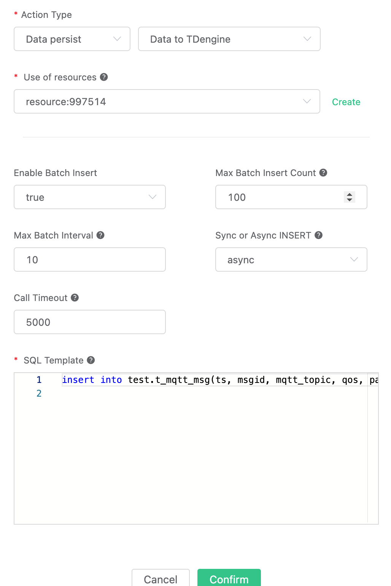

# Save data to TDengine

[TDengine](https://github.com/taosdata/TDengine)
</br>
TaosData(https://www.taosdata.com)
Enables efficient, real-time data ingestion, processing and monitoring of TB and even PB scale data per day, generated by billions of sensors and data collectors. TDengine can be widely applied to IoT, Industrial Internet, Connected Vehicles, DevOps, Energy , Finance and many other use-cases.

EMQX supports saving data to TDengine via **Send to Web Server**, and also provides native TDengine drivers on the Enterprise Edition for direct saving.

Install TDengine by docker or [Huawei Cloud](https://marketplace.huaweicloud.com/product/OFFI454488918838128640)

```bash
docker run --name TDengine -d -p 6030:6030 -p 6035:6035 -p 6041:6041 -p 6030-6040:6030-6040/udp tdengine/tdengine 
```

Execute cmd in docker:

```bash
docker exec -it TDengine bash
taos
```

Create database `test`

```bash
create database test;
```

Create table `t_mqtt_msg`. More [docs](https://tdengine.com/docs/en/v2.0/taos-sql):

```sql
USE test;
CREATE TABLE t_mqtt_msg (
  ts timestamp,
  msgid NCHAR(64),
  mqtt_topic NCHAR(255),
  qos TINYINT,
  payload BINARY(1024),
  arrived timestamp
);
```

Create Rule:

Open [EMQX Dashboard](http://127.0.0.1:18083/#/rules). Click `Rule`.

Write SQL:

```sql
SELECT

  *,
  now_timestamp('millisecond')  as ts

FROM

  "#"
```


The subsequent action creation operation can be selected flexibly depending on your EMQX version.

## Native SDK (Enterprise Edition)

Add Action:

Find `Action`, click `Add Action`.

Click `Data persist`, Choice `Data to TDengine`.

> Enterprise Edition 4.1.1 and later only.

Action parameters:

1. SQL template. In this example we insert a data to TDengine, note that we should specify the database name in the SQL and the character type should be enclosed in single quotes, the SQL template:

```sql
insert into test.t_mqtt_msg(ts, msgid, mqtt_topic, qos, payload, arrived) values (${ts}, '${id}', '${topic}', ${qos}, '${payload}', ${timestamp})
```

2. Now that the resource drop-down box is empty, you can create a TDengine resource by clicking on `Create` in the upper right corner:
  
Create new TDengine Resource:
</br>
TDEngine Username: root
</br>
TDEngine password: taosdata
</br>


Click `Confirm`.

Return to the action screen and click "Confirm".



Return to the rule screen and click "Create".

## Write by Web Server

To support development on different types of platforms, TDengine provides APIs that conform to REST design standards.

The [RESTful Connector](https://www.taosdata.com/cn/documentation/connector/#RESTful-Connector) provides the simplest way to connect, i.e. using HTTP requests carrying authentication information with the SQL operation to be performed TDengine.

Add Action:

Find `Action`, click `Add Action`.

Click `Data persist`, Choice `Data to Web Server`.

`Data to Web Server` parameters:

1. Using of resources: Associated Web Server resources, you can click the Create button to create new resources.
2. Method:`POST`
3. Path: `/rest/sql`
4. Headers: `Authorization Basic`, "root:taosdata" base64 encode is `cm9vdDp0YW9zZGF0YQ==`
5. Body: Request Body. In this example we are inserting a piece of data into TDengine, which should carry the INSERT SQL within the request body, noting that we should specify the database name in the SQL and the character type should be enclosed in single quotes, with the message content template as follows

```sql
-- Note: the topic is added as an identifier because in this example we will have two resources written to TDengine, and the identifier distinguishes between the data written natively and by the Web Server
insert into test.t_mqtt_msg(ts, msgid, mqtt_topic, qos, payload, arrived) values (${ts}, '${id}', 'http server ${topic}', ${qos}, '${payload}', ${timestamp})
```


Create Web Server resource:

</br>
Web Server config:
</br>
Request URL is http://127.0.0.1:6041.
</br>
Please fill in the other fields according to the server settings. If encrypted transmission is configured, please fill in the certificate information. Only the default parameters are used in the example.
</br>
Return to the rule screen and click "Create".


## Test

In the rule list, click on the Rule ID link to preview the rule you just created.


The rule has been created, now send a data:

```bash
Topic: "t/a"
QoS: 1
Payload: {"msg": "hello"}
```

Query and check:

```sql
select * from t_mqtt_msg;
```


