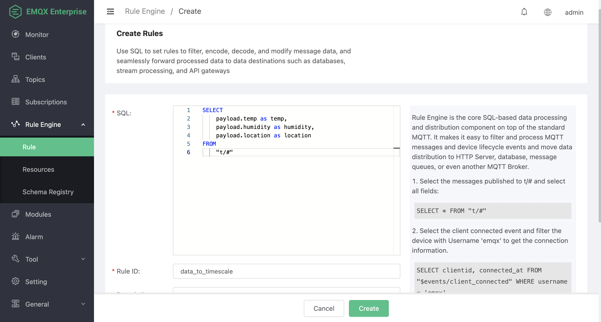
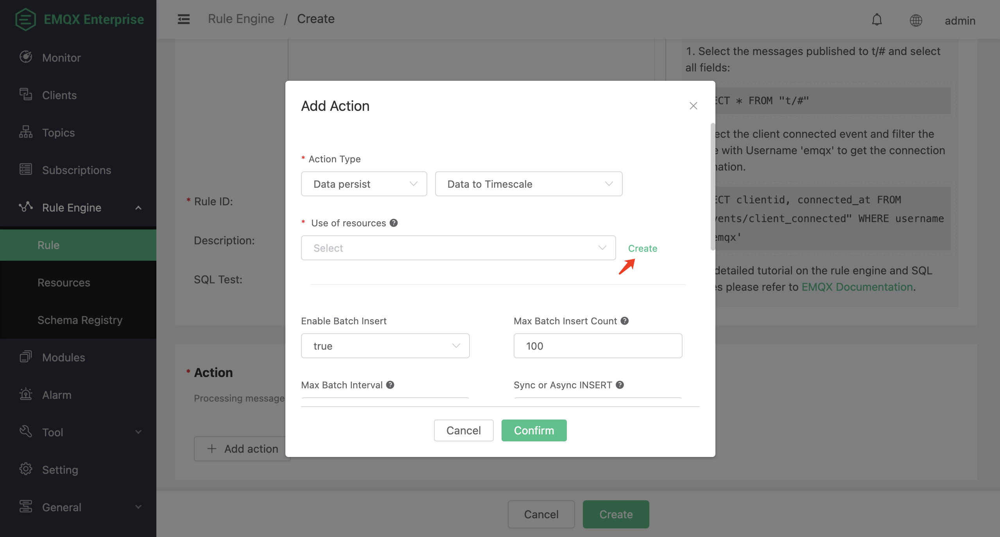
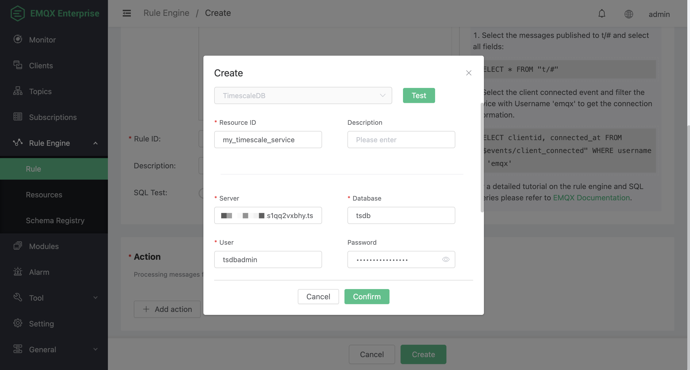
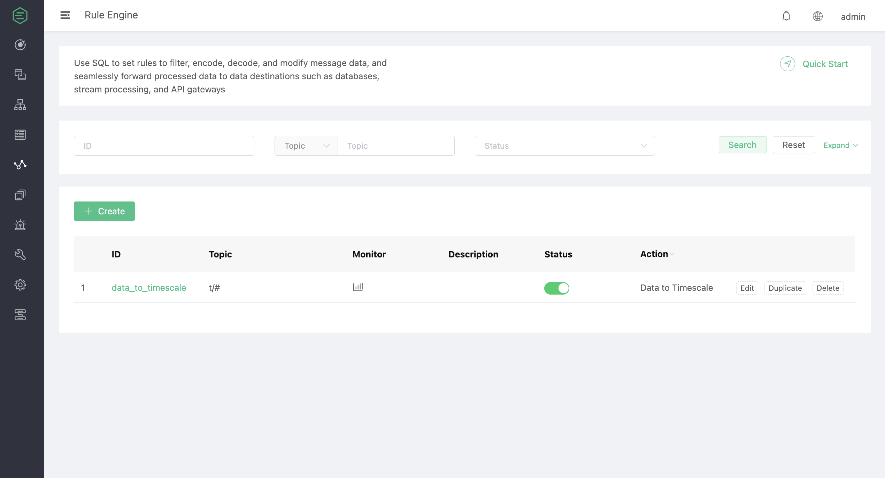

# Ingest Data into TimescaleDB

EMQX supports integration with TimescaleDB so you can save MQTT messages and client events to TimescaleDB or Timescale Service.

## Set Up TimescaleDB and Create Tables

You can use Timescale Service or TimescaleDB Docker image to set up a TimescaleDB instance.

:::: tabs 
::: tab Timescale Service

1. [Create a Timescale account](https://docs.timescale.com/getting-started/latest/services/#create-your-timescale-account), if you don't have one.
  
2. Sign in to the Timescale portal and [create a Timescale service](https://docs.timescale.com/getting-started/latest/services/#create-your-first-service). Save the **password** of the service.

3. Get the connection information from the service overview page. The fields required by EMQX include **Database name**, **Host**, **Port,** and **Username**.

4. [Connect to service](https://docs.timescale.com/getting-started/latest/services/#connect-to-your-service) with psql client.

   ```bash
   # connect to service by service URL
   psql "postgres://tsdbadmin@xxxxx.xxxxx.tsdb.cloud.timescale.com:32541/tsdb?sslmode=require"
   # use password in step 2
   Password for user tsdbadmin:
   ```

5. Create a table to save the client sensor data.

   ```sql
   CREATE TABLE sensor_data (
       time        TIMESTAMPTZ       NOT NULL,
       location    TEXT              NOT NULL,
       temperature DOUBLE PRECISION  NULL,
       humidity    DOUBLE PRECISION  NULL
   );
   
   SELECT create_hypertable('sensor_data', 'time');
   ```

After the table is successfully created, you can view the information of the table `sensor_data` under the **Explorer** Tab in Services.


:::

::: tab TimescaleDB Docker

1. [Install Docker](https://docs.docker.com/install/), if you don't have one.

2. Create a TimescaleDB container with Docker, and set the password of the database by `POSTGRES_PASSWORD` environment variable.

   ```bash
   docker run -d --name timescaledb \
       -p 5432:5432 \
       -e POSTGRES_PASSWORD=<your-password> \
       timescale/timescaledb:latest-pg13
   ```

3. Create a database to save the client sensor data.

   ```bash
   docker exec -it timescaledb psql -U postgres
   
   ## create tsdb database
   > CREATE database tsdb;
   
   > \c tsdb;
   ```

4. Create and initiate the table.

   ```sql
   CREATE TABLE sensor_data (
       time        TIMESTAMPTZ       NOT NULL,
       location    TEXT              NOT NULL,
       temperature DOUBLE PRECISION  NULL,
       humidity    DOUBLE PRECISION  NULL
   );
   
   SELECT create_hypertable('sensor_data', 'time');
   ```

:::

::::

## Create a Rule

1. Go to [EMQX Dashboard](http://127.0.0.1:18083/#/rules). Click **Rule Engine** -> **Rule** from the left navigation menu.

2. Type the following SQL in the **SQL** field:

   ```sql
   SELECT
       payload.temp as temp,
       payload.humidity as humidity,
       payload.location as location
   FROM
       "t/#"
   ```

   

3. Click the **+ Add action** button in the **Action** section. Select `Data persist` -> `Data to TimescaleDB` from the drop-down list of the **Action Type** field. Click the **Create** button to create a Timescale resource.

   

4. Fill the connection information in the **Create** pop-up dialog. Use `<host>:<port>` as **Server**. Click the **Confirm** button to create a Timescale resource.

   

5. In the **Add Action** dialog, input the SQL template. SQL template is the sql command to be run when the action is triggered. In this example, you can type the following SQL template to insert a message into TimescaleDB:

     ::: tip

     Before data is inserted into the table, placeholders like `${key}` will be replaced by the corresponding values.

     :::

   ```sql
   INSERT INTO 
       sensor_data (time, location, temperature, humidity)
   VALUES 
       (NOW(), ${location}, ${temp}, ${humidity})
   ```

6. Click **Confirm** to finish adding action. 

6. Back on the Create page, click **Create**. You can see the rule created is shown in the rule list.

   


## Test the Rule

You can use MQTTX CLI to test the rule by sending an MQTT message to EMQX:

```bash
mqttx pub -t t/1 -m '{"temp":24,"humidity":30,"location":"hangzhou"}'
```

Verify the TimescaleDB table. A new record should be inserted:

```bash
tsdb=> select * from sensor_data;
             time              | location | temperature | humidity
-------------------------------+----------+-------------+----------
 2023-06-25 10:14:05.456206+00 | hangzhou |          24 |       30
(1 row)
```

Click the icon in the **Monitor** column of the rule to see the metrics. Verify that the number of matched has increased to 1:


