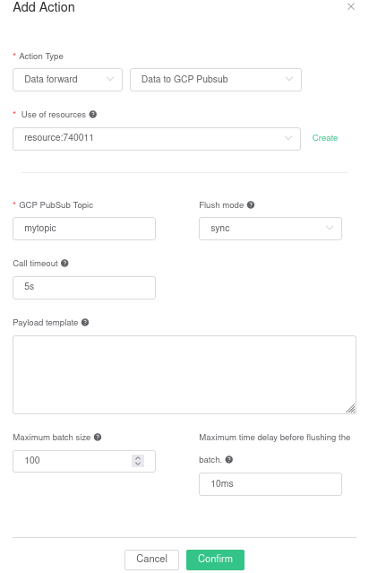

# Ingest Data into GCP PubSub
Starting from EMQX Enterprise e4.4.11, EMQX's Rule-Engine supports Google GCP PubSub integration.

EMQX GCP PubSub integration can send MQTT messages and events to [Google Cloud PubSub](https://cloud.google.com/pubsub?hl=en-us), which can help you flexibly choose services on Google Cloud and build IoT applications more easily.

The following steps will guide you to use this configuration.

::: tip
Introduced in `e4.4.11`
:::

## Setup

1. Create a [Service
   Account](https://developers.google.com/identity/protocols/oauth2/service-account#creatinganaccount)
   in your GCP account.  Ensure that the Service Account has
   permissions to at least publish messages to the topic of interest.
2. Create a Service Account Key for that account and download it in
   JSON format.
3. Create a PubSub topic (remember that the Service Account must have
   permissions to publish to that topic).

## Create the PubSub resource

Go to [EMQX Dashboard](http://127.0.0.1:18083/#/resources), select the
_"Rule Engine"_ item on the menu to the left, then _"Resources"_.
Then, click _"Create"_.

In the dialog, select the GCP PubSub type, and click _"Select file"_
to choose and upload the Service Account JSON file for the Service
Account you are going to use.  Click _"Confirm"_.


## Create the Rule and Action

Go to [EMQX Dashboard](http://127.0.0.1:18083/#/rules), select the
_"Rule Engine"_ item on the menu to the left, then _"Rule"_.  Then,
click _"Create"_.

Type in the following SQL:

```sql
SELECT
    *
FROM
    "t/gcp"
```


Then, click on _"Add Action"_.  Select the Action Type _"Data
Forward"_, _"Data to GCP PubSub"_ and in _"Use of resources"_ select
the GCP PubSub resource previously created.  Fill in the parameters
for the action.  The only required parameter to define here is the
PubSub Topic where the messages should be forwarded to.  Click
_"Confirm"_.



Finally, click _"Create"_ at the bottom of the page.

## Test the Action

You can test the new Action by sending a MQTT message to EMQX:

```bash
Topic: "t/gcp"

QoS: 0

Retained: false

Payload: "hello"
```

You may check that the metrics have increase for that rule with
the successful publishing.


By pulling the messages from the PubSub topic, you can verify that the
data has been forwarded to GCP.

```bash
# Create a subscription to your topic
gcloud pubsub subscriptions create my_subscription_id --topic=mytopic

# Pull data
gcloud pubsub subscriptions pull my_subscription_id --auto-ack
```
