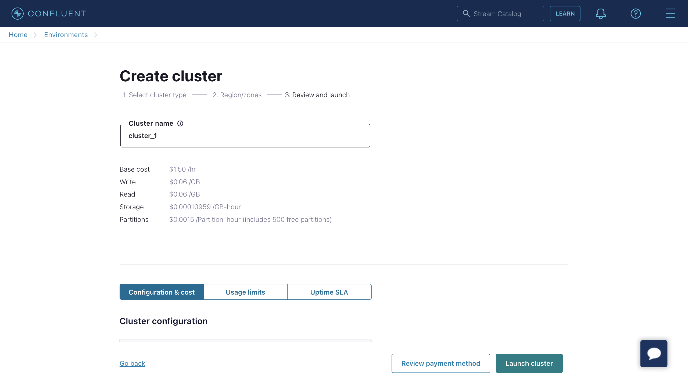
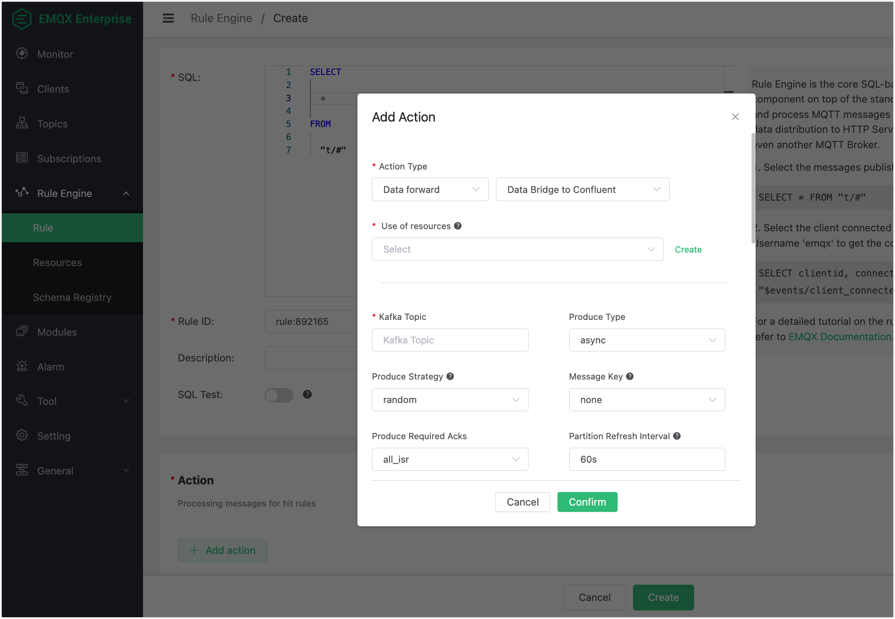

# Stream Data into Confluent

Confluent Cloud is a resilient, scalable, streaming data service based on Apache Kafka, delivered as a fully managed service. EMQX supports data integration with Confluent through a data bridge to enable you to stream MQTT data into Confluent seamlessly. This page mainly introduces you to the features and benefits of Confluent integration and guides you on how to configure Confluent Cloud and create a Confluent data bridge in EMQX.

## Features and Benefits

The integration of EMQX with Confluent offers the following features and advantages:

- **Reliable large-scale message transmission**: Both EMQX and Confluent Cloud adopt highly reliable cluster mechanisms, ensuring a stable and dependable message transmission channel with zero message loss for large-scale IoT device messages. They both support horizontal scaling by adding nodes and dynamically adjusting resources to handle sudden increases in large-scale messages, guaranteeing message transmission availability.
- **Powerful Data Processing Capability**: EMQX's native rule engine and Confluent Cloud both provide reliable stream data processing capabilities. They operate at different stages of IoT data, from devices to applications, allowing selective real-time data filtering, format conversion, aggregation, and analysis based on specific scenarios. This enables more complex IoT message processing workflows to meet the needs of data analytics applications.
- **Robust Integration Capability**: Leveraging various connectors provided by Confluent Cloud, EMQX can easily integrate with other databases, data warehouses, data stream processing systems, and more. This allows for the creation of complete IoT data pipelines and agile data analysis applications.
- **Processing capabilities in high-throughput situations**: The data integration supports both synchronous and asynchronous writing modes, allowing you to differentiate between real-time priority and performance priority for data writing strategies and enabling flexible balancing between latency and throughput according to different scenarios.
- **Effective topic mapping:** Numerous IoT business topics can be mapped into Kakfa topics by the configured Confluent data bridge. EMQX supports the MQTT user property mapping to Kafka headers and adopts various flexible topic mapping methods, including one-to-one, one-to-many, many-to-many, and also includes support for MQTT topic filters (wildcards).

## Configure Confluent Cloud

Before creating a Confluent data bridge, you must create a Confluent cluster in the Confluent Cloud console and create topic and API key using Confluent Cloud CLI.

### Create cluster

1. Login to the Confluent Cloud console and create a cluster. Select the Standard Cluster as an example, and click **Begin configuration**.

   

2. Select Region/zones. Make sure the deployment region matches the region of the Confluent Cloud. Click **Continue**.

   

3. Enter your cluster name and click **Launch cluster**.

   

### Create Topic and API Key Using Confluent Cloud CLI

Now that you have a cluster up and running in Confluent Cloud, and you can get the **Bootstrap server** URL in  **Cluster Overview** -> **Cluster Settings** page.


You can manage it using the Confluent Cloud CLI. Here are some basic commands that you could use with Confluent Cloud CLI.

#### Install the Confluent Cloud CLI

```bash
curl -sL --http1.1 https://cnfl.io/cli | sh -s -- -b /usr/local/bin
```

If you already have the CLI installed, you can update it using the command:

```bash
confluent update
```

#### Log in to Your Account

```bash
confluent login --save
```

#### Select the Environment

```bash
# list env
confluent environment list
# use env
confluent environment use <environment_id>
```

#### Select the Cluster

```bash
# list kafka cluster
confluent kafka cluster list
# use kafka
confluent kafka cluster use <kafka_cluster_id>
```

#### Use an API Key and Secret

If you have an existing API key to use, add it to the CLI using the command:

```bash
confluent api-key store --resource <kafka_cluster_id>
Key: <API_KEY>
Secret: <API_SECRET>
```

If you do not have the API key and secret, you can create one using the command:

```bash
$ confluent api-key create --resource <kafka_cluster_id>

It may take a couple of minutes for the API key to be ready.
Save the API key and secret. The secret is not retrievable later.
+------------+------------------------------------------------------------------+
| API Key    | YZ6R7YO6Q2WK35X7                                                 |
| API Secret | ****************************************                         |
+------------+------------------------------------------------------------------+
```

After add them to the CLI, you can use the API key and secret using the command:

```bash
confluent api-key use <API_Key> --resource <kafka_cluster_id>

```

#### Create a Topic

You can use the command below to create a topic:

```bash
confluent kafka topic create <topic_name>
```

You can use the command below to check the topic list:

```bash
confluent kafka topic list
```

#### Produce Messages to the Topic

You can use the command below to create a producer. After the producer starts, enter a message and press the Enter key. The message will be produced to the corresponding topic.

```bash
confluent kafka topic produce <topic_name>
```

#### Consume Messages from the Topic

You can use the command below to create a consumer.  It will output all messages in the corresponding topic.

```bash
confluent kafka topic consume -b <topic_name>
```

## Create a Confluent Data Bridge

This section provides instructions on how to create a Confluent data bridge in the EMQX Dashboard by creating a rule and adding an action to the rule to forward data to Confluent.

1. On EMQX Dashboard, click **Rule Engine** -> **Rule** from the left navigation menu.

2. Click **+ Create** on the Rule Engine page. Type the following SQL in **SQL** text box:

   ```sql
   SELECT
       *
   FROM
       "t/#"
   ```

3. Click the **+ Add Action** button in the **Action** area. In the **Add Action** pop-up window, select `Data forward` from the **Action Type** drop-down list and select `Data Bridge to Confluent`.

   

4. Click **Create** next to the **Use of resources** drop-down box to bind a resource to the action.

5. On the **Create** dialog, enter the information in **Endpoints** on Confluent cluster settings page to the **Bootstrap Servers** text box. Enter the API key and secret you created using the Confluent Cloud CLI to the **Key** and **Secret** text boxes. Keep all the other configuration items as default.

6. Click the **Test** button to make sure the connection can be created successfully, and then click the **Confirm** button.

   

6. Back to the **Add Action** dialog, configure the options for the rule action:

   - **Kafka Topic**: Enter the topic you created when you configured the Confluent, for example `t.1`.

   - **Kafka Headers**: (Optional) This field is used to directly send a variable output by the rule as Kafka Headers. For example, if you enter `${pub_props}`, the action will send all PUBLISH properties of the MQTT message processed by the rule as Kafka Headers.

   - **More Kafka Headers**: (Optional) This field provides a method to add one or more Kafka headers in the form of key-value pairs. The key and value can use placeholders in the format of `${var}`. For example, you can add a key-value pair with key `clientid` and value `${clientid}`. When a MQTT client with the client ID `foo` triggers the action, it will send out a Kafka header `clientid: foo`.

   - **Kafka Headers value encode mode**: This field allows you to select the encode mode for the key specified in the **Kafka Headers** and **More Kafka Headers** fields. When the specified key is not in string format, or the specified value is not in binary or string format, the value will be encoded before being sent out by the action.

     ::: tip

     According to the [specification](https://cwiki.apache.org/confluence/display/KAFKA/KIP-82+-+Add+Record+Headers), the key of Kafka Headers must be in string format(utf8), and its value must be in binary or string format.

     :::

     There are two optional values: `NONE` or `JSON`:

     - `NONE`: This option sends only headers with a string key and a binary or string value. It discards all headers with other key and value formats.
     - `JSON`: With this option, the system attempts to encode the `value` into a JSON string before sending any headers. If the encoding succeeds, the header is sent; otherwise, it is discarded. Additionally, the `key` must be in string format; otherwise, it will also be discarded.

   - Leave other options as default.

7. Click the **Confirm** button.

   

8. Back to the Create Rules page, you can see an action for processing messages for hit rules is added in **Action** pane. Click the **Create** button. The rule you created is shown in the rule list:

   

## Test the Data Bridge

1. You can test if the Confluent data bridge works properly by sending an MQTT message to EMQX:

```bash
Topic: "t/1"

QoS: 0

Retained: false

Payload: "hello"
```

2. Inspect the Confluent by consuming the message from the topic using the command:

```bash
confluent kafka topic consume -b t.1
```

3. Click the icon in the **Monitor** column of the rule. Verify that the "Matched" column has increased to 1.
