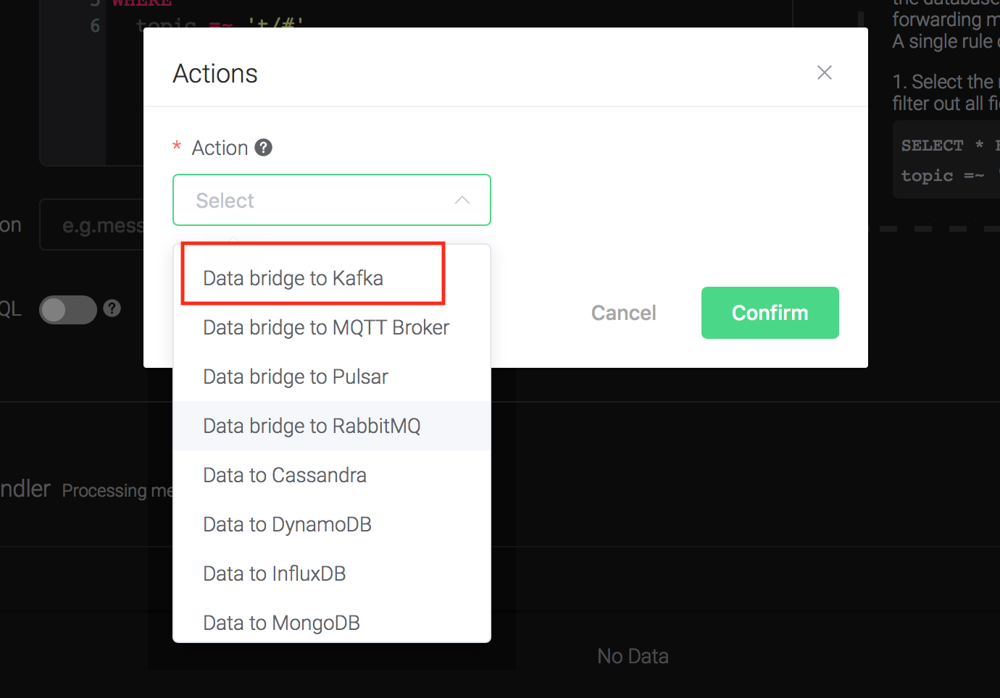
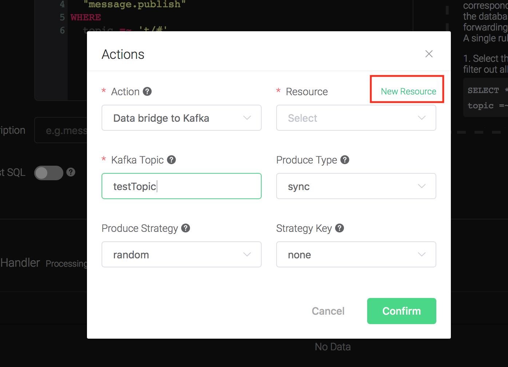
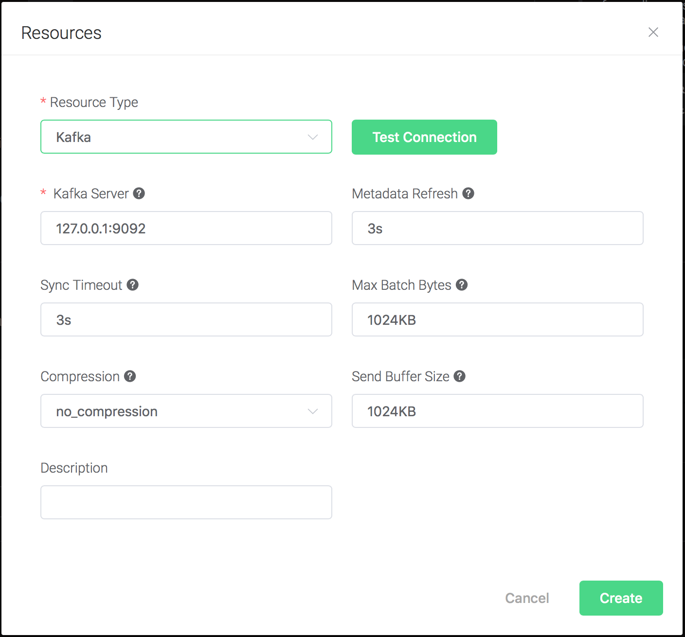
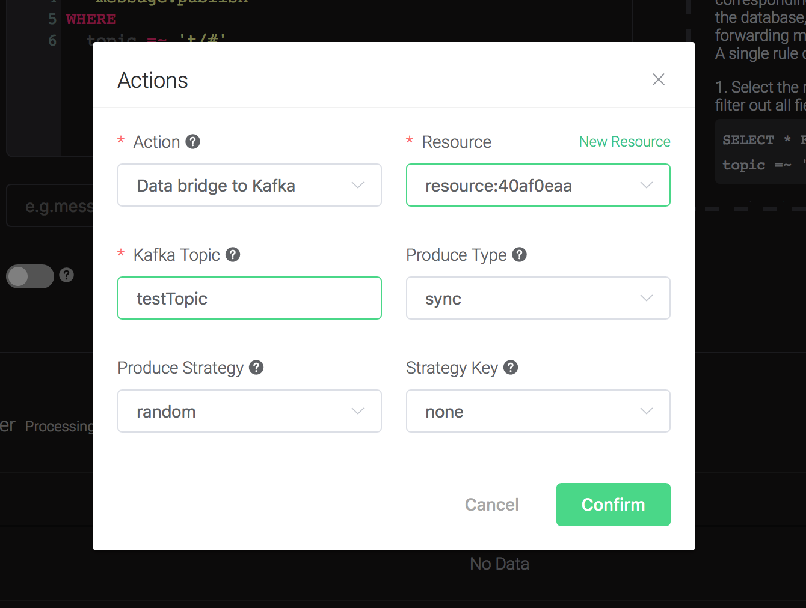
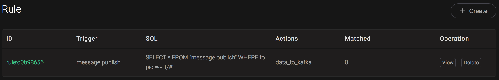

# Bridge data to Kafka

Setup a Kafka, taking Mac OSX for instance:

```bash
$ wget https://archive.apache.org/dist/kafka/2.3.0/kafka_2.12-2.3.0.tgz

$ tar -xzf  kafka_2.12-2.3.0.tgz

$ cd kafka_2.12-2.3.0

# start Zookeeper
$ ./bin/zookeeper-server-start.sh config/zookeeper.properties
# start Kafka
$ ./bin/kafka-server-start.sh config/server.properties
```


Create topics for
    Kafka:

```bash
$ ./bin/kafka-topics.sh --zookeeper localhost:2181 --replication-factor 1 --partitions 1 --topic testTopic --create

Created topic testTopic.

.. note:: Kafka topics should be created before creating the kafka rule, or the rule creation would not success.
```

Create a rule:

Go to [emqx dashboard](http://127.0.0.1:18083/#/rules), select the
"rule" tab on the menu to the left.

Select "message.publish", then type in the following SQL:

```bash
SELECT
    *
FROM
    "message.publish"
```


Bind an action:

Click on the "+ Add" button under "Action Handler", and then select
    "Data bridge to Kafka" in the pop-up dialog window.



Fill in the parameters required by the action:

Two parameters is required by action "Data to Kafka":

1). Kafka Topic

2). Bind a resource to the action. Since the dropdown list "Resource"
is empty for now, we create a new resource by clicking on the "New
Resource" to the top right, and then select "Kafka":



Configure the resource:
```
Set the "Kafka Server" to "127.0.0.1:9092" (multiple servers should
be separated by comma), and keep all other configs as default, and
click on the "Testing Connection" button to make sure the connection
can be created successfully, and then click on the "Create" button.
```


Back to the "Actions" dialog, and then click on the "Confirm"
    button.



Back to the creating rule page, then click on "Create" button. The
    rule we created will be show in the rule list:



We have finished, testing the rule by sending an MQTT message to
    emqx:

```bash
Topic: "t/1"

QoS: 0

Retained: false

Payload: "hello"
```

Then inspect Kafka by consume from the
topic:

```bash
$ ./bin/kafka-console-consumer.sh --bootstrap-server 127.0.0.1:9092  --topic testTopic --from-beginning
```

And from the rule list, verify that the "Matched" column has increased
to 1:


