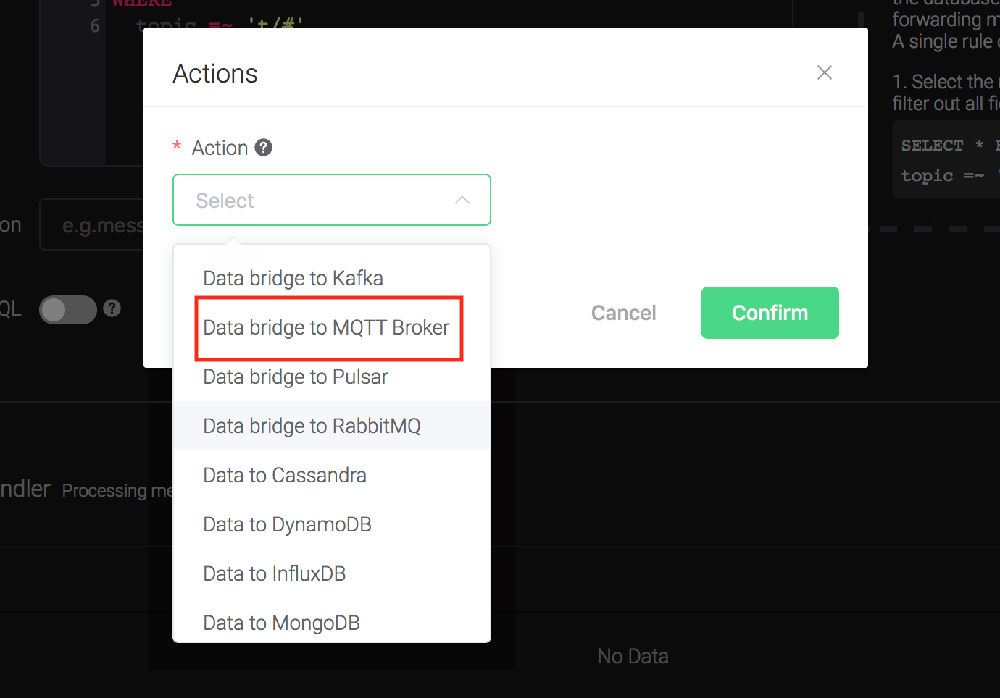
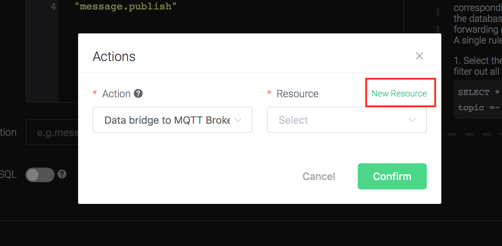
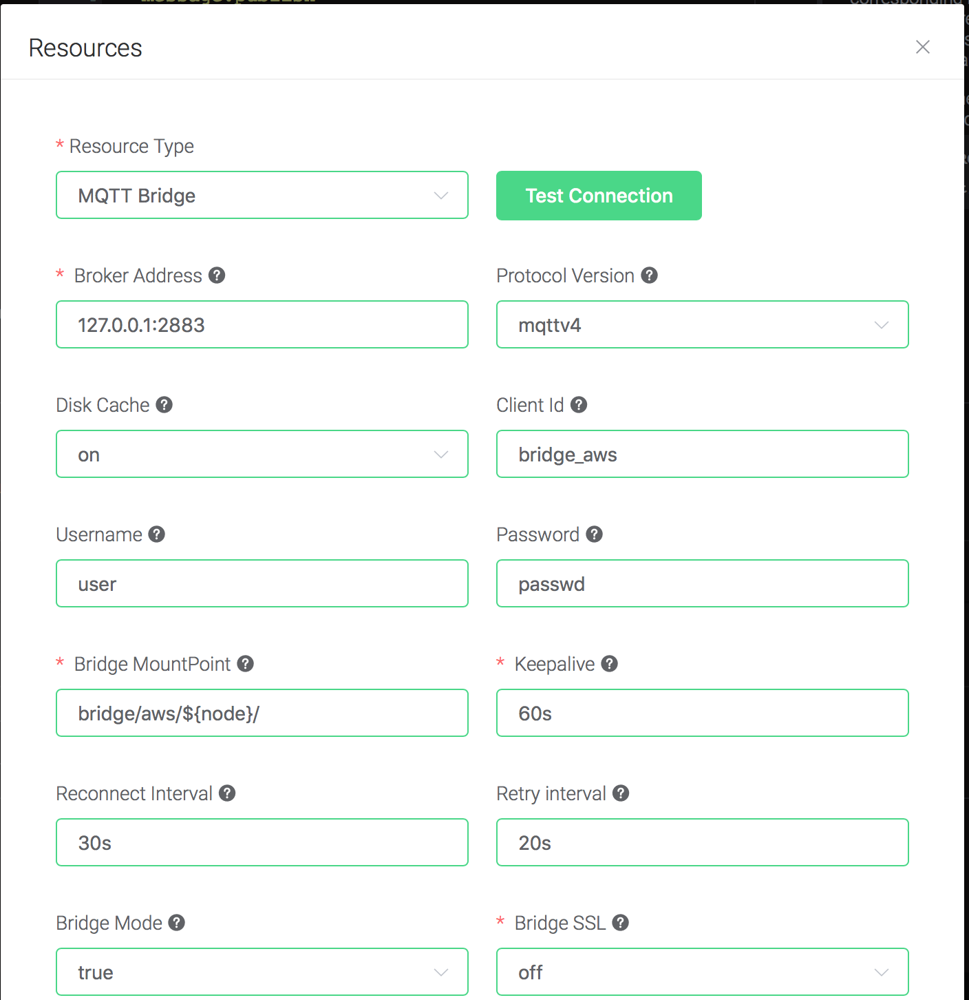
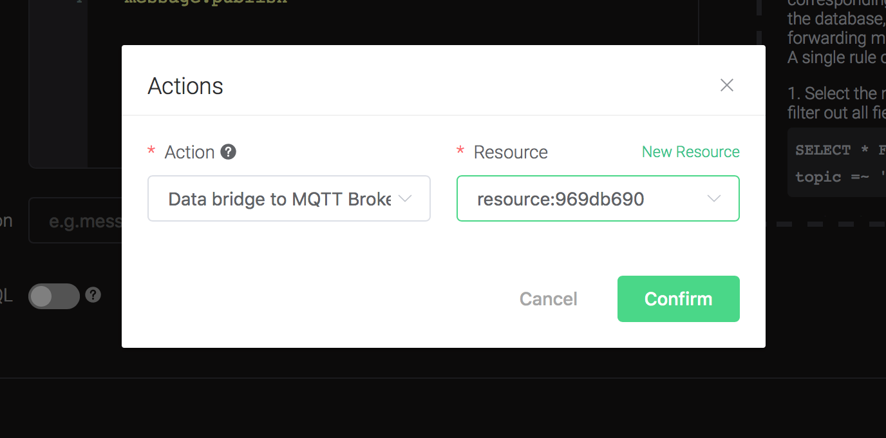
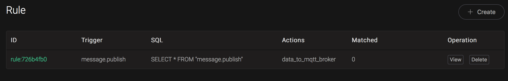
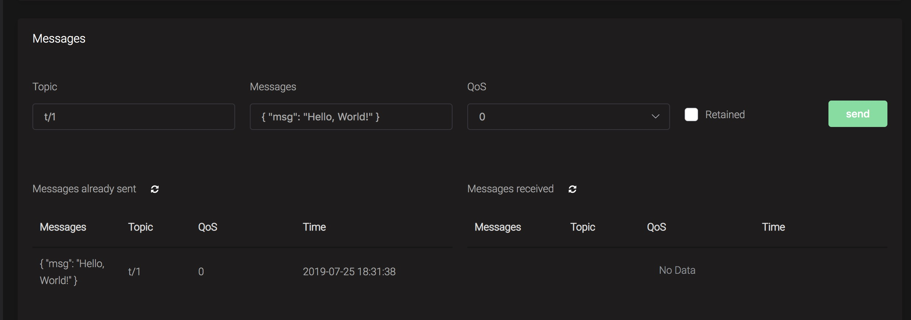

# Bridge data to MQTT Broker

Setup anther MQTT broker using mosquitto, change the port to 2883.
    Taking Mac OSX for instance:

```bash
$ brew install mosquitto

$ vim /usr/local/etc/mosquitto/mosquitto.conf

port 2883

# start mosquitto
$ brew services start mosquitto
```

Create a rule:

Go to [emqx dashboard](http://127.0.0.1:18083/#/rules), select the
"rule" tab on the menu to the left.

Select "message.publish", then type in the following SQL:

```sql
SELECT
    *
FROM
    "message.publish"
```


Bind an action:

    Click on the "+ Add" button under "Action Handler", and then select
    "Data bridge to MQTT Broker" in the pop-up dialog window.



Bind a resource to the action. Since the dropdown list "Resource" is
    empty for now, we create a new resource by clicking on the "New
    Resource" to the top right, and then select "MQTT Bridge":



Configure the resource:

    Set "Broker Address" to the address of mosquitto, here is
    127.0.0.1:2883, and keep all other configs as default, and click on
    the "Testing Connection" button to make sure the connection can be
    created successfully, and then click on the "Create" button.



Back to the "Actions" dialog, and then click on the "Confirm"
    button.



Back to the creating rule page, then click on "Create" button. The
    rule we created will be show in the rule list:



We have finished, testing the rule by sending an MQTT message to
    emqx:

```bash
> Topic: "t/1"
>
> QoS: 0
>
> Retained: false
>
> Payload: "Hello, World\!"
```

Then verify a message has been published to mosquitto:



And from the rule list, verify that the "Matched" column has increased
to 1:


