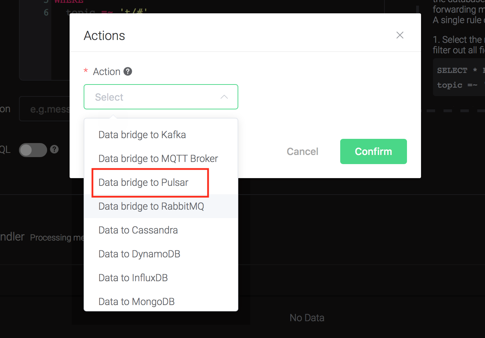
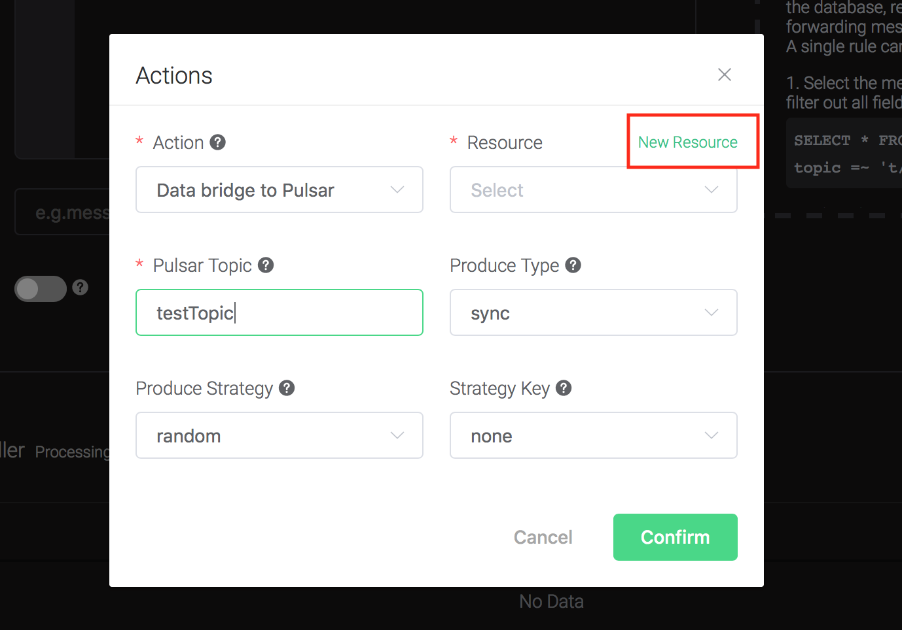
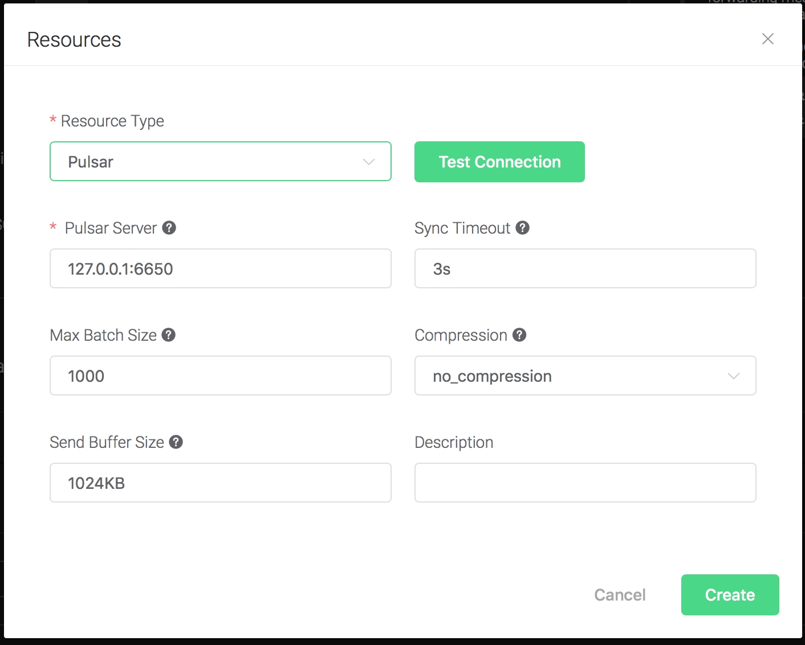
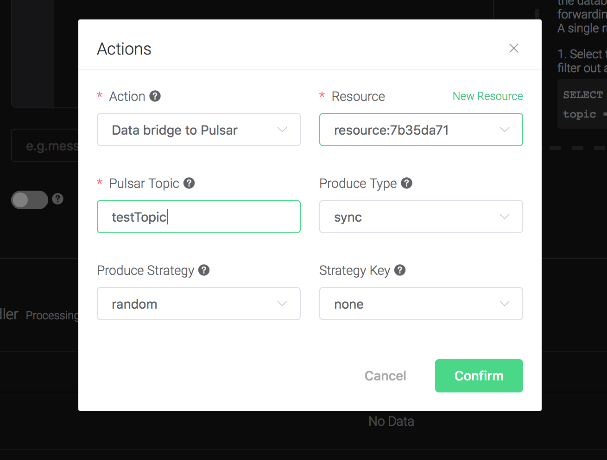
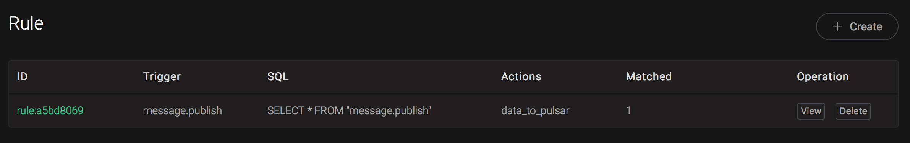

# Bridge data to Pulsar

Setup a Pulsar, taking Mac OSX for instance:

```bash
$ wget https://archive.apache.org/dist/pulsar/pulsar-2.3.2/apache-pulsar-2.3.2-bin.tar.gz

$ tar xvfz apache-pulsar-2.3.2-bin.tar.gz

$ cd apache-pulsar-2.3.2

# Start Pulsar
$ ./bin/pulsar standalone

```

Create Pulsar Topics:

```bash
$ ./bin/pulsar-admin topics create-partitioned-topic -p 5 testTopic
```

Create a rule:

Go to [EMQX Dashboard](http://127.0.0.1:18083/#/rules), select the
"rule" tab on the menu to the left.

Select "message.publish", then type in the following SQL:

```bash
SELECT
    *
FROM
    "message.publish"
```


Bind an action:

Click on the "+ Add" button under "Action Handler", and then select
"Data bridge to Pulsar" in the pop-up dialog window.



Fill in the parameters required by the action:

Two parameters is required by action "Data bridge to Pulsar":

1). Pulsar Topic

2). Bind a resource to the action. Since the dropdown list "Resource"
is empty for now, we create a new resource by clicking on the "New
Resource" to the top right, and then select "Pulsar":



Configure the resource:
```
Set the " Pulsar Server" to "127.0.0.1:6650"(multiple servers should
be separated by comma), and keep all other configs as default, and
click on the "Testing Connection" button to make sure the connection
can be created successfully, and then click on the "Create" button.
```


Back to the "Actions" dialog, and then click on the "Confirm"
    button.



Back to the creating rule page, then click on "Create" button. The
    rule we created will be show in the rule list:


We have finished, testing the rule by sending an MQTT message to
    emqx:

```bash
Topic: "t/1"

QoS: 0

Retained: false

Payload: "hello"
```

Then inspect the Pulsar by consume the topic, verify a new record has
been produced:

```bash
\$ ./bin/pulsar-client consume testTopic -s "sub-name" -n 1000
```

And from the rule list, verify that the "Matched" column has increased
to 1:



