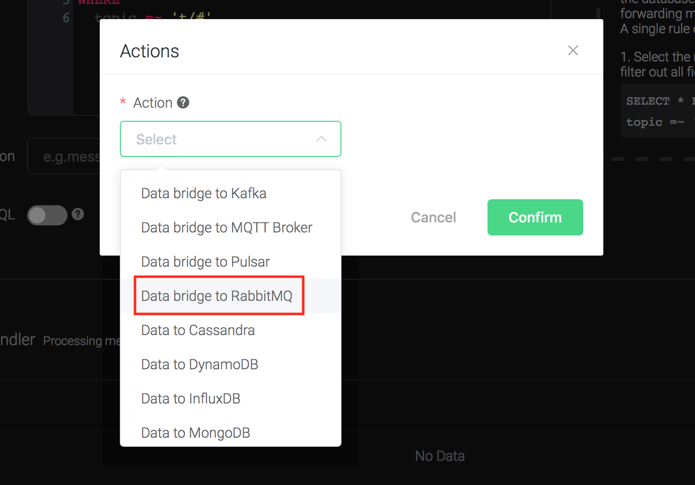
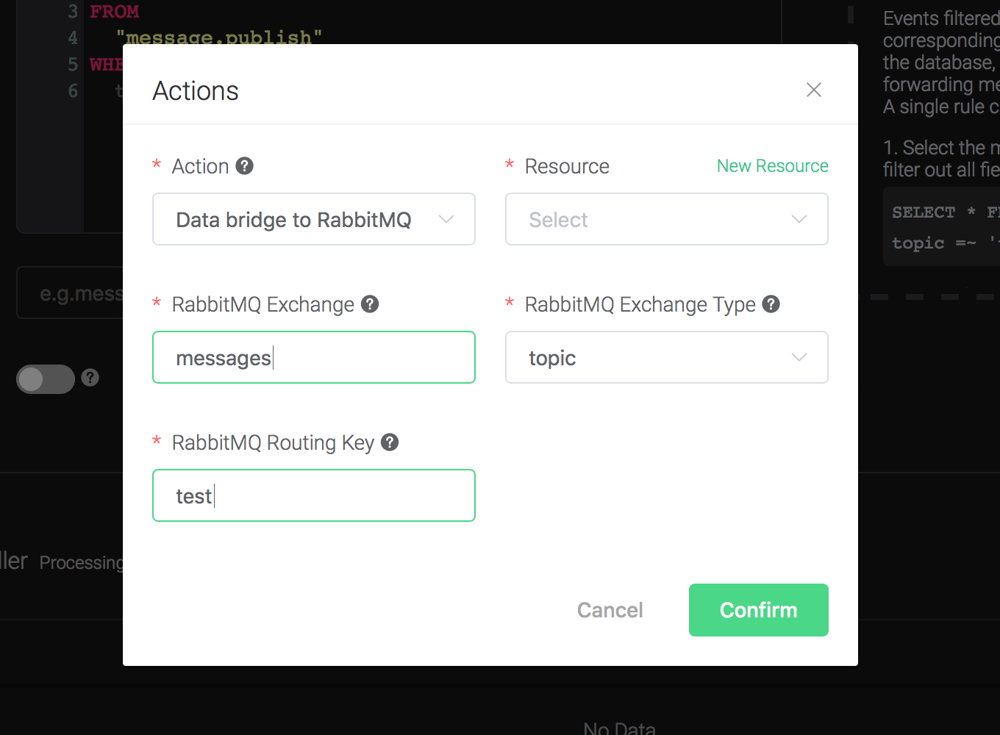
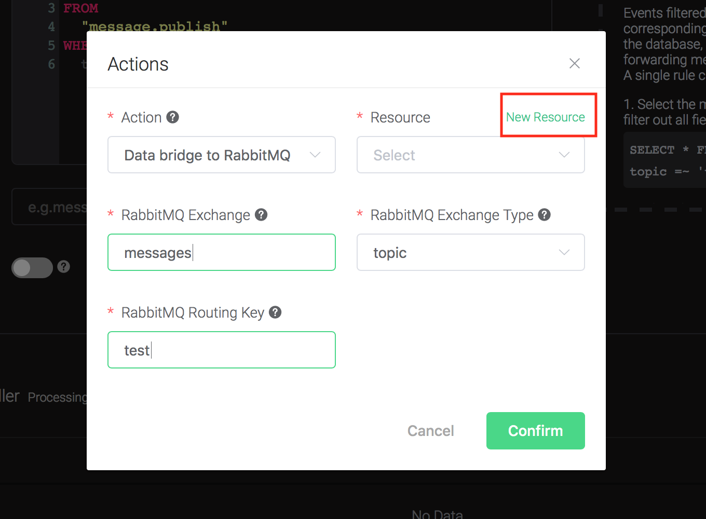
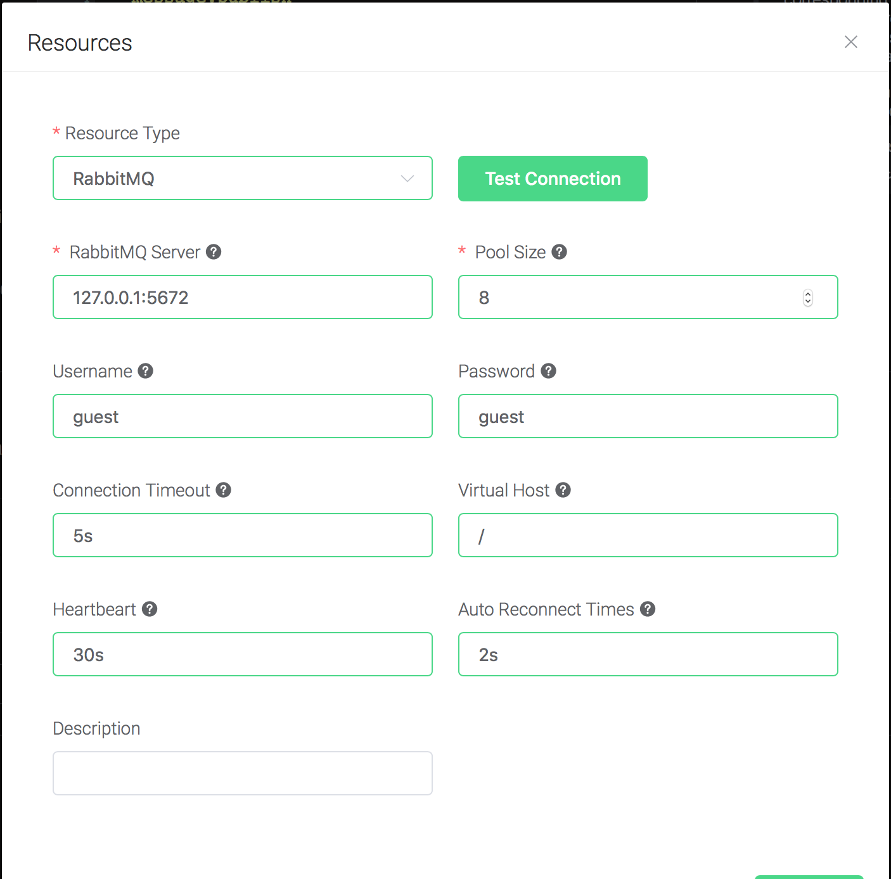
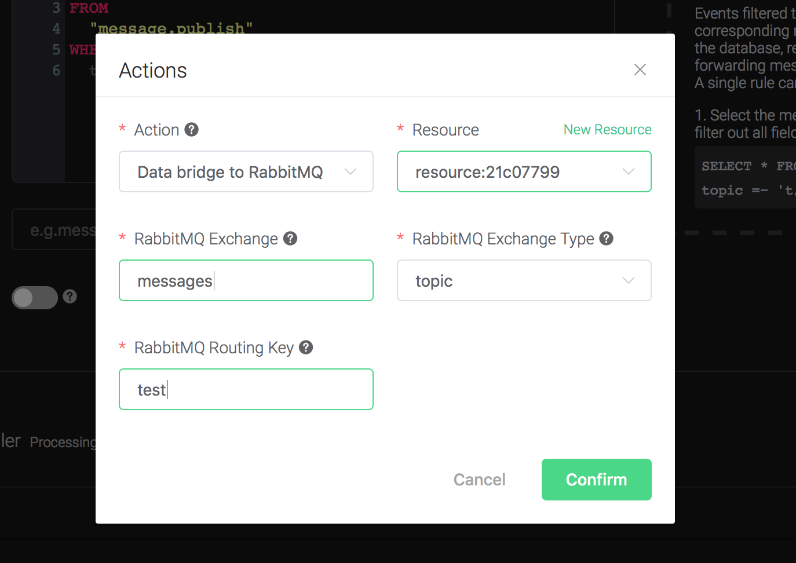
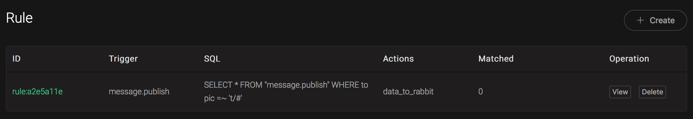
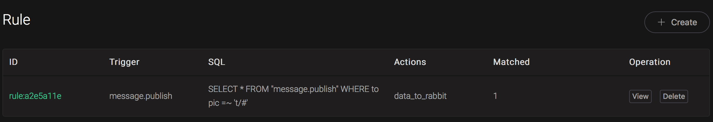

# Bridge data to RabbitMQ

Setup a RabbitMQ, taking Mac OSX for instance:

```bash
$ brew install rabbitmq

# start rabbitmq
$ rabbitmq-server
```
Create a rule:

Go to [EMQ X Dashboard](http://127.0.0.1:18083/#/rules), select the
"rule" tab on the menu to the left.

Select "message.publish", then type in the following SQL:

```sql
SELECT
    *
FROM
    "message.publish"
```


Bind an action:
```
Click on the "+ Add" button under "Action Handler", and then select
"Data bridge to RabbitMQ" in the pop-up dialog window.
```


Fill in the parameters required by the action:

Two parameters is required by action "Data bridge to RabbitMQ":

1). RabbitMQ Exchange. Here set it to "messages"

2). RabbitMQ Exchange Type. Here set it to "topic"

3). RabbitMQ Routing Key. Here set it to "test"



4). Bind a resource to the action. Since the dropdown list "Resource"
is empty for now, we create a new resource by clicking on the "New
Resource" to the top right, and then select "RabbitMQ":



Configure the resource:

Set "RabbitMQ Server" to "127.0.0.1:5672", and keep all other configs
as default, and click on the "Testing Connection" button to make sure
the connection can be created successfully, and then click on the
"Create" button.



Back to the "Actions" dialog, and then click on the "Confirm"
    button.



Back to the creating rule page, then click on "Create" button. The
    rule we created will be show in the rule list:



We have finished, testing the rule by sending an MQTT message to
    emqx:

```bash
Topic: "t/1"

QoS: 0

Retained: false

Payload: "Hello, World\!"
```

Write an AMQP Client to consume the messages, following is the one
written in python:

```python
#!/usr/bin/env python
import pika

connection = pika.BlockingConnection(
    pika.ConnectionParameters(host='localhost'))
channel = connection.channel()

channel.exchange_declare(exchange='messages', exchange_type='topic')

result = channel.queue_declare(queue='', exclusive=True)
queue_name = result.method.queue

channel.queue_bind(exchange='messages', queue=queue_name, routing_key='test')

print('[*] Waiting for messages. To exit press CTRL+C')

def callback(ch, method, properties, body):
    print(" [x] %r" % body)

channel.basic_consume(
    queue=queue_name, on_message_callback=callback, auto_ack=True)

channel.start_consuming()
```


And from the rule list, verify that the "Matched" column has increased
to 1:



