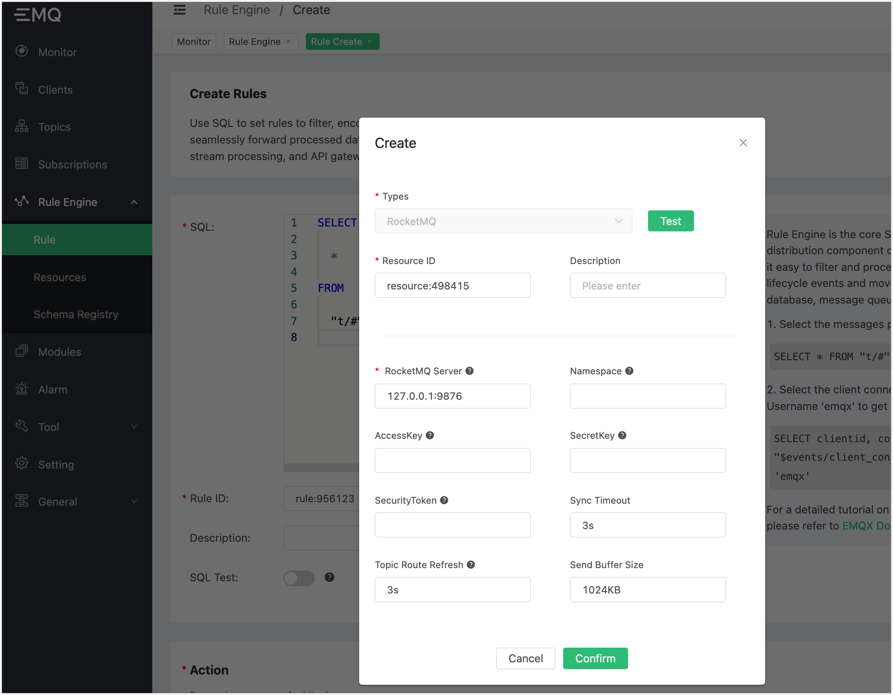

# Ingest Data into RocketMQ

Set up RocketMQ, taking MacOS X for instance:

```bash
$ wget https://mirrors.bfsu.edu.cn/apache/rocketmq/4.8.0/rocketmq-all-4.8.0-bin-release.zip
$ unzip rocketmq-all-4.8.0-bin-release.zip
$ cd rocketmq-all-4.8.0-bin-release/

# Add 2 configuration items in conf/broker.conf
brokerIP1 = 127.0.0.1
autoCreateTopicEnable = true

# Start RocketMQ NameServer
$ ./bin/mqnamesrv

# Start RocketMQ Broker
$ ./bin/mqbroker -n localhost:9876 -c conf/broker.conf
```

Create a rule:

Go to [EMQX Dashboard](http://127.0.0.1:18083/#/rules), and select **Rule Engine** -> **Rule** on the left navigation menu. Click **Create**.

Type the following SQL:

```sql
SELECT * FROM "t/#"
```


Add action:

In the **Action** pane, click **Add action**. Select **Data bridge to RocketMQ** from the drop-down list.


Provide the arguments for the action:

1. Use of resources. Click **Create** right to the **Use of Resources** text box to create a RocketMQ resource.

   Fill in the information according to the configurations in RocketMQ ACL.
   Consult the service provider for the ACL information. For local or private deployment, you can check the ACL information in the configuration file. Change the prefix of the configuration file path based on the way of your deployment. 

   ```bash
   ${rocket_path}/conf/plain_acl.yml
   ```

   Fill in the resource configuration:

   Fill in the actual RocketMQ server address. Use `,` to separate multiple addresses. Keep other values as default. Click **Test** to make sure the connection is successful.

   Then, click **Confirm**.



2. RocketMQ topic. Type `TopicTest` in **RocketMQ Topic** text box. Click **Confirm**.

   An action is added in the **Action** pane. Click **Create**.


A rule for ingesting data into RocketMQ is created. Now you can use the statement below to send a message:

```bash
Topic: "t/1"

QoS: 0

Payload: "hello"
```

Use the RocketMQ command line to check if the message is sent successfully:

```bash
$ ./bin/tools.sh org.apache.rocketmq.example.quickstart.Consumer TopicTest
```


In the rule list, click the icon in **Monitor** column. In **Metrics**, you can see the number for **matched** has increased by 1:


