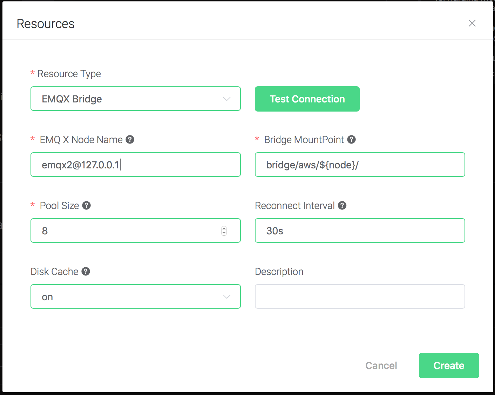
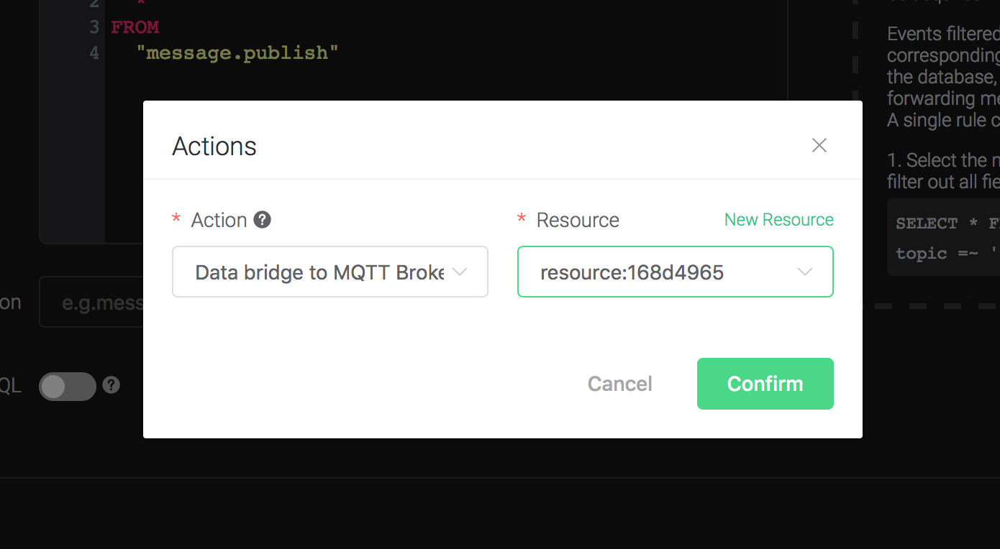
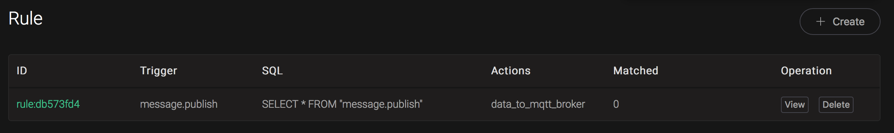
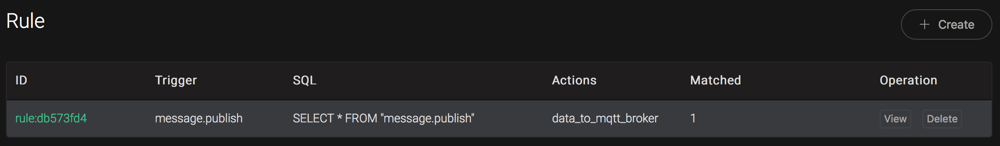

# EMQ X Bridges

## Bridge data to MQTT Broker

Setup anther MQTT broker using mosquitto, change the port to 2883.
    Taking Mac OSX for instance:

```bash
$ brew install mosquitto

$ vim /usr/local/etc/mosquitto/mosquitto.conf

port 2883

# start mosquitto
$ brew services start mosquitto
```

Create a rule:

Go to [emqx dashboard](http://127.0.0.1:18083/#/rules), select the
"rule" tab on the menu to the left.

Select "message.publish", then type in the following SQL:

```sql
SELECT
    *
FROM
    "message.publish"
```


Bind an action:

    Click on the "+ Add" button under "Action Handler", and then select
    "Data bridge to MQTT Broker" in the pop-up dialog window.


Bind a resource to the action. Since the dropdown list "Resource" is
    empty for now, we create a new resource by clicking on the "New
    Resource" to the top right, and then select "MQTT Bridge":


Configure the resource:

    Set "Broker Address" to the address of mosquitto, here is
    127.0.0.1:2883, and keep all other configs as default, and click on
    the "Testing Connection" button to make sure the connection can be
    created successfully, and then click on the "Create" button.


Back to the "Actions" dialog, and then click on the "Confirm"
    button.


Back to the creating rule page, then click on "Create" button. The
    rule we created will be show in the rule list:


We have finished, testing the rule by sending an MQTT message to
    emqx:

```bash
> Topic: "t/1"
>
> QoS: 0
>
> Retained: false
>
> Payload: "Hello, World\!"
```

Then verify a message has been published to mosquitto:


And from the rule list, verify that the "Matched" column has increased
to 1:


## Bridge data to Kafka

Setup a Kafka, taking Mac OSX for instance:

```bash
$ wget http://apache.claz.org/kafka/2.3.0/kafka_2.12-2.3.0.tgz

$ tar -xzf  kafka_2.12-2.3.0.tgz

$ cd kafka_2.12-2.3.0

# start Zookeeper
$ ./bin/zookeeper-server-start.sh config/zookeeper.properties
# start Kafka
$ ./bin/kafka-server-start.sh config/server.properties
```


Create topics for
    Kafka:

```bash
$ ./bin/kafka-topics.sh --zookeeper localhost:2181 --replication-factor 1 --partitions 1 --topic testTopic --create

Created topic testTopic.

.. note:: Kafka topics should be created before creating the kafka rule, or the rule creation would not success.
```

Create a rule:

Go to [emqx dashboard](http://127.0.0.1:18083/#/rules), select the
"rule" tab on the menu to the left.

Select "message.publish", then type in the following SQL:

```bash
SELECT
    *
FROM
    "message.publish"
```


Bind an action:

Click on the "+ Add" button under "Action Handler", and then select
    "Data bridge to Kafka" in the pop-up dialog window.


Fill in the parameters required by the action:

Two parameters is required by action "Data to Kafka":

1). Kafka Topic

2). Bind a resource to the action. Since the dropdown list "Resource"
is empty for now, we create a new resource by clicking on the "New
Resource" to the top right, and then select "Kafka":


Configure the resource:

    Set the "Kafka Server" to "127.0.0.1:9092" (multiple servers should
    be separated by comma), and keep all other configs as default, and
    click on the "Testing Connection" button to make sure the connection
    can be created successfully, and then click on the "Create" button.


Back to the "Actions" dialog, and then click on the "Confirm"
    button.


Back to the creating rule page, then click on "Create" button. The
    rule we created will be show in the rule list:


We have finished, testing the rule by sending an MQTT message to
    emqx:

```bash
> Topic: "t/1"
>
> QoS: 0
>
> Retained: false
>
> Payload: "hello"
```

Then inspect Kafka by consume from the
topic:

```bash
$ ./bin/kafka-console-consumer.sh --bootstrap-server 127.0.0.1:9092  --topic testTopic --from-beginning
```

And from the rule list, verify that the "Matched" column has increased
to 1:


## Bridge data to Pulsar

Setup a Pulsar, taking Mac OSX for instance:

```bash
$ wget http://apache.mirrors.hoobly.com/pulsar/pulsar-2.3.2/apache-pulsar-2.3.2-bin.tar.gz

$ tar xvfz apache-pulsar-2.3.2-bin.tar.gz

$ cd apache-pulsar-2.3.2

# Start Pulsar
$ ./bin/pulsar standalone

```

Create Pulsar Topics:

```bash
$ ./bin/pulsar-admin topics create-partitioned-topic -p 5 testTopic
```

Create a rule:

Go to [emqx dashboard](http://127.0.0.1:18083/#/rules), select the
"rule" tab on the menu to the left.

Select "message.publish", then type in the following SQL:

```bash
SELECT
    *
FROM
    "message.publish"
```


Bind an action:

Click on the "+ Add" button under "Action Handler", and then select
"Data bridge to Pulsar" in the pop-up dialog window.


Fill in the parameters required by the action:

Two parameters is required by action "Data bridge to Pulsar":

1). Pulsar Topic

2). Bind a resource to the action. Since the dropdown list "Resource"
is empty for now, we create a new resource by clicking on the "New
Resource" to the top right, and then select "Pulsar":


Configure the resource:

    Set the " Pulsar Server" to "127.0.0.1:6650"(multiple servers should
    be separated by comma), and keep all other configs as default, and
    click on the "Testing Connection" button to make sure the connection
    can be created successfully, and then click on the "Create" button.


Back to the "Actions" dialog, and then click on the "Confirm"
    button.


Back to the creating rule page, then click on "Create" button. The
    rule we created will be show in the rule list:


We have finished, testing the rule by sending an MQTT message to
    emqx:

```bash
> Topic: "t/1"
>
> QoS: 0
>
> Retained: false
>
> Payload: "hello"
```

Then inspect the Pulsar by consume the topic, verify a new record has
been produced:

```bash
\$ ./bin/pulsar-client consume testTopic -s "sub-name" -n 1000
```

And from the rule list, verify that the "Matched" column has increased
to 1:


## Bridge data to RabbitMQ

Setup a RabbitMQ, taking Mac OSX for instance:

```bash
$ brew install rabbitmq

# start rabbitmq
$ rabbitmq-server
```
Create a rule:

Go to [emqx dashboard](http://127.0.0.1:18083/#/rules), select the
"rule" tab on the menu to the left.

Select "message.publish", then type in the following SQL:

```sql
SELECT
    *
FROM
    "message.publish"
```


Bind an action:

    Click on the "+ Add" button under "Action Handler", and then select
    "Data bridge to RabbitMQ" in the pop-up dialog window.


Fill in the parameters required by the action:

Two parameters is required by action "Data bridge to RabbitMQ":

1). RabbitMQ Exchange. Here set it to "messages"

2). RabbitMQ Exchange Type. Here set it to "topic"

3). RabbitMQ Routing Key. Here set it to "test"


4). Bind a resource to the action. Since the dropdown list "Resource"
is empty for now, we create a new resource by clicking on the "New
Resource" to the top right, and then select "RabbitMQ":


Configure the resource:

Set "RabbitMQ Server" to "127.0.0.1:5672", and keep all other configs
as default, and click on the "Testing Connection" button to make sure
the connection can be created successfully, and then click on the
"Create" button.


Back to the "Actions" dialog, and then click on the "Confirm"
    button.


Back to the creating rule page, then click on "Create" button. The
    rule we created will be show in the rule list:


We have finished, testing the rule by sending an MQTT message to
    emqx:

```bash
> Topic: "t/1"
>
> QoS: 0
>
> Retained: false
>
> Payload: "Hello, World\!"
```

Write an AMQP Client to consume the messages, following is the one
written in python:

```python
#!/usr/bin/env python
import pika

connection = pika.BlockingConnection(
    pika.ConnectionParameters(host='localhost'))
channel = connection.channel()

channel.exchange_declare(exchange='messages', exchange_type='topic')

result = channel.queue_declare(queue='', exclusive=True)
queue_name = result.method.queue

channel.queue_bind(exchange='messages', queue=queue_name, routing_key='test')

print('[*] Waiting for messages. To exit press CTRL+C')

def callback(ch, method, properties, body):
    print(" [x] %r" % body)

channel.basic_consume(
    queue=queue_name, on_message_callback=callback, auto_ack=True)

channel.start_consuming()
```


And from the rule list, verify that the "Matched" column has increased
to 1:


## Bridge data to EMQX

Setup anther MQTT broker using emqx, taking Mac OSX for instance:

```bash
$ brew tap emqx/emqx/emqx

$ brew install emqx

# start emqx
$ emqx console
```

Create a rule:

Go to [emqx dashboard](http://127.0.0.1:18083/#/rules), select the
"rule" tab on the menu to the left.

Select "message.publish", then type in the following SQL:

```sql
SELECT
    *
FROM
    "message.publish"
```


Bind an action:

Click on the "+ Add" button under "Action Handler", and then select
"Data bridge to MQTT Broker" in the pop-up dialog window.


Bind a resource to the action. Since the dropdown list "Resource" is
    empty for now, we create a new resource by clicking on the "New
    Resource" to the top right, and then select "MQTT Bridge":


Configure the resource:

    Set "EMQ X Node Name" to the node name of the remote name, and keep
    all other configs as default, and click on the "Testing Connection"
    button to make sure the connection can be created successfully, and
    then click on the "Create" button.



Back to the "Actions" dialog, and then click on the "Confirm"
    button.



Back to the creating rule page, then click on "Create" button. The
    rule we created will be show in the rule list:



We have finished, testing the rule by sending an MQTT message to
    emqx:

```bash
> Topic: "t/1"
>
> QoS: 0
>
> Retained: false
>
> Payload: "Hello, World\!"
```

Then verify a message has been published to the other emqx:


And from the rule list, verify that the "Matched" column has increased
to 1:



