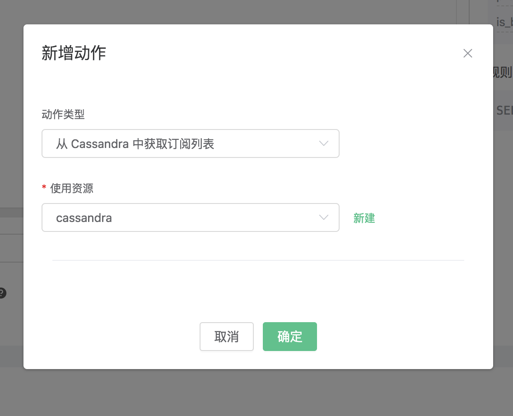

# 从 Cassandra 中获取订阅关系

搭建 Cassandra 数据库，并设置用户名密码为 root/public，以 MacOS X 为例:
```bash
$ brew install cassandra
## 修改配置，关闭匿名认证
$  vim /usr/local/etc/cassandra/cassandra.yaml

    authenticator: PasswordAuthenticator
    authorizer: CassandraAuthorizer

$ brew services start cassandra

## 创建 root 用户
$ cqlsh -ucassandra -pcassandra

create user root with password 'public' superuser;
```

创建 "mqtt" 表空间:
```bash
$ cqlsh -uroot -ppublic

CREATE KEYSPACE mqtt WITH replication = {'class': 'SimpleStrategy', 'replication_factor': '1'}  AND durable_writes = true;
```

创建 mqtt_sub 表:

```sql

CREATE TABLE mqtt_sub (
    clientid text,
    topic text,
    qos int,
    PRIMARY KEY (clientid, topic)
) WITH CLUSTERING ORDER BY (topic ASC)
    AND bloom_filter_fp_chance = 0.01
    AND caching = {'keys': 'ALL', 'rows_per_partition': 'NONE'}
    AND comment = ''
    AND compaction = {'class': 'org.apache.cassandra.db.compaction.SizeTieredCompactionStrategy', 'max_threshold': '32', 'min_threshold': '4'}
    AND compression = {'chunk_length_in_kb': '64', 'class': 'org.apache.cassandra.io.compress.LZ4Compressor'}
    AND crc_check_chance = 1.0
    AND dclocal_read_repair_chance = 0.1
    AND default_time_to_live = 0
    AND gc_grace_seconds = 864000
    AND max_index_interval = 2048
    AND memtable_flush_period_in_ms = 0
    AND min_index_interval = 128
    AND read_repair_chance = 0.0
    AND speculative_retry = '99PERCENTILE';

```

::: danger

订阅关系表结构不能修改，请使用上面SQL语句创建

:::

创建规则:

打开 [EMQ X Dashboard](http://127.0.0.1:18083/#/rules)，选择左侧的“规则”选项卡。

然后填写规则 SQL:

```bash
SELECT * FROM "$events/client_connected"
```


关联动作:

在“响应动作”界面选择“添加动作”，然后在“新增动作”下拉框里选择“从 Cassandra 中获取订阅列表”


填写动作参数:

“从 Cassandra 中获取订阅列表”动作需要一个参数：

1). 关联资源。现在资源下拉框为空，可以点击右上角的 “新建” 来创建一个 Cassandra 资源：


弹出“创建资源”对话框


填写资源配置:

   填写真实的 Cassandra 服务器地址，其他配置相应的值，然后点击 “测试连接” 按钮，确保连接测试成功。

最后点击 “确定” 按钮。



返回响应动作界面，点击 “确认”。


返回规则创建界面，点击 “创建”。


规则已经创建完成，通过 “cqlsh” 往 Cassandra 插入一条订阅关系:

```
insert into mqtt_sub(clientid, topic, qos) values('test', 't1', 1);
```


通过 Dashboard 登录 clientid 为 test 的设备:


查看“订阅”列表，可以看到 Broker 从 Cassandra 里面获取到订阅关系，并代理设备订阅:


