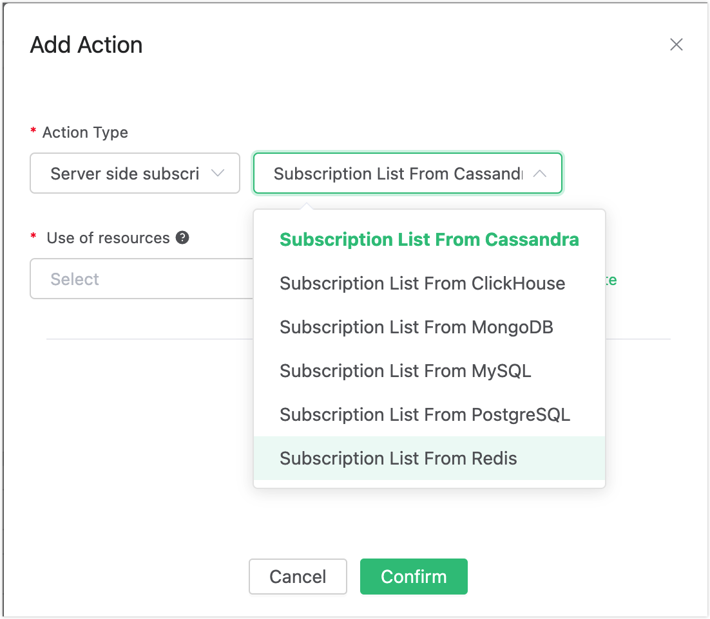
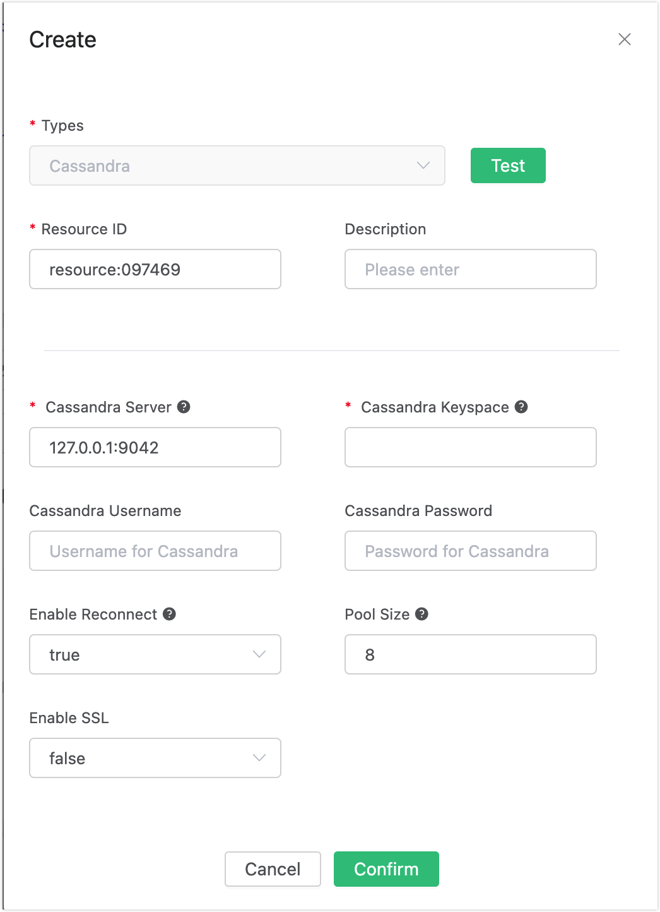
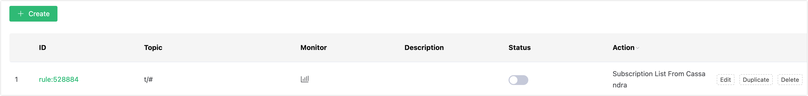

# Auto Subscribe with Cassandra

## Set up the Environment

Set up the Cassandra database and set the user name and password to root/public. Take MacOS X as an example:

```bash
$ brew install cassandra
## Modify the configuration and disable anonymous authentication
$  vim /usr/local/etc/cassandra/cassandra.yaml

    authenticator: PasswordAuthenticator
    authorizer: CassandraAuthorizer

$ brew services start cassandra

## Create root user
$ cqlsh -ucassandra -pcassandra

create user root with password 'public' superuser;
```

Create the "mqtt" tablespace:
```bash
$ cqlsh -uroot -ppublic

CREATE KEYSPACE mqtt WITH replication = {'class': 'SimpleStrategy', 'replication_factor': '1'}  AND durable_writes = true;
```

Create the mqtt_sub table:

```sql

CREATE TABLE mqtt_sub (
    clientid text,
    topic text,
    qos int,
    PRIMARY KEY (clientid, topic)
) WITH CLUSTERING ORDER BY (topic ASC)
    AND bloom_filter_fp_chance = 0.01
    AND caching = {'keys': 'ALL', 'rows_per_partition': 'NONE'}
    AND comment = ''
    AND compaction = {'class': 'org.apache.cassandra.db.compaction.SizeTieredCompactionStrategy', 'max_threshold': '32', 'min_threshold': '4'}
    AND compression = {'chunk_length_in_kb': '64', 'class': 'org.apache.cassandra.io.compress.LZ4Compressor'}
    AND crc_check_chance = 1.0
    AND dclocal_read_repair_chance = 0.1
    AND default_time_to_live = 0
    AND gc_grace_seconds = 864000
    AND max_index_interval = 2048
    AND memtable_flush_period_in_ms = 0
    AND min_index_interval = 128
    AND read_repair_chance = 0.0
    AND speculative_retry = '99PERCENTILE';

```

:::tip

The table structure of the subscription relationship cannot be altered. Kindly utilize the provided SQL statement for creating the table.

:::

## Create Rules

Open [EMQX Dashboard](http://127.0.0.1:18083/#/rules) and select the "Rules" tab on the left.

Then fill in the rule SQL:

```sql
SELECT * FROM "$events/client_connected"
```


## Add an Action

Select "Add Action" on the "Response Action" interface, and then select "Get Subscription List from Cassandra" in the "Add Action" drop-down box



Fill in the action parameters:

The action of "Get subscription list from Cassandra" requires one parameter:

Associated resources. The resource drop-down box is empty now, and you can click "Create" in the upper right corner to create a Cassandra resource. The "Create Resource" dialog box pops up.



Fill in the resource configuration:

Fill in the real Cassandra server address and the values corresponding to other configurations, and then click the "Test" button to ensure that the connection test is successful.

Finally, click the "Confirm" button.

Return to the response action interface and click "Confirm".

Return to the rule creation interface and click "Create".



## Test the Rule

The rule has been created, and you can insert a subscription relationship into Cassandra through "cqlsh":

```
insert into mqtt_sub(clientid, topic, qos) values('test', 't1', 1);
```


Log in to the device (with clientid test) via Dashboard:


Check the "Subscription" list, and you can see that the Broker obtains the subscription relationship from Cassandra and subscribes as the agent device:


