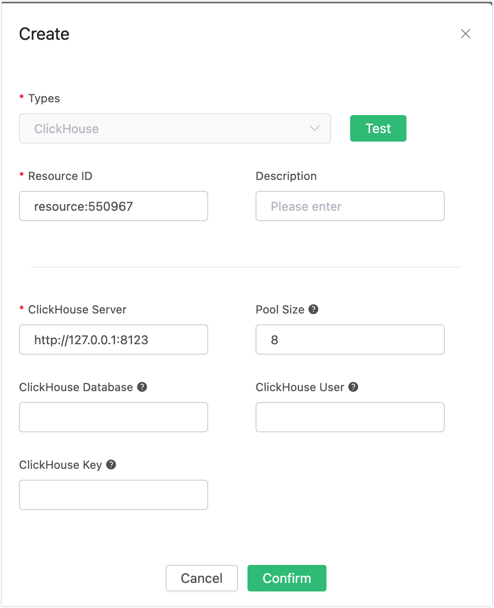
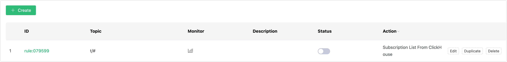

# Auto Subscribe with ClickHouse

## Set up the Environment

Set up the ClickHouse database and set the user name and password to root/public. Take MacOS X as an example:

```bash
## Install dependency
sudo yum install -y epel-release

## Download and run the installation shell script provided with packagecloud.io
curl -s https://packagecloud.io/install/repositories/altinity/clickhouse/script.rpm.sh | sudo bash

## Install the ClickHouse server and client
sudo yum install -y clickhouse-server clickhouse-client

## Start ClickHouse
clickhouse-server

## Start ClickHouse client
clickhouse-client
```

Create “mqtt” database:
```sql
create database mqtt;
```
Create the mqtt_sub table:

```sql
use mqtt;
create table mqtt_sub (
    clientid String,
    topic String,
    qos Nullable(Int8) DEFAULT 0
    ) engine = MergeTree() ORDER BY clientid;
```

:::tip

The table structure of the subscription relationship cannot be altered. Kindly utilize the provided SQL statement for creating the table.

:::

## Create Rules

Open [EMQX Dashboard](http://127.0.0.1:18083/#/rules) and select the "Rules" tab on the left.

Then fill in the rule SQL:

```sql
SELECT * FROM "$events/client_connected"
```


## Add an Action

Select "Add Action" on the "Response Action" interface, and then select "Get Subscription List from ClickHouse" in the "Add Action" drop-down box


Fill in the action parameters:

The action of "Get subscription list from ClickHouse" requires one parameter:

1). Associated resources. The resource drop-down box is empty now, and you can click "Create" in the upper right corner to create a ClickHouse resource, the "Create Resource" dialog box pops up。




Fill in the resource configuration:

Fill in the ClickHouse server address and the values corresponding to other configurations, and then click the "Test" button to ensure that the connection test is successful.

Finally, click the "Confirm" button.

Return to the response action interface and click "Confirm".

Return to the rule creation interface and click "Create".





## Test the Rule

The rule has been created, and you can insert a subscription relationship into ClickHouse with the command below:

```bash
insert into mqtt_sub(clientid, topic, qos) values('test', 't1', 1);
```


Log in to the device (with clientid test) via Dashboard:


Check the "Subscription" list, and you can see that the Broker obtains the subscription relationship from ClickHouse and subscribes as the agent device:


