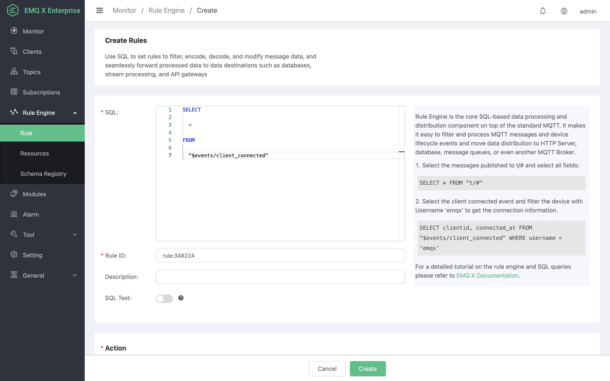
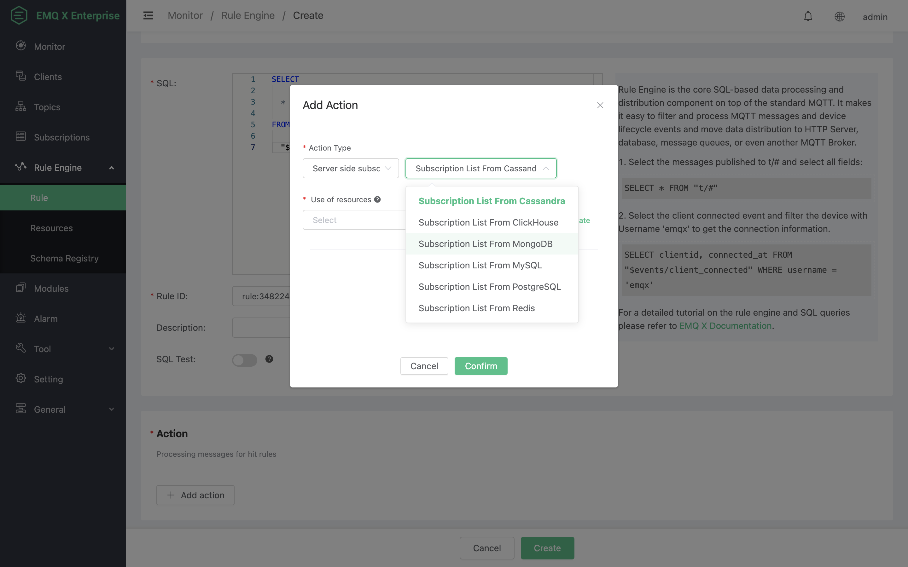
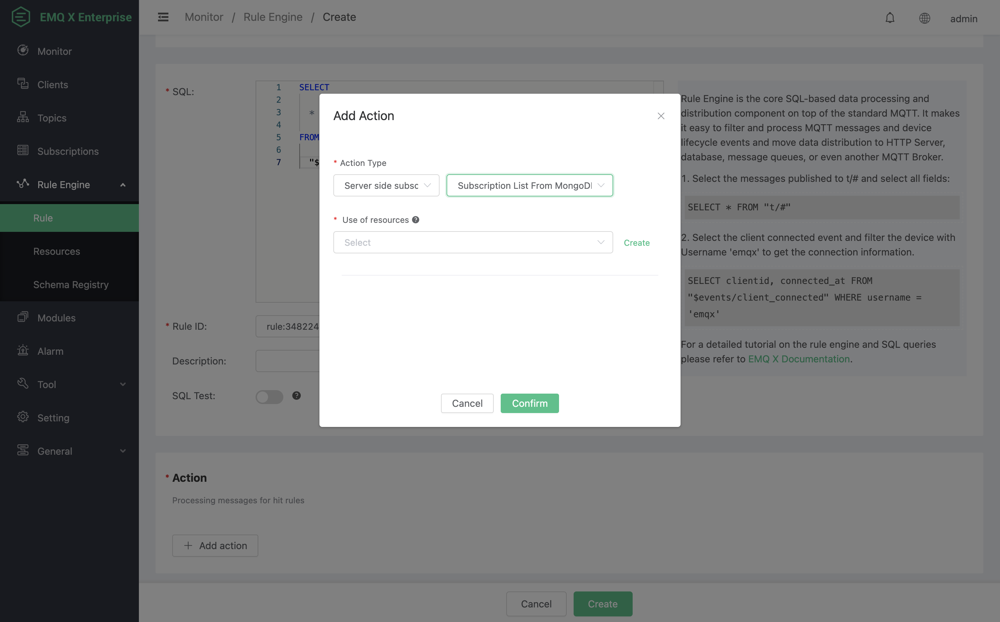
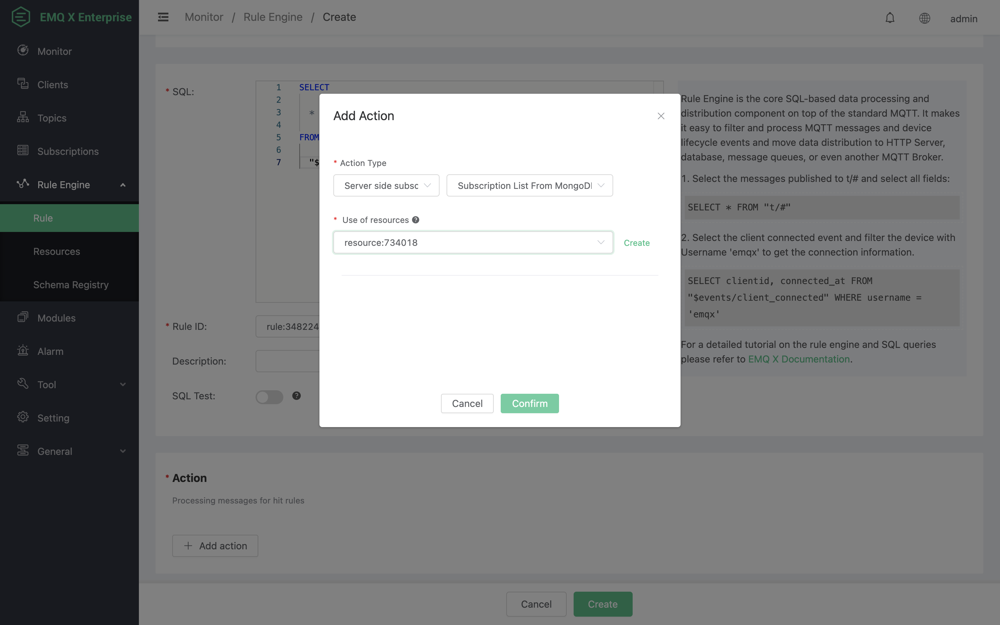
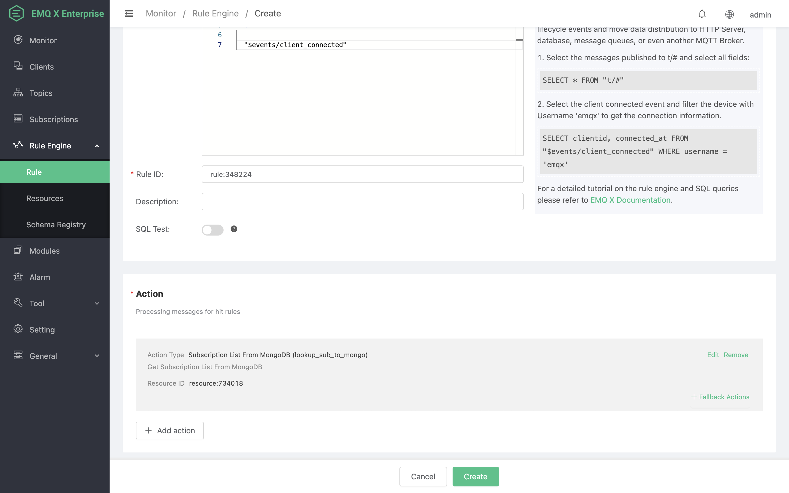
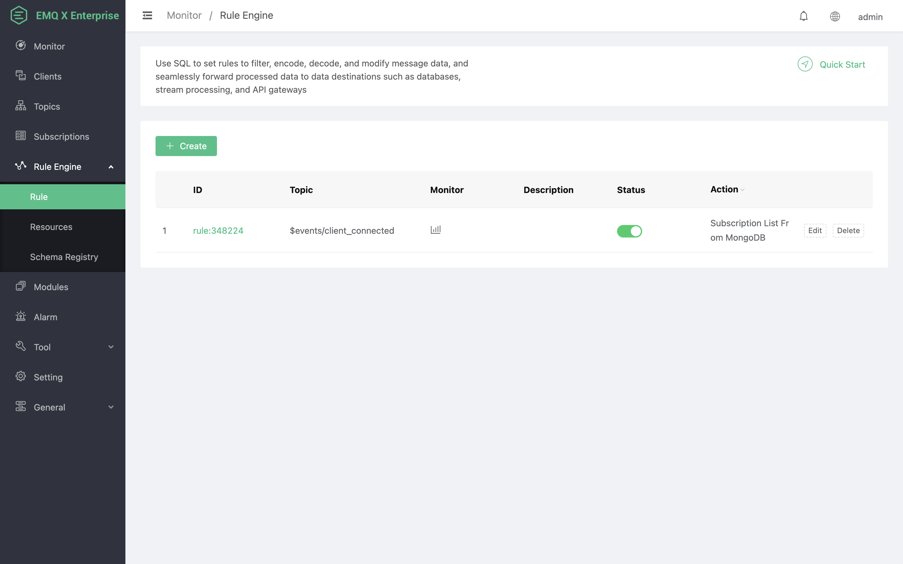
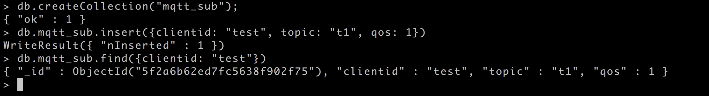
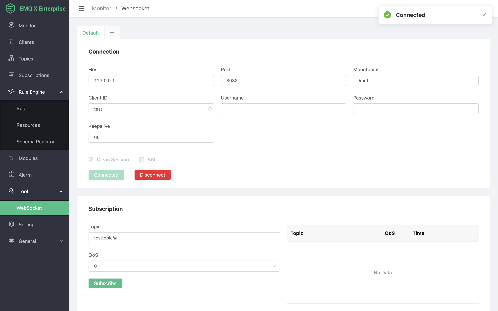
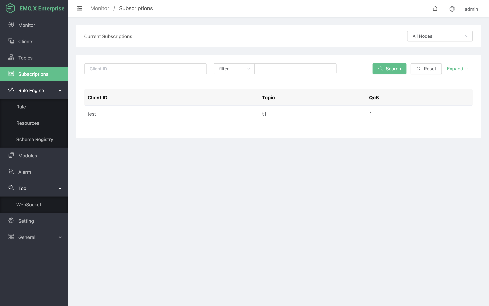

# 从 MongoDB 中获取订阅关系

搭建 MongoDB 数据库，并设置用户名密码为 root/public，以 MacOS X 为例:
```bash
$ brew install mongodb
$ brew services start mongodb

## 新增 root/public 用户
$ use mqtt;
$ db.createUser({user: "root", pwd: "public", roles: [{role: "readWrite", db: "mqtt"}]});

## 修改配置，关闭匿名认证
$ vi /usr/local/etc/mongod.conf

    security:
    authorization: enabled

$ brew services restart mongodb
```

创建 mqtt_sub 表:
```sql
$ mongo 127.0.0.1/mqtt -uroot -ppublic
db.createCollection("mqtt_sub");
```

创建规则:

打开 [EMQ X Dashboard](http://127.0.0.1:18083/#/rules)，选择左侧的“规则”选项卡。

然后填写规则 SQL:

```bash
SELECT * FROM "$events/client_connected"
```



关联动作:

在“响应动作”界面选择“添加动作”，然后在“新增动作”下拉框里选择“从MongoDB中获取订阅列表”



填写动作参数:

“从 MongoDB 中获取订阅列表”动作需要一个参数：

1). 关联资源。现在资源下拉框为空，可以点击右上角的 “新建” 来创建一个 MongoDB 资源：



弹出“创建资源”对话框


填写资源配置:

   填写真实的 MongoDB 服务器地址，其他配置相应的值，然后点击 “测试连接” 按钮，确保连接测试成功。

最后点击 “确定” 按钮。



返回响应动作界面，点击 “确认”。



返回规则创建界面，点击 “创建”。



规则已经创建完成，通过 “mongo” 往MongoDB插入一条订阅关系

```
db.mqtt_sub.insert({clientid: "test", topic: "t1", qos: 1})
```



通过 Dashboard 登录 clientid 为 test 的设备:



查看“订阅”列表，可以看到 Broker 从 MongoDB 里面获取到订阅关系，并代理设备订阅:

