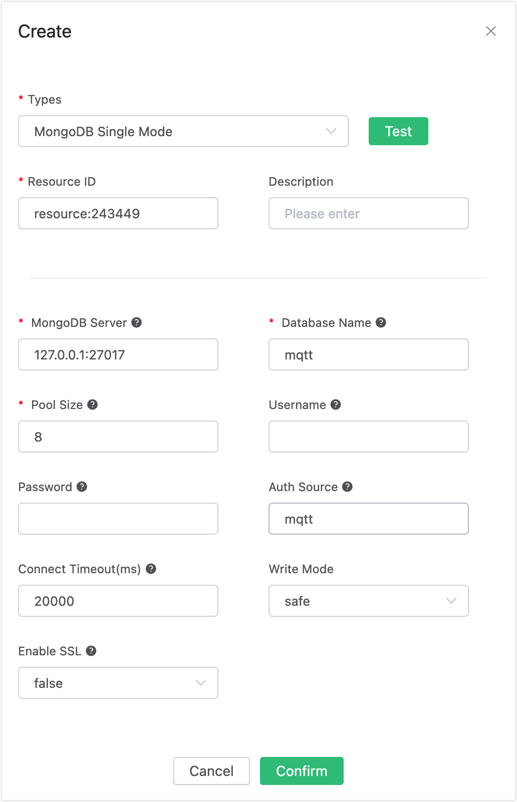
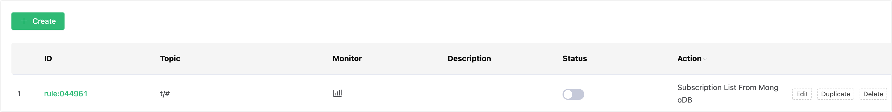

# Auto Subscribe with MongoDB

## Set up the Environment

Set up the MongoDB database and set the user name and password to root/public. Take MacOS X as an example:

```bash
$ brew install mongodb
$ brew services start mongodb

## Add root/public user
$ use mqtt;
$ db.createUser({user: "root", pwd: "public", roles: [{role: "readWrite", db: "mqtt"}]});

## Modify the configuration and disable anonymous authentication
$ vi /usr/local/etc/mongod.conf

    security:
    authorization: enabled

$ brew services restart mongodb
```

Create the mqtt_sub table:
```sql
$ mongo 127.0.0.1/mqtt -uroot -ppublic
db.createCollection("mqtt_sub");
```

## Create Rules

Open [EMQX Dashboard](http://127.0.0.1:18083/#/rules) and select the "Rules" tab on the left.

Then fill in the rule SQL:

```sql
SELECT * FROM "$events/client_connected"
```


## Add an Action

Select "Add Action" on the "Response Action" interface, and then select "Get Subscription List from MongoDB" in the "Add Action" drop-down box


Fill in the action parameters:

The action of "Get subscription list from MongoDB" requires one parameter:

Associated resources. The resource drop-down box is empty now, and you can click "Create" in the upper right corner to create a MongoDB  resource:

The "Create Resource" dialog box pops up



Fill in the resource configuration:

Fill in the real MongoDB server address and the values corresponding to other configurations, and then click the "Test" button to ensure that the connection test is successful.

Finally, click the "OK" button.

Return to the response action interface and click "OK".

Return to the rule creation interface and click "Create".



## Test the Rule

The rule has been created, and you can insert a subscription relationship into MongoDB through "mongo":

```
db.mqtt_sub.insert({clientid: "test", topic: "t1", qos: 1})
```


Log in to the device (with clientid test) via Dashboard:


Check the "Subscription" list, and you can see that the Broker obtains the subscription relationship from MongoDB and subscribes as the agent device:


