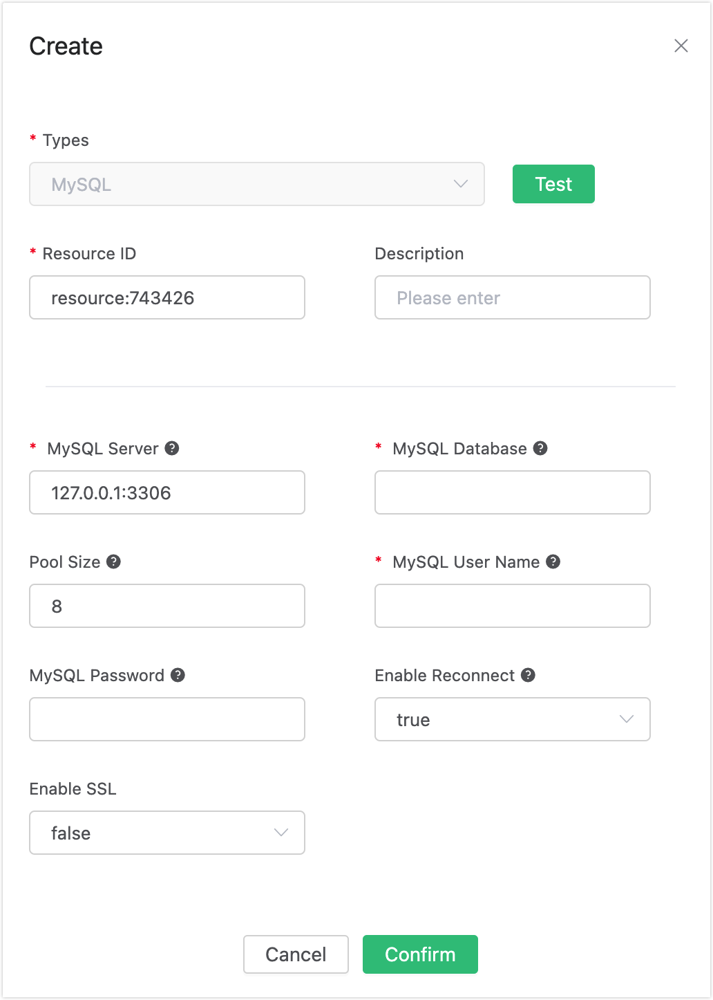
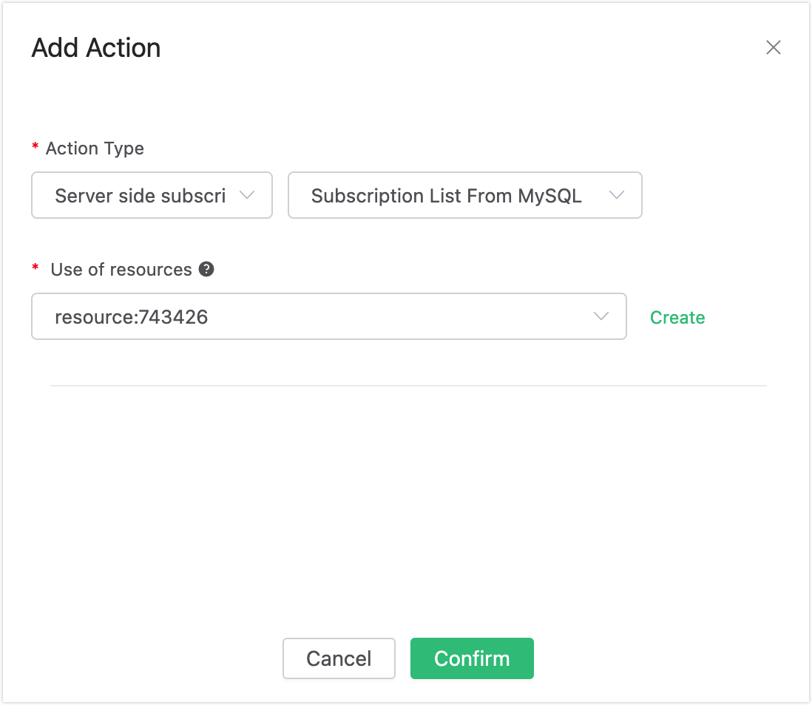
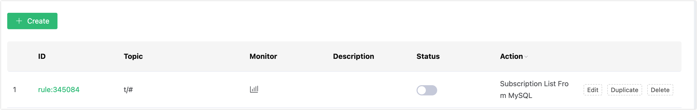

# Auto Subscribe with MySQL 

## Set up the Environment

Set up the MySQL database and set the user name and password to root/public. Take MacOS X as an example:

```bash
$ brew install mysql

$ brew services start mysql

$ mysql -u root -h localhost -p

ALTER USER 'root'@'localhost' IDENTIFIED BY 'public';
```

Initialize the MySQL database:
```bash
$ mysql -u root -h localhost -ppublic

create database mqtt;
```

Create the mqtt_sub table:
```sql
DROP TABLE IF EXISTS `mqtt_sub`;

CREATE TABLE `mqtt_sub` (
  `id` int(11) unsigned NOT NULL AUTO_INCREMENT,
  `clientid` varchar(64) DEFAULT NULL,
  `topic` varchar(180) DEFAULT NULL,
  `qos` tinyint(1) DEFAULT NULL,
  PRIMARY KEY (`id`),
  KEY `mqtt_sub_idx` (`clientid`,`topic`,`qos`),
  UNIQUE KEY `mqtt_sub_key` (`clientid`,`topic`),
  INDEX topic_index(`id`, `topic`)
) ENGINE=InnoDB DEFAULT CHARSET=utf8MB4;
```

::: tip

The table structure of the subscription relationship cannot be altered. Kindly utilize the provided SQL statement for creating the table.

:::

## Create Rules

Open [EMQX Dashboard](http://127.0.0.1:18083/#/rules) and select the "Rules" tab on the left.

Then fill in the rule SQL:

```sql
SELECT * FROM "$events/client_connected"
```


## Add an Action

Select "Add Action" on the "Response Action" interface, and then select "Get Subscription List from MySQL" in the "Add Action" drop-down box


Fill in the action parameters:

The action of "Get subscription list from MySQL" requires one parameter:

1). Associated resources. The resource drop-down box is empty now, and you can click "Create" in the upper right corner to create a MySQL resource, the "Create Resource" dialog box pops up



Fill in the resource configuration:

Fill in the real MySQL server address and the values corresponding to other configurations, and then click the "Test" button to ensure that the connection test is successful.

Finally, click the "Confirm" button.

Return to the response action interface and click "Confirm".




Return to the rule creation interface and click "Create".



## Test the Rule

The rule has been created, and you can insert a subscription relationship into MySQL through "mysql":

```
insert into mqtt_sub(clientid, topic, qos) values("test", "t1", 1);
```


Log in to the device (with clientid test) via Dashboard:


Check the "Subscription" list, and you can see that the Broker obtains the subscription relationship from MySQL and subscribes as the agent device:


