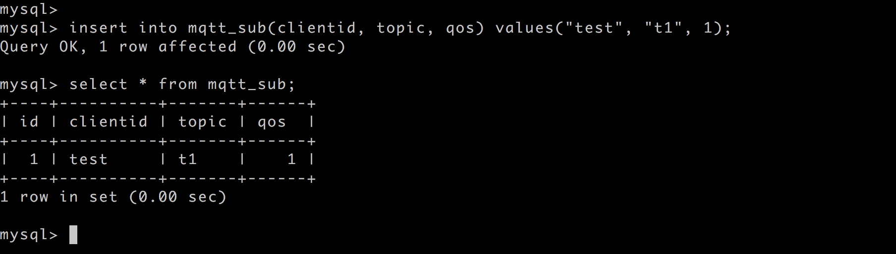

# Get subscription relationship from MySQL 

Set up the MySQL database and set the user name and password to root/public. Take MacOS X as an example:

```bash
$ brew install mysql

$ brew services start mysql

$ mysql -u root -h localhost -p

ALTER USER 'root'@'localhost' IDENTIFIED BY 'public';
```

Initialize the MySQL database:
```bash
$ mysql -u root -h localhost -ppublic

create database mqtt;
```

Create the mqtt_sub table:
```sql
DROP TABLE IF EXISTS `mqtt_sub`;

CREATE TABLE `mqtt_sub` (
  `id` int(11) unsigned NOT NULL AUTO_INCREMENT,
  `clientid` varchar(64) DEFAULT NULL,
  `topic` varchar(180) DEFAULT NULL,
  `qos` tinyint(1) DEFAULT NULL,
  PRIMARY KEY (`id`),
  KEY `mqtt_sub_idx` (`clientid`,`topic`,`qos`),
  UNIQUE KEY `mqtt_sub_key` (`clientid`,`topic`),
  INDEX topic_index(`id`, `topic`)
) ENGINE=InnoDB DEFAULT CHARSET=utf8MB4;
```

::: danger

The subscription relationship table structure cannot be modified. Please use the above SQL statement to create

:::

Create rules:

Open [EMQ X Dashboard](http://127.0.0.1:18083/#/rules) and select the "Rules" tab on the left.

Then fill in the rule SQL:

```bash
SELECT * FROM "$events/client_connected"
```


Related actions:

Select "Add Action" on the "Response Action" interface, and then select "Get Subscription List from MySQL" in the "Add Action" drop-down box


Fill in the action parameters:

The action of "Get subscription list from MySQL" requires one parameter:

1). Associated resources. The resource drop-down box is empty now, and you can click "New" in the upper right corner to create a MySQL resource:


The "Create Resource" dialog box pops up


Fill in the resource configuration:

Fill in the real MySQL server address and the values corresponding to other configurations, and then click the "Test Connection" button to ensure that the connection test is successful.

Finally click the "OK" button.


Return to the response action interface and click "OK".


Return to the rule creation interface and click "Create".


The rule has been created, and you can insert a subscription relationship into MySQL through "mysql":

```
insert into mqtt_sub(clientid, topic, qos) values("test", "t1", 1);
```



Log in to the device whose clientid is test via Dashboard:


Check the "Subscription" list, and you can see that the Broker obtains the subscription relationship from MySQL and subscribes as the agent device:


