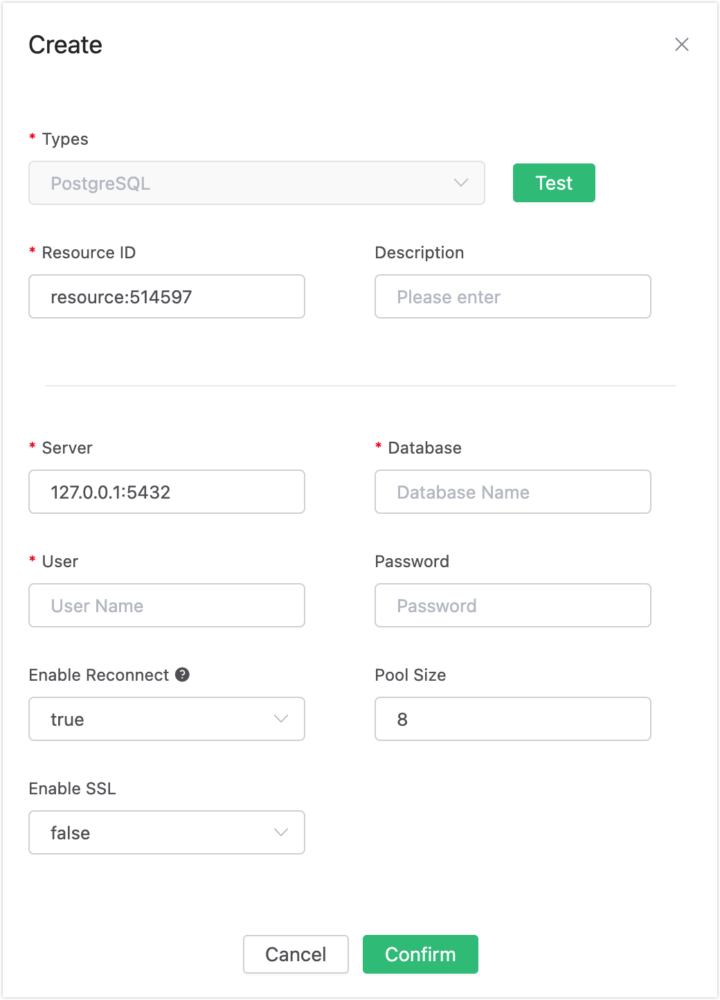
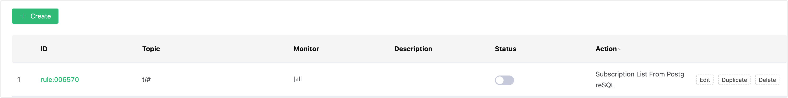

# Auto Subscribe with PostgreSQL 

## Set up the Environment

Set up the PostgreSQL database, and take MacOS X as an example:

```bash
$ brew install postgresql
$ brew services start postgresql
```

Create the MQTT database:

```
# Create a database named 'mqtt' with the username postgres
$ createdb -U postgres mqtt

$ psql -U postgres mqtt

mqtt=> \dn;
List of schemas
Name  | Owner
--------+-------
public | postgres
(1 row)
```

Create the mqtt_sub table:

```sql
$ psql -U postgres mqtt
CREATE TABLE mqtt_sub(
  id SERIAL8 primary key,
  clientid character varying(64),
  topic character varying(255),
  qos integer,
  UNIQUE (clientid, topic)
);
```

:::tip

The table structure of the subscription relationship cannot be altered. Kindly utilize the provided SQL statement for creating the table.

:::

## Create Rules

Open [EMQX Dashboard](http://127.0.0.1:18083/#/rules) and select the "Rules" tab on the left.

Then fill in the rule SQL:

```sql
SELECT * FROM "$events/client_connected"
```


Related actions:

Select "Add Action" on the "Response Action" interface, and then select "Get Subscription List from PostgreSQL" in the "Add Action" drop-down box


Fill in the action parameters:

The action of "Get subscription list from PostgreSQL" requires one parameter:

Associated resources. The resource drop-down box is empty now, and you can click "Create" in the upper right corner to create a PostgreSQL resource. The "Create Resource" dialog box pops up



Fill in the resource configuration:

Fill in the real PostgreSQL server address and the values corresponding to other configurations, and then click the "Test" button to ensure that the connection test is successful.

Finally, click the "Confirm" button.

Return to the response action interface and click "Confirm".

Return to the rule creation interface and click "Create".



## Test the Rule

The rule has been created, and you can insert a subscription relationship into PostgreSQL through "psql":

```
insert into mqtt_sub(clientid, topic, qos) values('test', 't1', 1)
```


Log in to the device (with clientid test) via Dashboard:


Check the "Subscription" list, and you can see that the Broker obtains the subscription relationship from PostgreSQL and subscribes as the agent device:


