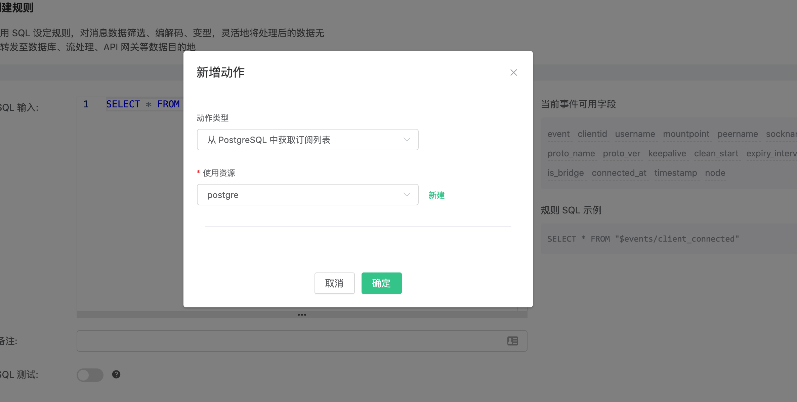

# 从 PostgreSQL 中获取订阅关系

搭建 PostgreSQL 数据库，以 MacOS X 为例:
```bash
$ brew install postgresql
$ brew services start postgresql
```

创建 mqtt 数据库:

```
# 使用用户名 postgres 创建名为 'mqtt' 的数据库
$ createdb -U postgres mqtt

$ psql -U postgres mqtt

mqtt=> \dn;
List of schemas
Name  | Owner
--------+-------
public | postgres
(1 row)
```

创建 mqtt_sub 表:

```sql
$ psql -U postgres mqtt
CREATE TABLE mqtt_sub(
  id SERIAL8 primary key,
  clientid character varying(64),
  topic character varying(255),
  qos integer,
  UNIQUE (clientid, topic)
);
```

::: danger

订阅关系表结构不能修改，请使用上面SQL语句创建

:::

创建规则:

打开 [EMQ X Dashboard](http://127.0.0.1:18083/#/rules)，选择左侧的“规则”选项卡。

然后填写规则 SQL:

```bash
SELECT * FROM "$events/client_connected"
```


关联动作:

在“响应动作”界面选择“添加动作”，然后在“新增动作”下拉框里选择“从PostgreSQL中获取订阅列表”


填写动作参数:

“从PostgreSQL中获取订阅列表“ 动作需要一个参数：

1). 关联资源。现在资源下拉框为空，可以点击右上角的 “新建” 来创建一个 PostgreSQL 资源：


弹出“创建资源”对话框


填写资源配置:

   填写真实的 PostgreSQL 服务器地址，其他配置相应的值，然后点击 “测试连接” 按钮，确保连接测试成功。

最后点击 “确定” 按钮。



返回响应动作界面，点击 “确认”。


返回规则创建界面，点击 “创建”。


规则已经创建完成，通过 “psql” 往PostgreSQL插入一条订阅关系

```
insert into mqtt_sub(clientid, topic, qos) values('test', 't1', 1)'
```


通过 Dashboard 登录 clientid 为 test 的设备:


查看“订阅”列表，可以看到 Broker 从 PostgreSQL 里面获取到订阅关系，并代理设备订阅:

