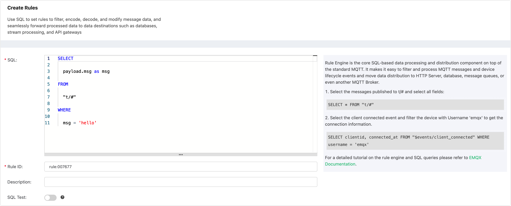
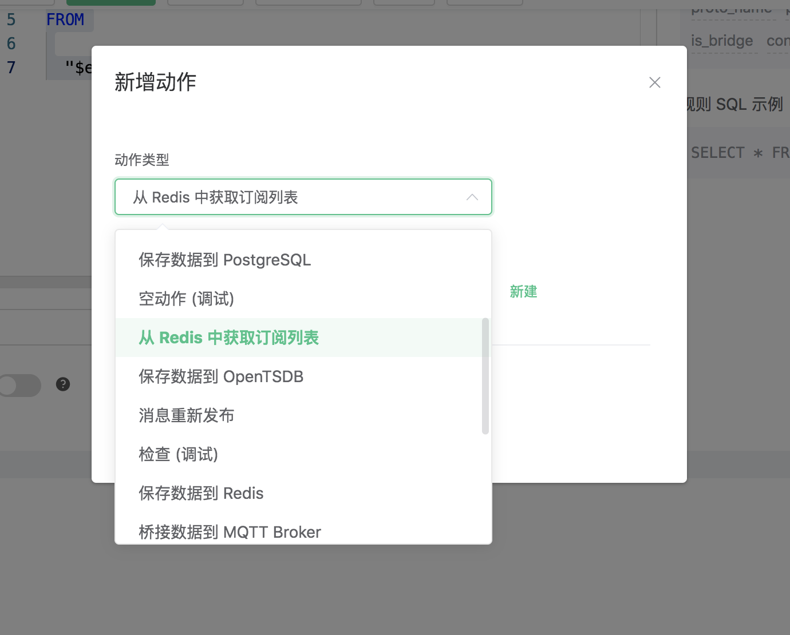
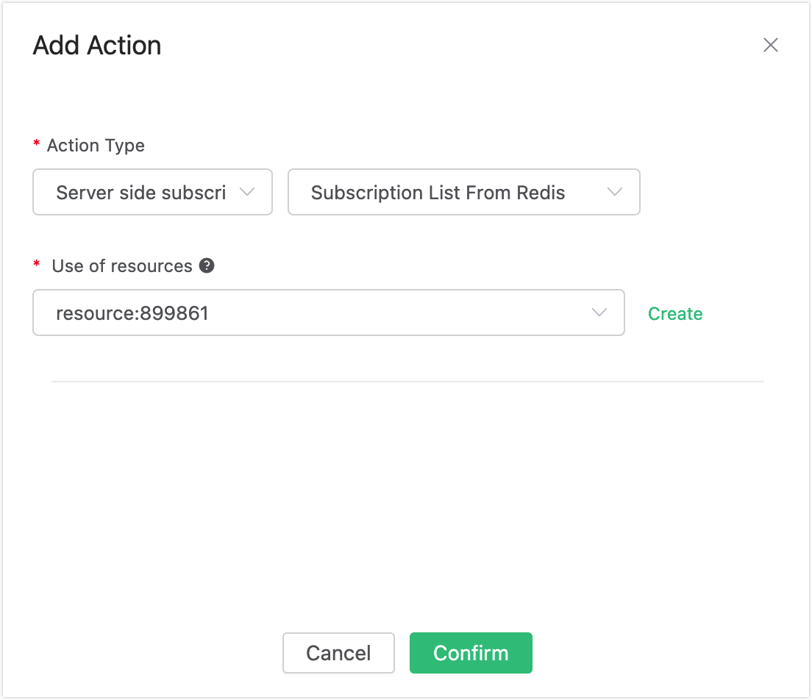
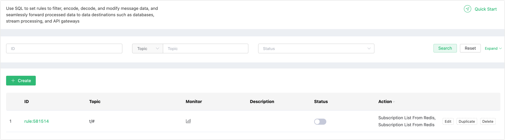
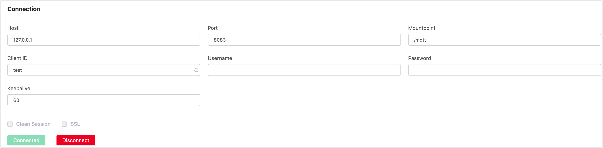
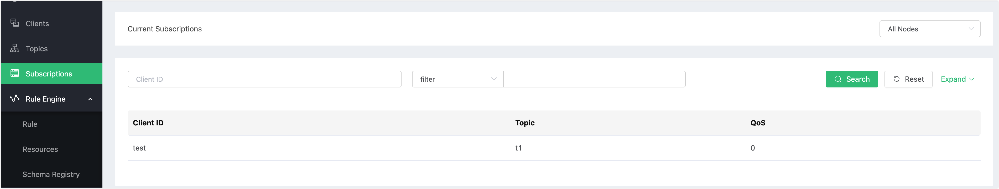

# 从 Redis 中获取订阅关系

搭建 Redis 环境，以 MacOS X 为例:

```bash
 $ wget http://download.redis.io/releases/redis-4.0.14.tar.gz
$ tar xzf redis-4.0.14.tar.gz
$ cd redis-4.0.14
$ make && make install

# 启动 redis
$ redis-server
```

创建规则:

打开 [EMQ X Dashboard](http://127.0.0.1:18083/#/rules)，选择左侧的 “规则” 选项卡。

然后填写规则 SQL:

```bash
SELECT * FROM "$events/client_connected"
```



关联动作:

在 “响应动作” 界面选择 “添加动作”，然后在 “动作” 下拉框里选择 “从 Redis 中获取订阅关系”。



填写动作参数:

“从 Redis 中获取订阅列表”动作需要一个参数：

1). 关联资源。现在资源下拉框为空，可以点击右上角的 “新建资源” 来创建一个 Redis 资源:


选择 Redis 单节点模式资源”。


填写资源配置:

   填写真实的 Redis 服务器地址，其他配置保持默认值，然后点击 “测试连接” 按钮，确保连接测试成功。

最后点击 “新建” 按钮。



返回响应动作界面，点击 “确认”。


返回规则创建界面，点击 “新建”。



规则已经创建完成，通过 Redis CLI 往Redis插入一条订阅关系:

```bash
HSET mqtt:sub:test t1 1
```


通过 Dashboard  登录 clientid 为 test 的设备:



查看订阅列表，可以看到 **test** 设备已经订阅了 **t1** 主题:



