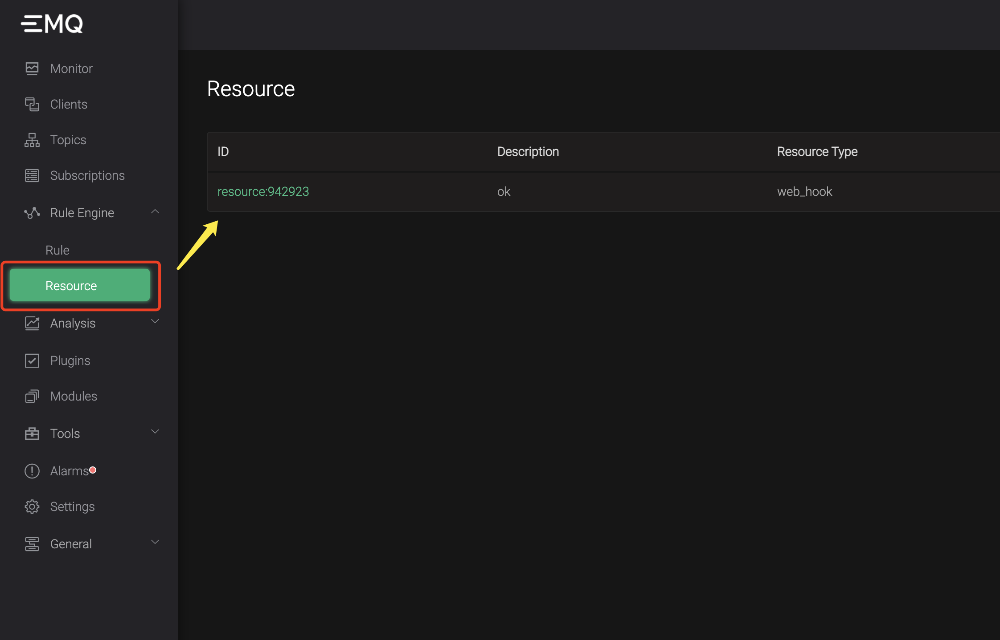
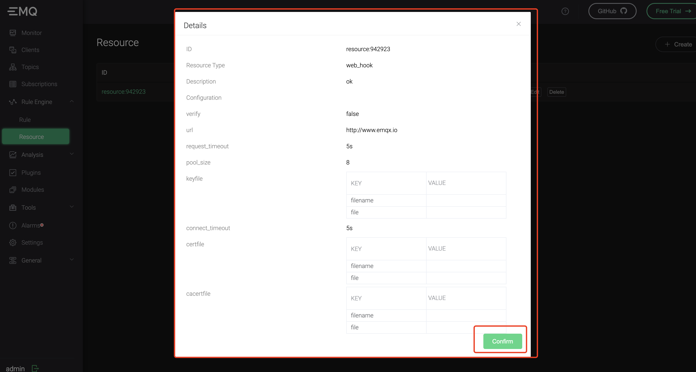
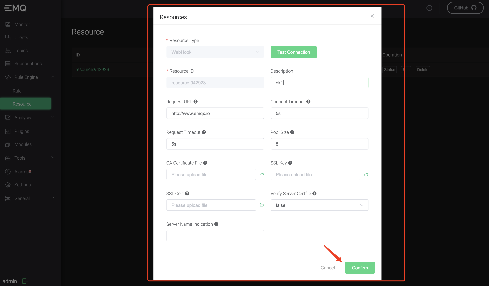
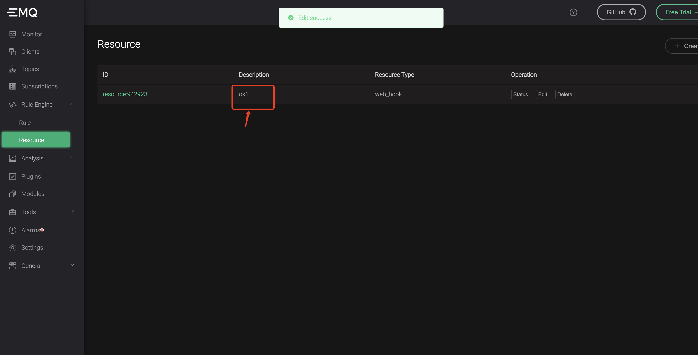
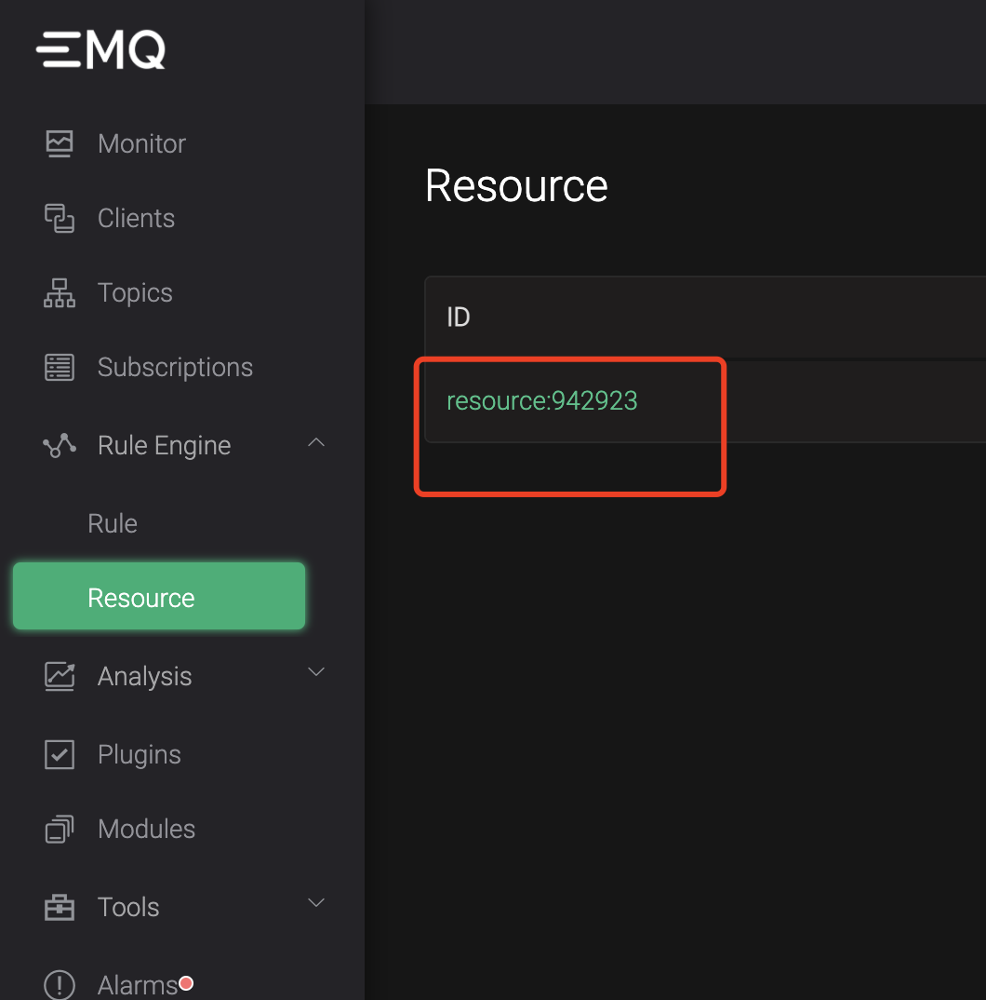

# Update resource

## On Dashboard

First your should click card at `Resource` menu to select the resource which you want to update, then click `Edit` button



It will pop a edit dialog:



Input your new params and click `Confirm` button



At this time, you will be prompted whether to confirm the modification, just click the `Confirm` button. The following figure shows the modified effect:


At this time the "description" information has been updated.


## By CLI

To update through the command line, you need to know the ID of the resource in advance:



Then use the following command to update:

```shell
emqx_ctl resources update $ID -d $Desc -c $Config
```

The first parameter after `update` is the resource ID, the `-d` parameter is "description" and the `-c` parameter is the ***JSON string*** format of the specific resource parameter:

For example：

```json
{
    "verify":false,
    "url":"http://www.demo.com",
    "request_timeout":5,
    "pool_size":32,
    "keyfile":"",
    "connect_timeout":5,
    "certfile":"",
    "cacertfile":""
}
```

It's string format is：

```shell
"{\"verify\":false,\"url\":\"http://www.demo.com\",\"request_timeout\":5,\"pool_size\":32,\"keyfile\":\"\",\"connect_timeout\":5,\"certfile\":\"\",\"cacertfile\":\"\"}"
```

Full command ：

```shell
emqx_ctl resources update resource:001 -d "hello" -c "{\"verify\":false,\"url\":\"http://www.demo.com\",\"request_timeout\":5,\"pool_size\":32,\"keyfile\":\"\",\"connect_timeout\":5,\"certfile\":\"\",\"cacertfile\":\"\"}"
```

So far, we have completed two ways to update resources through the management interface and the command line.
