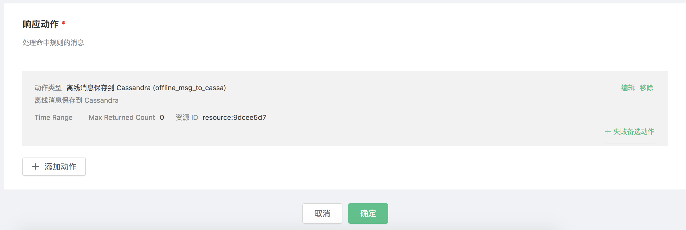

# Save offline messages to Cassandra

Set up the Cassandra database and set the user name and password to root/public. Take MacOS X as an example:
```bash
$ brew install cassandra
## Modify the configuration and disable anonymous authentication
$  vim /usr/local/etc/cassandra/cassandra.yaml

    authenticator: PasswordAuthenticator
    authorizer: CassandraAuthorizer

$ brew services start cassandra

## Create root user
$ cqlsh -ucassandra -pcassandra

create user root with password 'public' superuser;
```

Initialize the Cassandra tablespace:
```bash
$ cqlsh -uroot -ppublic

CREATE KEYSPACE mqtt WITH replication = {'class': 'SimpleStrategy', 'replication_factor': '1'}  AND durable_writes = true;

```

Create the mqtt_msg table:
```sql
CREATE TABLE mqtt.mqtt_msg (
    topic text,
    msgid text,
    arrived timestamp,
    payload text,
    qos int,
    retain int,
    sender text,
    PRIMARY KEY (topic, msgid)
) WITH CLUSTERING ORDER BY (msgid DESC)
    AND bloom_filter_fp_chance = 0.01
    AND caching = {'keys': 'ALL', 'rows_per_partition': 'NONE'}
    AND comment = ''
    AND compaction = {'class': 'org.apache.cassandra.db.compaction.SizeTieredCompactionStrategy', 'max_threshold': '32', 'min_threshold': '4'}
    AND compression = {'chunk_length_in_kb': '64', 'class': 'org.apache.cassandra.io.compress.LZ4Compressor'}
    AND crc_check_chance = 1.0
    AND dclocal_read_repair_chance = 0.1
    AND default_time_to_live = 0
    AND gc_grace_seconds = 864000
    AND max_index_interval = 2048
    AND memtable_flush_period_in_ms = 0
    AND min_index_interval = 128
    AND read_repair_chance = 0.0
    AND speculative_retry = '99PERCENTILE';

```
::: tip

The message table structure cannot be modified. Please use the above SQL statement to create

:::

Create rules:

Open [EMQ X Dashboard](http://127.0.0.1:18083/#/rules) and select the "Rules" tab on the left.

Then fill in the rule SQL:

FROM description

​	**t/#**: The publisher publishes a message to trigger the action of saving of offline messages to Cassandra

​	**$events/session_subscribed**: The subscriber subscribes to topics to trigger  the action of getting offline messages

​	**$events/message_acked**: The subscriber replies to the message ACK to trigger the action of deleting the offline message that has been received

```bash
SELECT * FROM "t/#", "$events/session_subscribed", "$events/message_acked" WHERE topic =~ 't/#'
```


Related actions:

Select "Add Action" on the "Response Action" interface, and then select "Save offline messages to Cassandra" in the "Add Action" drop-down box


Now that the resource drop-down box is empty, and you can click "New" in the upper right corner to create a Cassandra resource:


The "Create Resource" dialog box pops up


Fill in the resource configuration:

Fill in the real Cassandra server address and the values corresponding to other configurations, and then click the "Test Connection" button to ensure that the connection test is successful.

Finally click the "OK" button.


Return to the response action interface and click "OK".



Return to the rule creation interface and click "Create".


The rule has been created, and you can send a piece of data through the WebSocket client of Dashboard **(The QoS of the published message must be greater than 0):**


After the message is sent, you can see the message is saved in Cassandra through cqlsh:


Use another client to subscribe to the topic "t/1" (the QoS of the subscribed topic must be greater than 0, otherwise the message will be received repeatedly):


After subscribing, you will receive the offline message saved in Cassandra immediately:


Offline messages will be deleted in Cassandra after being received:


