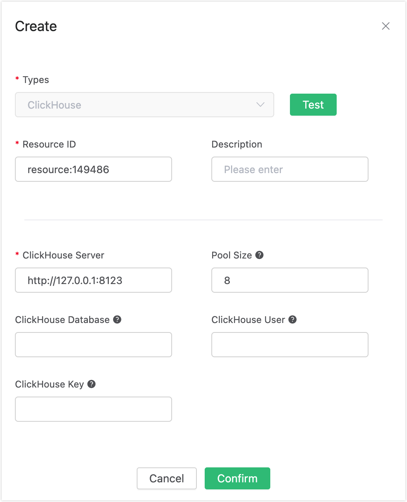
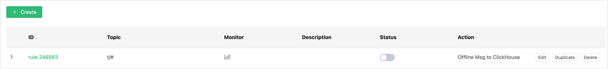
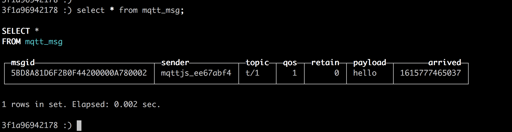

# Save Offline Messages to ClickHouse

## Set up Environment

Set up the MongoDB database and set the user name and password to default/public. Take MacOS X as an example:

```bash
## Install dependencies
sudo yum install -y epel-release

## Download and run the installation shell script provided with packagecloud.io
curl -s https://packagecloud.io/install/repositories/altinity/clickhouse/script.rpm.sh | sudo bash

## Install the ClickHouse server and client
sudo yum install -y clickhouse-server clickhouse-client

## Start ClickHouse server
clickhouse-server

## Start ClickHouseclient
clickhouse-client
```

Create the “mqtt”  database:
```bash
create database mqtt;
```
Create the mqtt_msg table:

```sql
use mqtt;
create table mqtt_msg (
	msgid String,
	sender String,
	topic String,
	qos Nullable(Int8) DEFAULT 0,
	retain Nullable(Int8) DEFAULT 0,
	payload String,
	arrived Int64) engine = MergeTree() ORDER BY msgid;
```

::: tip

The table structure of the subscription relationship cannot be altered. Kindly utilize the provided SQL statement for creating the table.

:::

## Create Rules

Open [EMQX Dashboard](http://127.0.0.1:18083/#/rules) and select the "Rules" tab on the left.

Then fill in the rule SQL:

FROM description

​	**t/#**: The publisher publishes a message to trigger the action of saving offline messages to ClickHouse.

​	**$events/session_subscribed**: The subscriber subscribes to topics to trigger the action of getting offline messages.

​	**$events/message_acked**: The subscriber replies to the message ACK to trigger the action of deleting the offline message that has been received.

```sql
SELECT * FROM "t/#", "$events/session_subscribed", "$events/message_acked" WHERE topic =~ 't/#'
```


## Add an Action

Select "Add Action" on the "Response Action" interface, and then select "Save offline messages to ClickHouse" in the "Add Action" drop-down box


Now that the resource drop-down box is empty, you can click "Create" in the upper right corner to create a ClickHouse resource:

The "Create Resource" dialog box pops up, fill in the resource configuration.

Fill in the real ClickHouse server address and the values corresponding to other configurations, and then click the "Test" button to ensure that the connection test is successful.




Finally, click the "Confirm" button.

Return to the response action interface and click "Confirm".

Return to the rule creation interface and click "Create".



## Test the Rule

The rule has been created, and you can send a piece of data through the WebSocket client of Dashboard **(The QoS of the published message must be greater than 0):**


After the message is sent, you can see the message is saved in ClickHouse



Use another client to subscribe to the topic "t/1" (the QoS of the subscribed topic must be greater than 0, otherwise the message will be received repeatedly):


After subscribing, you will receive the offline message saved in  ClickHouse immediately:


Offline messages will be deleted in ClickHouse after being received:


