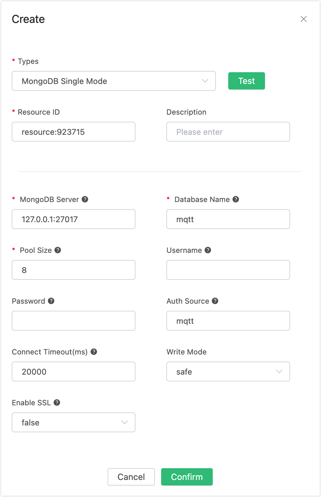
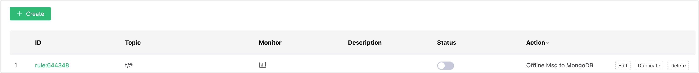

# Save Offline Messages to MongoDB

## Set up Environment

Set up the MongoDB database and set the user name and password to root/public. Take MacOS X as an example:

```bash
$ brew install mongodb
$ brew services start mongodb

## Add root/public user
$ use mqtt;
$ db.createUser({user: "root", pwd: "public", roles: [{role: "readWrite", db: "mqtt"}]});

## Modify the configuration and disable anonymous authentication
$ vi /usr/local/etc/mongod.conf

    security:
    authorization: enabled

$ brew services restart mongodb
```

Create the mqtt_msg table:
```bash
$ mongo 127.0.0.1/mqtt -uroot -ppublic
db.createCollection("mqtt_msg");
```

## Create Rules

Open [EMQX Dashboard](http://127.0.0.1:18083/#/rules) and select the "Rules" tab on the left.

Then fill in the rule SQL:

FROM description

​	**t/#**: The publisher publishes a message to trigger the action of saving of offline messages to MongoDB

​	**$events/session_subscribed**: The subscriber subscribes to topics to trigger  the action of getting offline messages

​	**$events/message_acked**: The subscriber replies to the message ACK to trigger the action of deleting the offline message that has been received

```sql
SELECT * FROM "t/#", "$events/session_subscribed", "$events/message_acked" WHERE topic =~ 't/#'
```


## Add Actions

Select "Add Action" on the "Response Action" interface, and then select "Save offline messages to MongoDB" in the "Add Action" drop-down box


Now that the resource drop-down box is empty, and you can click "Create" in the upper right corner to create a MongoDB resource:

The "Create Resource" dialog box pops up, fill in the resource configuration.

Fill in the real MongoDB server address and the values corresponding to other configurations, and then click the "Test Connection" button to ensure that the connection test is successful.




Finally, click the "Confirm" button.

Return to the response action interface and click "Confirm".

Return to the rule creation interface and click "Create".



The rule has been created, and you can send a piece of data through the WebSocket client of Dashboard **(The QoS of the published message must be greater than 0):**


After the message is sent, you can see the message is saved in MongoDB through mongo:

```
db.mqtt_msg.find()
```


Use another client to subscribe to the topic "t/1" (the QoS of the subscribed topic must be greater than 0, otherwise the message will be received repeatedly):


After subscribing, you will receive the offline message saved in MongoDB immediately:


Offline messages will be deleted in MongoDB after being received:


