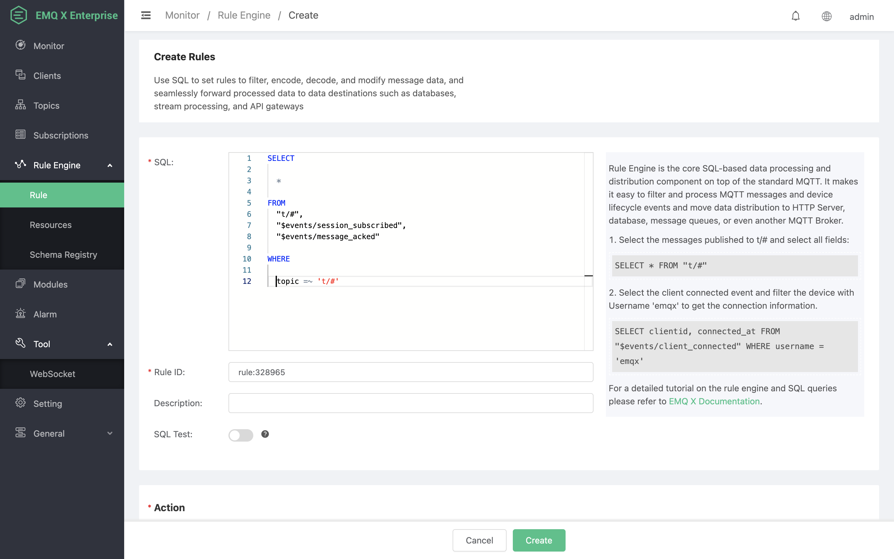
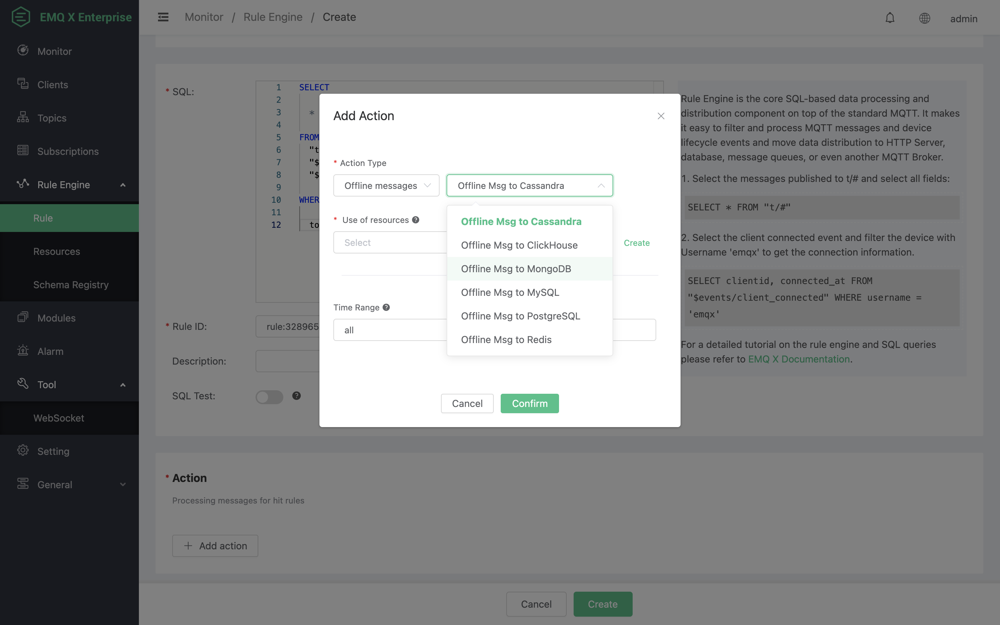
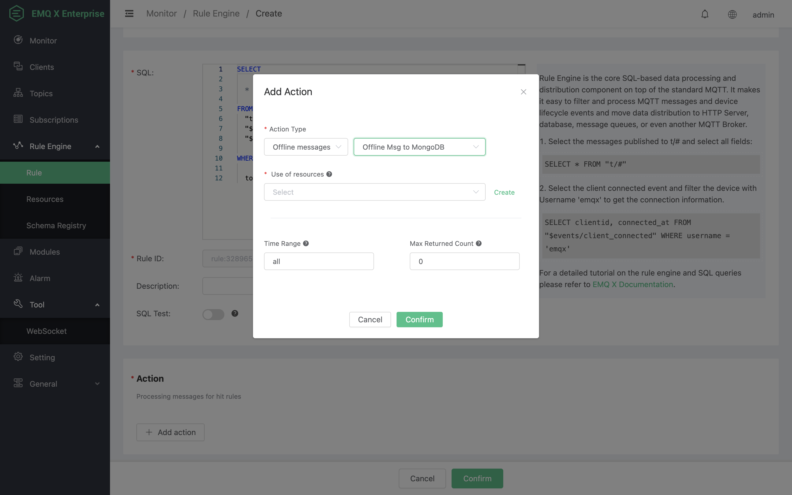
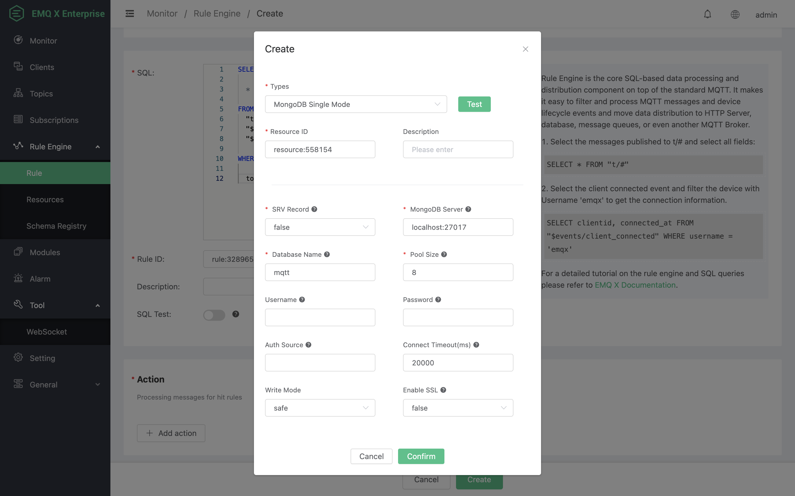
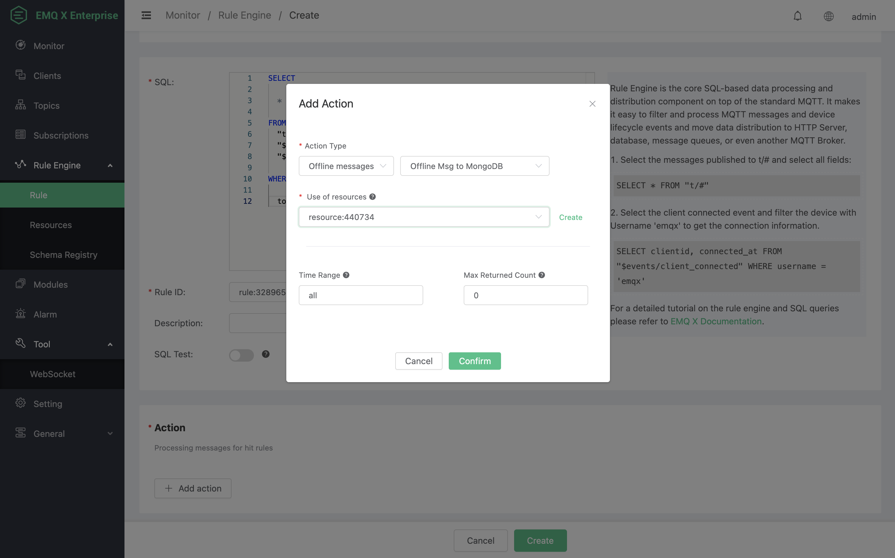
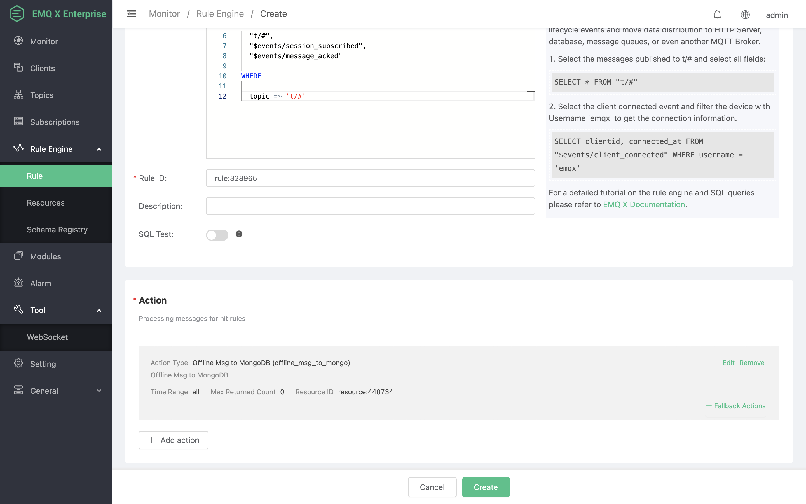
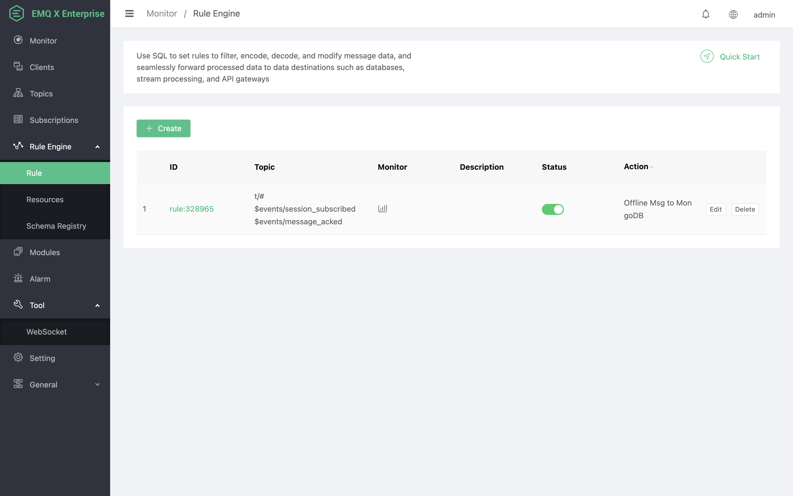
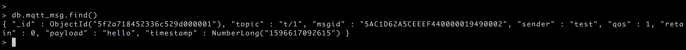

# 离线消息保存到 MongoDB

搭建 MongoDB 数据库，并设置用户名密码为 root/public，以 MacOS X 为例:
```bash
$ brew install mongodb
$ brew services start mongodb

## 新增 root/public 用户
$ use mqtt;
$ db.createUser({user: "root", pwd: "public", roles: [{role: "readWrite", db: "mqtt"}]});

## 修改配置，关闭匿名认证
$ vi /usr/local/etc/mongod.conf

    security:
    authorization: enabled

$ brew services restart mongodb
```

创建 mqtt_msg 表:
```bash
$ mongo 127.0.0.1/mqtt -uroot -ppublic
db.createCollection("mqtt_msg");
```

创建规则:

打开 [EMQ X Dashboard](http://127.0.0.1:18083/#/rules)，选择左侧的“规则”选项卡。

然后填写规则 SQL:

FROM说明

​	**t/#**: 发布者发布消息触发保存离线消息到MongoDB

​	**$events/session_subscribed**: 订阅者订阅主题触发获取离线消息

​	**$events/message_acked**: 订阅者回复消息ACK后触发删除已经被接收的离线消息

```bash
SELECT * FROM "t/#", "$events/session_subscribed", "$events/message_acked" WHERE topic =~ 't/#'
```



关联动作:

在“响应动作”界面选择“添加动作”，然后在“动作”下拉框里选择“离线消息保存到 MongoDB”。




现在资源下拉框为空，可以点击右上角的 “新建” 来创建一个 MongoDB 资源:



弹出一个“创建资源”对话框



填写资源配置:

填写真实的 MongoDB 服务器地址，其他配置填写相应的值，然后点击 “测试连接” 按钮，确保连接测试成功。

最后点击 “确定” 按钮。



返回响应动作界面，点击 “确认”。



返回规则创建界面，点击 “创建”。



规则已经创建完成，通过 Dashboard 的 WebSocket 客户端发一条数据**(发布消息的QoS必须大于0)**:


消息发送后，通过 mongo 查看到消息被保存到 MongoDB 里面:

```
db.mqtt_msg.find()
```



使用另外一个客户端，订阅主题 "t/1" (订阅主题的QoS必须大于0，否则消息会被重复接收):


订阅后马上接收到了保存到 MongoDB 里面的离线消息:


离线消息被接收后会在 MongoDB 中删除:

