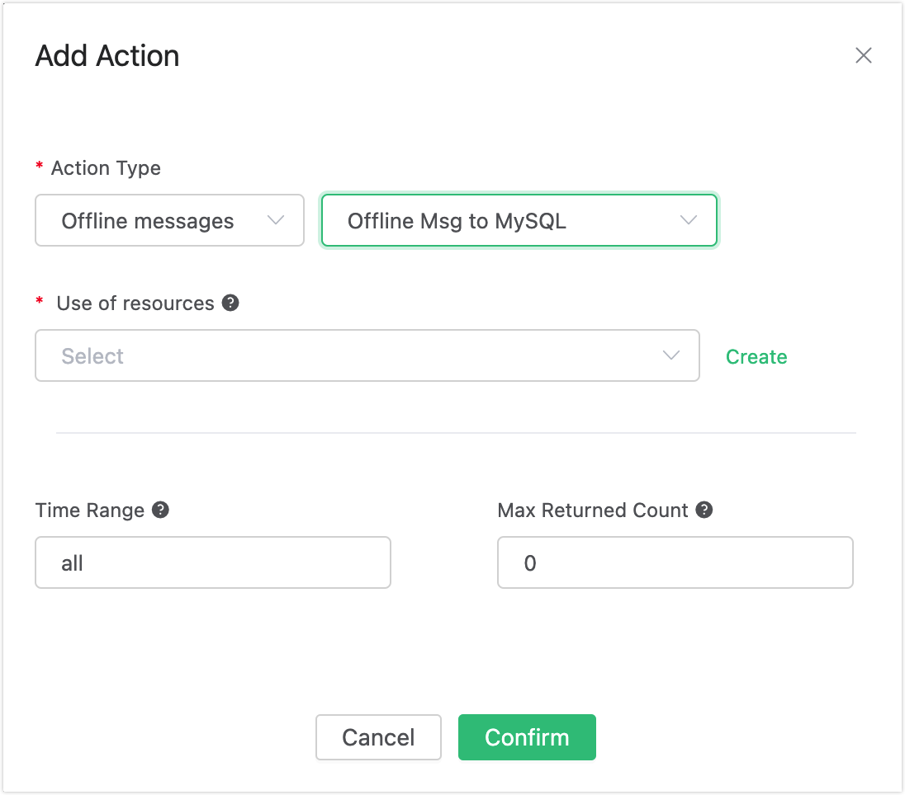
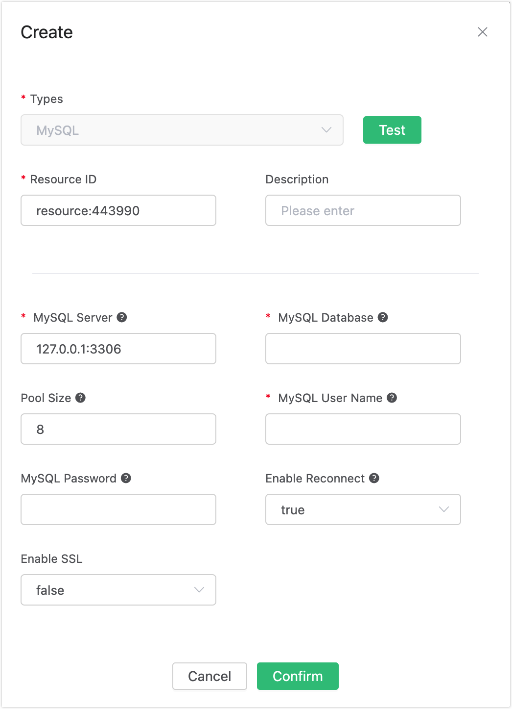
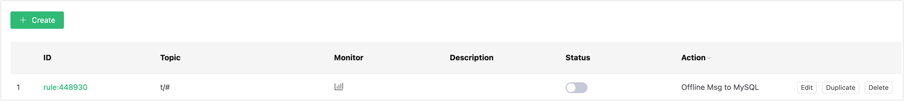

# Save offline messages to MySQL

## Set up Environment

Set up the MySQL database and set the user name and password to root/public. Take MacOS X as an example:

```bash
$ brew install mysql

$ brew services start mysql

$ mysql -u root -h localhost -p

ALTER USER 'root'@'localhost' IDENTIFIED BY 'public';
```

Initialize the MySQL database:
```bash
$ mysql -u root -h localhost -ppublic

create database mqtt;
```

Create the mqtt_msg table:
```sql
DROP TABLE IF EXISTS `mqtt_msg`;
CREATE TABLE `mqtt_msg` (
  `id` int(11) unsigned NOT NULL AUTO_INCREMENT,
  `msgid` varchar(64) DEFAULT NULL,
  `topic` varchar(180) NOT NULL,
  `sender` varchar(64) DEFAULT NULL,
  `qos` tinyint(1) NOT NULL DEFAULT '0',
  `retain` tinyint(1) DEFAULT NULL,
  `payload` blob,
  `arrived` datetime NOT NULL,
  PRIMARY KEY (`id`),
  INDEX topic_index(`id`, `topic`)
) ENGINE=InnoDB DEFAULT CHARSET=utf8MB4;
```

::: tip

The message table structure cannot be modified. Please use the above SQL statement to create

:::

## Create Rules

Open [EMQX Dashboard](http://127.0.0.1:18083/#/rules) and select the "Rules" tab on the left.

Then fill in the rule SQL:

FROM description

​	**t/#**: The publisher publishes a message to trigger the action of saving of offline messages to MySQL

​	**$events/session_subscribed**: The subscriber subscribes to topics to trigger  the action of getting offline messages

​	**$events/message_acked**: The subscriber replies to the message ACK to trigger the action of deleting the offline message that has been received

```sql
SELECT * FROM "t/#", "$events/session_subscribed", "$events/message_acked" WHERE topic =~ 't/#'
```


Related actions:

Select "Add Action" on the "Response Action" interface, and then select "Save offline messages to MySQL" in the "Add Action" drop-down box.


Now that the resource drop-down box is empty, you can click "Create" in the upper right corner to create a MySQL resource:



The "Create Resource" dialog box pops up, fill in the resource configuration.

Fill in the real MySQL server address and the values corresponding to other configurations, and then click the "Test" button to ensure that the connection test is successful.




Finally, click the "Confirm" button.

Return to the response action interface and click "Confirm".

Return to the rule creation interface and click "Create".



## Test the Rule

The rule has been created, and you can send a piece of data through the WebSocket client of Dashboard **(The QoS of the published message must be greater than 0):**


After the message is sent, you can see the message is saved in MySQL through MySQL:


Use another client to subscribe to the topic "t/1" (the QoS of the subscribed topic must be greater than 0, otherwise the message will be received repeatedly):


After subscribing, you will receive the offline message saved in MySQL immediately:


Offline messages will be deleted in MySQL after being received:


