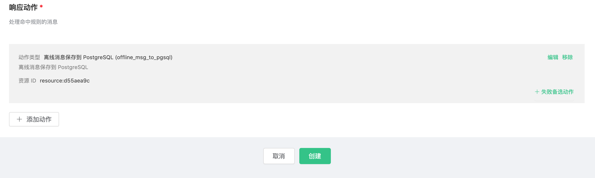
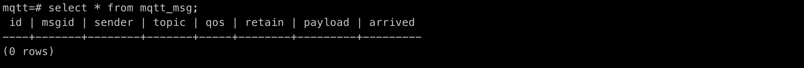

# Save offline messages to PostgreSQL

::: tip

Support PostgreSQL 13 and below versions

:::

Set up the PostgreSQL database, and take MacOS X as an example:
```bash
$ brew install postgresql
$ brew services start postgresql
```

Create the mqtt database:

```
# Create a database named'mqtt' with the username postgres
$ createdb -U postgres mqtt

$ psql -U postgres mqtt

mqtt=> \dn;
List of schemas
Name  | Owner
--------+-------
public | postgres
(1 row)
```

Create the mqtt_msg table:

```sql
$ psql -U postgres mqtt

CREATE TABLE mqtt_msg (
  id SERIAL8 primary key,
  msgid character varying(64),
  sender character varying(64),
  topic character varying(255),
  qos integer,
  retain integer,
  payload text,
  arrived timestamp without time zone
);
```

::: tip

The message table structure cannot be modified. Please use the above SQL statement to create

:::

Create rules:

Open [EMQX Dashboard](http://127.0.0.1:18083/#/rules) and select the "Rules" tab on the left.

Then fill in the rule SQL:

FROM description

​	**t/#**: The publisher publishes a message to trigger the action of saving of offline messages to PostgreSQL

​	**$events/session_subscribed**: The subscriber subscribes to topics to trigger  the action of getting offline messages

​	**$events/message_acked**: The subscriber replies to the message ACK to trigger the action of deleting the offline message that has been received

```bash
SELECT * FROM "t/#", "$events/session_subscribed", "$events/message_acked" WHERE topic =~ 't/#'
```


Related actions:

Select "Add Action" on the "Response Action" interface, and then select "Save offline messages to PostgreSQL" in the "Add Action" drop-down box


Now that the resource drop-down box is empty, and you can click "New" in the upper right corner to create a PostgreSQL resource:


The "Create Resource" dialog box pops up


Fill in the resource configuration:

Fill in the real PostgreSQL server address and the values corresponding to other configurations, and then click the "Test Connection" button to ensure that the connection test is successful.

Finally click the "OK" button.


Return to the response action interface and click "OK".



Return to the rule creation interface and click "Create".


The rule has been created, and you can send a piece of data through the WebSocket client of Dashboard **(The QoS of the published message must be greater than 0):**


After the message is sent, you can see the message is saved in PostgreSQL through psql:


Use another client to subscribe to the topic "t/1" (the QoS of the subscribed topic must be greater than 0, otherwise the message will be received repeatedly):


After subscribing, you will receive the offline message saved in PostgreSQL immediately:


Offline messages will be deleted in PostgreSQL after being received:


