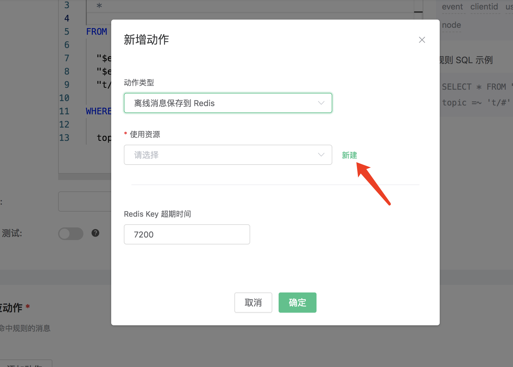

# 离线消息保存到 Redis

搭建 Redis 环境，以 MacOS X 为例:

```bash
 $ wget http://download.redis.io/releases/redis-4.0.14.tar.gz
$ tar xzf redis-4.0.14.tar.gz
$ cd redis-4.0.14
$ make && make install

# 启动 redis
$ redis-server
```

创建规则:

打开 [EMQ X Dashboard](http://127.0.0.1:18083/#/rules)，选择左侧的 “规则” 选项卡。

然后填写规则 SQL:

FROM说明

 **t/#**: 发布者发布消息触发保存离线消息到Redis

 **$events/session_subscribed**: 订阅者订阅主题触发获取离线消息

 **$events/message_acked**: 订阅者回复消息ACK后触发删除已经被接收的离线消息

```bash
SELECT * FROM "t/#", "$events/session_subscribed", "$events/message_acked" WHERE topic =~ 't/#'
```


关联动作:

在 “响应动作” 界面选择 “添加动作”，然后在 “动作” 下拉框里选择 “离线消息保存到 Redis”。


填写动作参数:

“离线消息保存到 Redis 动作需要两个参数：

1). Redis Key 超期的 TTL

2). 关联资源。现在资源下拉框为空，可以点击右上角的 “新建资源” 来创建一个 Redis 资源:



选择 Redis 单节点模式资源”。


填写资源配置:

   填写真实的 Redis 服务器地址，其他配置保持默认值，然后点击 “测试连接” 按钮，确保连接测试成功。

最后点击 “新建” 按钮。


返回响应动作界面，点击 “确认”。


返回规则创建界面，点击 “新建”。


规则已经创建完成，通过 Dashboard 的 WebSocket 客户端发一条数据**(发布消息的QoS必须大于0)**:


消息发送后，通过 Redis CLI 查看到消息被保存到 Redis 里面:

```bash
$ redis-cli

KEYS mqtt:msg\*

hgetall Key
```


使用另外一个客户端，订阅主题 "t/1" **(订阅主题的QoS必须大于0，否则消息会被重复接收, 不支持主题通配符方式订阅获取离线消息)**:


订阅后马上接收到了保存到 Redis 里面的离线消息:


离线消息被接收后会在 Redis 中删除:

