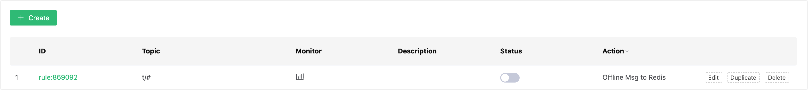

# Save Offline Messages to Redis

## Set Up Environment

Set up the Redis environment, and take MacOS X as an example:

```bash
 $ wget http://download.redis.io/releases/redis-4.0.14.tar.gz
$ tar xzf redis-4.0.14.tar.gz
$ cd redis-4.0.14
$ make && make install

# Start redis
$ redis-server
```

## Create Rules

Open [EMQX Dashboard](http://127.0.0.1:18083/#/rules) and select the "Rules" tab on the left.

Then fill in the rule SQL:

FROM description

​	**t/#**: The publisher publishes a message to trigger the action of saving of offline messages to Redis

​	**$events/session_subscribed**: The subscriber subscribes to topics to trigger  the action of getting offline messages

​	**$events/message_acked**: The subscriber replies to the message ACK to trigger the action of deleting the offline message that has been received

```sql
SELECT * FROM "t/#", "$events/session_subscribed", "$events/message_acked" WHERE topic =~ 't/#'
```


## Add an Action

Select "Add Action" on the "Response Action" interface, and then select "Save offline messages to Redis" in the "Action" drop-down box.


Fill in the action parameters:

The action of saving offline messages to Redis requires two parameters:

1). Redis Key expired TTL

2). Associated resources. Now that the resource drop-down box is empty, and you can click "Create" in the upper right corner to create a Redis resource:

Select Redis single-node mode resources.


Fill in the resource configuration:

Fill in the real Redis server address and keep other configurations as default, and then click the "Test" button to ensure that the connection test is successful.

Finally, click the "Confirm" button.

Return to the response action interface and click "Confirm".

Return to the rule creation interface and click "Create".

## Test the Rule

The rule has been created, and you can send a piece of data through the WebSocket client of Dashboard **(The QoS of the published message must be greater than 0):**



After the message is sent, you can see the message is saved in Redis through Redis CLI:

```bash
$ redis-cli

KEYS mqtt:msg\*

hgetall Key
```


Use another client to subscribe to the topic "t/1" (the QoS of the subscribed topic must be greater than 0, otherwise the message will be received repeatedly. Topic wildcard subscription is not supported to get offline messages):


After subscribing, you will receive the offline message saved in Redis immediately:


Offline messages will be deleted in Redis after being received:


