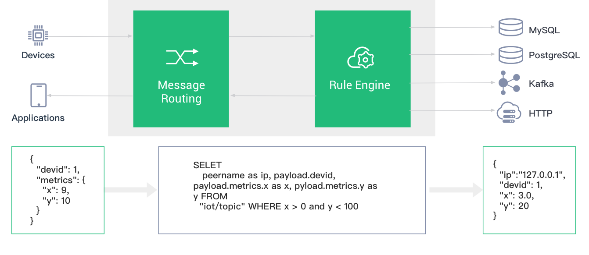
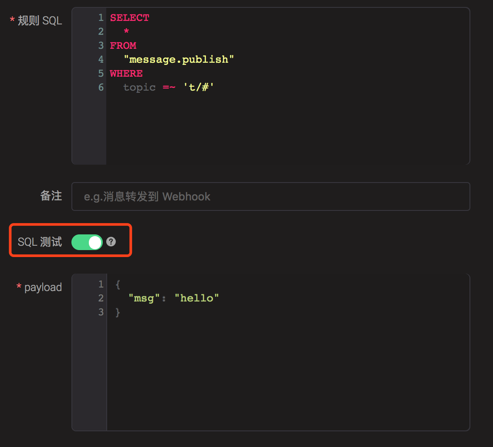
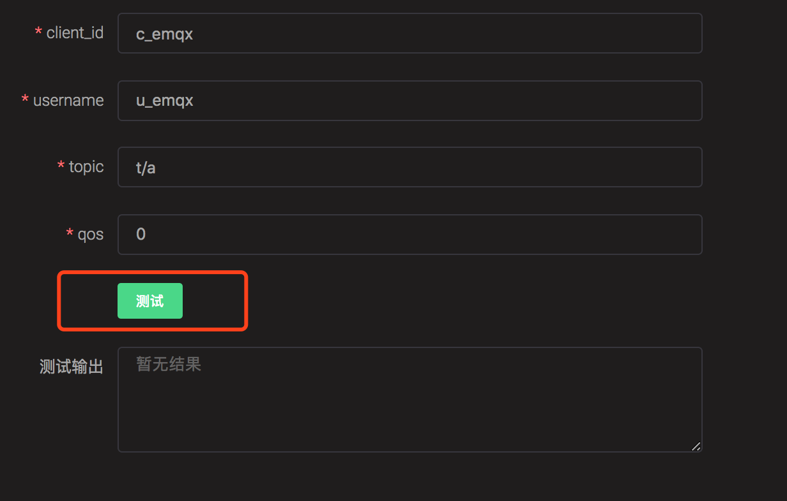
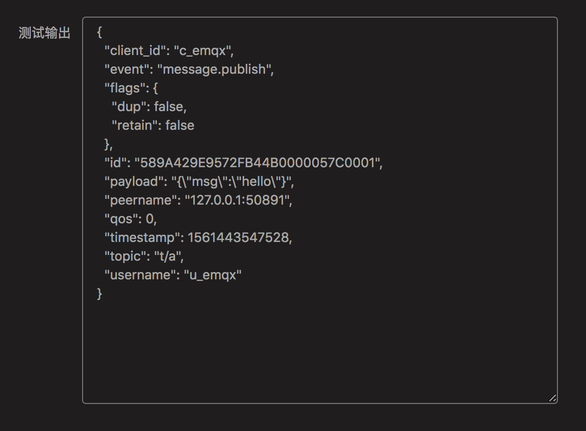

# Rule Engine

EMQ X Broker Rule Engine (Hereinafter referred to as rule engine) is used to configure EMQ X Broker message flow and device event processing and response rules. The rule engine not only provides a clear and flexible "configuration-style" business integration solution, simplifies the business development process, improves ease of use for user, and reduces the coupling between the business system and EMQ X Broker, but also provides a better infrastructure for the private function customization of EMQ X broker.



EMQ X Broker will trigger the rule engine when **publishing message or triggering  event**, and the rules that meet the triggering conditions will execute their own SQL statements to filter and process the context information of messages and events.

::: tip
Applicable version:**EMQ X Broker v3.1.0+**

Compatibility Tip: EMQ X Broker v4.0 makes major adjustments to the SQL syntax of the rule engine. For v3.x upgrade users, please refer to  [Migration Guide](./rule-engine.md#migration-guide) for compatibility.
:::

## Publish message

The rule engine can store the message processing results of a specific topic to the database with the response action, send it to the HTTP server, forward it to the message queue of Kafka or RabbitMQ, and republish to a new topic or even another Broker cluster. Each rule can be configured with multiple response actions.

Select the message published to the t/# topic and filter out all fields:

```sql
SELECT * FROM "t/#"
```

Select the message posted to the t/a topic, and filter out the "x" field from the message content in JSON format:

```sql
SELECT payload.x as x FROM "t/a"
```

## Event trigger

The rule engine uses a virtual topic beginning with **$events/** to process EMQ X Broker built-in events. The built-in events provide finer message control and client action processing capabilities, which can be used in the business of QoS 1 QoS 2 messages arrival recording, device online and offline recording.

Select the client connection event, filter the device whose Username is `emqx` and obtain the connection information:

```sql
SELECT clientid, connected_at FROM "$events/client_connected" WHERE username = 'emqx'
```

For rule engine data, SQL statement format and [event topic](#event-topics) list, please refer to [SQL manual](#sql-statement) for detailed tutorials.

## Minimum rule

The rule describes the three configurations of **where data comes from ,  how to filter and process data, and where to processed results goes**, which means an available rule contains three elements:

- Triggered event: The rule is triggered by an event. When triggered, the event inputs the context information (data source) of the event into the rule, and the event type is specified through the FROM clause of SQL;
- Processing rules (SQL): Use SELECT clause and WHERE clause and built-in processing functions to filter and process data from context information;
- Response action: If there is a processing result output, the rule will perform the corresponding action, such as persisting to the database, republishing the processed message, forwarding the message to the message queue, etc. A rule can configure multiple response actions.

The following figure is a simple rule, which is used to process the data at the time of **message publishing**, filter out the `msg` field,  messages `topic`, ` qos` of all topic messages, and send them to the Web Server and /uplink topics:


## Examples of typical application scenarios for rule engine

- Action listening: In the development of intelligent door lock for smart home, the function of the door lock will be abnormal because of offline resulting by the network or power failure, man-made damage and other reasons. Through using rule engine configuration to monitor offline events, it can push the fault information to the application service and realize the ability of first time fault detection in the access layer.
- Data filtering: Truck fleet management of vehicle network. Vehicle sensors collect and report a large amount of operational data. The application platform only focuses on data with a vehicle speed greater than 40 km/h. In this scenario, the rule engine can be used to conditionally filter messages to the service, and data that satisfies the condition can be written to the business message queue .
- Message routing: In the intelligent billing application, the terminal device distinguishes the service type by different topics. The message of billing service can be connected to the billing message queue by configuring the rule engine, and the non-billing information can be connected to other message queues to realize the routing configuration of business messages.
- Message encoding and decoding: In the application scenarios such as public protocol/proprietary TCP protocol access and industrial control, the encoding and decoding of binary/special format message body can be done through the local processing function of the rule engine (which can be customized and developed on EMQ X). Relevant messages can also be routed through the rule engine to external computing resources such as function computing for processing (processing logic can be developed by users), and the messages can be converted into JSON format that is easy for business processing, which simplifies the difficulty of project integration and improves the ability of rapid development and delivery of applications.

## Migration Guide

In version 4.0, the SQL syntax of the rule engine is easier to use. In version 3. X, the event name needs to be specified after the **FROM** clause. After 4.0 version, we introduce the concept of **event topic** . By default, the **message publish** event no longer needs to be specified. 

```sql
## 3.x
## Event name needs to be specified for processing
SELECT * FROM "message.publish" WHERE topic =~ 't/#'

## 4.0 and later
## The message.publish event is processed by default, and MQTT topics are filtered directly after FROM
## The above SQL is equivalent to:
SELECT * FROM 't/#'

## Other events are filtered by event topics
SELECT * FROM "$events/message_acked" where topic =~ 't/#'
SELECT * FROM "$events/client_connected"
```

::: tip
The old version of SQL syntax conversion function is provided in Dashboard to complete SQL upgrade and migration. 
:::

## Rule engine composition

EMQ X Broker's rule engine can be used to flexibly process messages and events. By using the rule engine, it can easily achieve such function as converting the message into a specified format, and then stored in a database table, or sent to the message queue.

The concepts related to the EMQ X Broker rule engine include: rules, actions, resources, and resource-types.

The relationship between rules, actions and resources:
```
Rule: {
    SQL statement
    Action list: [
        {
            action 1,
            Action parameters,
            Bind resources: {
                Resource configuration
            }
        },
        {
            action 2,
            Action parameters,
            Bind resources:  {
                Resource configuration
            }
        }
    ]
}
```
- Rule: Rule consists of SQL statements and action list. The action list contains one or more actions and their parameters.
- SQL statements are used to filter or transform data in messages.
- The action is the task performed after the SQL statement is matched, which defines an operation for data.
  Actions can be bound to resources or unbound. For example, the "inspect" action does not require binding resources, which simply prints the data content and action parameters. The "data_to_webserver" action needs to bind a web_hook type resource, and a URL is configured in this resource.
- Resource: A resource is an object instantiated through a resource type as a template, and saves the configuration related to the resource (such as database connection address and port, user name and password, etc.).
- Resource Type: Resource type is a static definition of a resource and describes the configuration items required for this type of resource.

::: tip
Actions and resource types are provided by emqx or plugin code and cannot be created dynamically through API and CLI.
:::

## SQL statement 
### SQL syntax
**FROM, SELECT, and WHERE clauses:**

The basic format of the SQL statement of the rule engine is:
```sql
SELECT <fields> FROM <topic> [WHERE <any>]
```
- The `FROM` clause mounts rules to a topic
- The `SELECT` clause is used to select fields in the output
- The `WHERE` clause is used to filter messages based on conditions

**FOREACH, DO and INCASE clauses:**

If you want to perform some operations and actions for each element of an array data, you need to use the `FOREACH-DO-INCASE` syntax. The basic format is:

```sql
FOREACH <Field name> [DO <Condition>] [INCASE <Condition>] FROM <Topic> [WHERE <Condition>]
```

- The `FOREACH` clause is used to select the field that needs to perform foreach operation. Note that the selected field must be an array type
- The `DO` clause is used to transform each element in the array selected by FOREACH and select the field of interest
- The `INCASE` clause is used to apply conditional filtering to a field selected by DO

The DO and INCASE clauses are optional. DO is equivalent to the SELECT clause for objects in the current loop, while INCASE is equivalent to the WHERE statement for objects in the current loop.

### Events and event topics 
The SQL statements of the rule engine can handle both messages (message publishing) and events (client online and offline, client subscription, etc.). For messages, the FROM clause is directly followed by the topic name; for events, the FROM clause is followed by the event topic.

The topic of the event message starts with `"$events/"`, such as `"$events/client_connected",` `"$events/session_subscribed"`.
If you want emqx to publish the event message, you can configure it in the `emqx_rule_engine.conf` file.

For all supported events and available fields, please see  [rule event](#rule-sql-events).

### SQL statement example: 
**Basic syntax examples**

-  Extract all fields from the messages with a topic of "t/a": 
    ```sql
    SELECT * FROM "t/a"
    ```
-  Extract all fields from the messages with a topic of "t/a" or "t/b": 
    ```sql
    SELECT * FROM "t/a","t/b"
    ```
-  Extract all fields from the message with a topic that can match 't/#'. 
    ```sql
    SELECT * FROM "t/#"
    ```
-  Extract the qos, username, and clientid fields from the message with a topic that can match 't/#' :
    ```sql
    SELECT qos, username, clientid FROM "t/#"
    ```
-  Extract the username field from any topic message with the filter criteria of username = 'Steven':
    ```sql
    SELECT username FROM "#" WHERE username='Steven'
    ```
- Extract the x field from the payload of message with any topic and create the alias x for use in the WHERE clause. The WHERE clause is restricted as x = 1. Note that the payload must be in JSON format. Example: This SQL statement can match the payload `{"x": 1}`, but can not match to the payload `{"x": 2}`:
    ```sql
  SELECT payload FROM "#" WHERE payload.x = 1
  ```
- Similar to the SQL statement above, but nested extract the data in the payload, this SQL statement can match the payload{"x": {"y": 1}}`:
    ```sql
    SELECT payload FROM "#" WHERE payload.x.y = 1
    ```
-  Try to connect when clientid = 'c1', extract its source IP address and port number:
    ```sql
    SELECT peername as ip_port FROM "$events/client_connected" WHERE clientid = 'c1'
    ```
- Filter all clientids that subscribe to the 't/#' topic and have a subscription level of QoS1 :
    ```sql
    SELECT clientid FROM "$events/session_subscribed" WHERE topic = 't/#' and qos = 1
    ```
- Filter all clientids that subscribe to the 't/#' topic and subscription level is QoS1. Note that the strict equality operator '=~' is used here, so it does not match subscription requests with the topic 't' or 't/+/a' :
    ```sql
    SELECT clientid FROM "$events/session_subscribed" WHERE topic =~ 't/#' and qos = 1
    ```
- For an MQTT 5.0 PUBLISH message, select the User Property with Key "foo":
    ```sql
    SELECT pub_props.'User-Property'.foo as foo FROM "t/#"
    ```

::: tip
- Topic after the FROM clause need to be enclosed in double quotes `""` or single quotes `''`.
- The WHERE clause is followed by the filter condition. If a string is used, it needs to be enclosed in single quotes `'' `.
- If there are multiple topics in the FROM clause, they need to be separated by commas `","`. For example,
    ```sql
    SELECT * FROM "t/1", "t/2".
    ```
- You can use the `"." `Symbol to nest select payloads
- If possible, don't create alias for payload, as this would cause performance degradations.
  i.e. Do not use `SELECT payload as p`
:::

#### Examples of FOREACH-DO-INCASE

Suppose there is a message with ClientID of `c_steve` and topic of ` t/1`. The message body is in JSON format, and the sensors field is an array containing multiple Objects:

```json
{
    "date": "2020-04-24",
    "sensors": [
        {"name": "a", "idx":0},
        {"name": "b", "idx":1},
        {"name": "c", "idx":2}
    ]
}
```

**Example 1: It is required that each object in sensors is re-published as a data input to the topic of `sensors/${idx}` with the content of `${name}`. That means the final rule engine will issue 3 messages:** 

1) Topic: sensors/0
   Content: a
2) Topic: sensors/1
   Content: b
3) Topic: sensors/2
   Content: c

To complete this rule, we need to configure the following actions:

- Action type: message republish
- Target topic: sensors/$ {idx}
- Target QoS: 0
- Message content template: $ {name}

And the following SQL statement:

```sql
FOREACH
    payload.sensors
FROM "t/#"
```

**Example analysis: **

In this SQL, the FOREACH clause specifies the array sensors that need to be traversed, then the selection result is:

```json
[
  {
    "name": "a",
    "idx": 0
  },
  {
    "name": "b",
    "idx": 1
  },
  {
    "name": "c",
    "idx": 2
  }
]
```

The FOREACH statement will perform a "message republish" action for each object in the result array, so the republish action will be performed 3 times.

**Example 2: It is required that each object in sensors with ids value greater than or equal to 1 is re-published as a data input to the topic of `sensors/${idx}` with the content of  `clientid=${clientid},name=${name},date=${date}`. That means the final rule engine will issue 2 messages:** 

1) Topic: sensors/1
   Content: clientid=c_steve,name=b,date=2020-04-24
2) Topic: sensors/2
   Content: clientid=c_steve,name=c,date=2020-04-24

To complete this rule, we need to configure the following actions:

- Action type: message republish
- Target topic: sensors/$ {idx}
- Target QoS: 0
- Message content template: clientid=${clientid},name=${name},date=${date}

And the following SQL statement:

```sql
FOREACH
    payload.sensors
DO
    clientid,
    item.name as name,
    item.idx as idx
INCASE
    item.idx >= 1
FROM "t/#"
```

**Example analysis: **

In this SQL, the FOREACH clause specifies the array `sensors` that need to be traversed; the DO clause selects the fields required for each operation, and we select the outer clientid field here, and the two fields of `name` and `idx` of the current sensor object. Note that  item  represents the object of this loop in the sensors array. The INCASE clause is a filtering condition for the fields in the DO statement, only if idx> = 1 meets the condition. So the selection result of SQL is:

```json
[
  {
    "name": "b",
    "idx": 1,
    "clientid": "c_emqx"
  },
  {
    "name": "c",
    "idx": 2,
    "clientid": "c_emqx"
  }
]
```

The FOREACH statement will perform a "message republish" action for each object in the result array, so the republish action will be performed twice.

In DO and INCASE statements, you can use `item` to access the object of the current loop, or you can customize a variable name by using the `as` syntax in FOREACH. So the SQL statement in this example can be written as:

```sql
FOREACH
    payload.sensors as s
DO
    clientid,
    s.name as name,
    s.idx as idx
INCASE
    s.idx >= 1
FROM "t/#"
```

**Example 3: Based on Example 2, remove the `c_` prefix of `c_steve` in the clientid field**

Various SQL functions can be called in the FOREACH and DO statements. If you want to change `c_steve` into `steve`, you can change the SQL in Example 2 into:

```sql
FOREACH
    payload.sensors as s
DO
    nth(2, tokens(clientid,'_')) as clientid,
    s.name as name,
    s.idx as idx
INCASE
    s.idx >= 1
FROM "t/#"
```

In addition, multiple expressions can also be placed in the FOREACH clause, as long as the last expression specifies the array to traverse. For example, we can change the message body, and there is one more layer of Object outside the sensors:

```json
{
    "date": "2020-04-24",
    "data": {
        "sensors": [
            {"name": "a", "idx":0},
            {"name": "b", "idx":1},
            {"name": "c", "idx":2}
        ]
    }
}
```

Then FOREACH can select data before deciding which array to be traversed:

```sql
FOREACH
    payload.data as data
    data.sensors as s
...
```

#### CASE-WHEN Syntax example

**Example 1: Limit the value of the x field in the message to the range of 0 ~ 7.**

```sql
SELECT
  CASE WHEN payload.x < 0 THEN 0
       WHEN payload.x > 7 THEN 7
       ELSE payload.x
  END as x
FROM "t/#"
```

Suppose the message is:

```json
{"x": 8}
```

Then the above SQL output is:

```json
{"x": 7}
```

### Event topic available for FROM clause
| Event topic name              | Explanation          |
| ----------------------------- | :------------------- |
| $events/message\_delivered    | message delivery     |
| $events/message\_acked        | message acknowledged |
| $events/message\_dropped      | Message dropped      |
| $events/client\_connected     | Connection complete  |
| $events/client\_disconnected  | Disconnect           |
| $events/session\_subscribed   | Subscribe            |
| $events/session\_unsubscribed | Unsubcribe           |

### Available fields in SELECT and WHERE clauses
The fields available in the SELECT and WHERE clauses are related to the type of event. Among them, `clientid`, `username` and ` event` are common fields that is contained by each type of event.

#### Message Publish

| event               | Event type, fixed at "message.publish"                    |
| :------------------ | :-------------------------------------------------------- |
| id                  | MQTT message ID                                           |
| clientid            | Client ID of the sender                                   |
| username            | Username of the sender                                    |
| payload             | MQTT payload                                              |
| peerhost            | Client IPAddress                                          |
| topic               | MQTT topic                                                |
| qos                 | Enumeration of message QoS 0,1,2                          |
| flags               | Flags                                                     |
| headers             | Internal data related to the message processing           |
| pub_props           | The PUBLISH Properties (MQTT 5.0 only)                    |
| timestamp           | Timestamp (ms)                                            |
| publish_received_at | Time when PUBLISH message reaches Broker (ms)             |
| node                | Node name of the trigger event                            |

#### $events/message\_delivered

| event               | Event type, fixed at "message.delivered"      |
| ------------------- | --------------------------------------------- |
| id                  | MQTT message ID                               |
| from\_clientid      | Client ID of the sender                       |
| from\_username      | Username of the sender                        |
| clientid            | Client ID of the receiver                     |
| username            | Username of the receiver                      |
| payload             | MQTT payload                                  |
| peerhost            | client IPAddress                              |
| topic               | MQTT topic                                    |
| qos                 | Enumeration of message QoS 0,1,2              |
| flags               | flags                                         |
| pub_props           | The PUBLISH Properties (MQTT 5.0 only)        |
| timestamp           | Event trigger time(millisecond)               |
| publish_received_at | Time when PUBLISH message reaches Broker (ms) |
| node                | Node name of the trigger event                |

#### $events/message_acked
| event               | Event type, fixed at "message.acked"          |
| :------------------ | :-------------------------------------------- |
| id                  | MQTT message id                               |
| from\_clientid      | Client ID of the sender                       |
| from\_username      | Username of the sender                        |
| clientid            | Client ID of the receiver                     |
| username            | Username of the receiver                      |
| payload             | MQTT payload                                  |
| peerhost            | client IPAddress                              |
| topic               | MQTT topic                                    |
| qos                 | Enumeration of message QoS 0,1,2              |
| flags               | flags                                         |
| pub_props           | The PUBLISH Properties (MQTT 5.0 only)        |
| puback_props        | The PUBACK Properties (MQTT 5.0 only)         |
| timestamp           | Event trigger time(millisecond)               |
| publish_received_at | Time when PUBLISH message reaches Broker (ms) |
| node                | Node name of the trigger event                |

#### $events/message_dropped

| event               | Event type, fixed at "message.dropped"        |
| :------------------ | :-------------------------------------------- |
| id                  | MQTT message id                               |
| reason              | reason for dropping, possible reasons: <br/>no_subscribers: no clients subscribes the topic|
| clientid            | Client ID of the sender                       |
| username            | Username of the sender                        |
| payload             | MQTT payload                                  |
| peerhost            | Client IPAddress                              |
| topic               | MQTT topic                                    |
| qos                 | Enumeration of message QoS 0,1,2              |
| flags               | flags                                         |
| pub_props           | The PUBLISH Properties (MQTT 5.0 only)        |
| timestamp           | Event trigger time(millisecond)               |
| publish_received_at | Time when PUBLISH message reaches Broker (ms) |
| node                | Node name of the trigger event                |

#### $events/delivery_dropped (消息在投递的过程中被丢弃)

|        event        | 事件类型，固定为 "delivery.dropped" |
| ------------------- | ------------------------------------ |
| id                  | MQTT message id                               |
| reason              | reason for dropping, possible reasons: <br/>queue_full: the message queue is full(QoS>0)<br/>no_local: it's not allowed for the client to received messages published by themselves<br/>expired: the message or the session is expired<br/>qos0_msg: the message queue is full(QoS0)|
| from\_clientid      | Client ID of the sender                       |
| from\_username      | Username of the sender                        |
| clientid            | Client ID of the receiver                     |
| username            | Username of the receiver                      |
| payload             | MQTT payload                                  |
| peerhost            | client IPAddress                              |
| topic               | MQTT topic                                    |
| qos                 | Enumeration of message QoS 0,1,2              |
| flags               | flags                                         |
| pub_props           | The PUBLISH Properties (MQTT 5.0 only)        |
| timestamp           | Event trigger time(millisecond)               |
| publish_received_at | Time when PUBLISH message reaches Broker (ms) |
| node                | Node name of the trigger event                |

#### $events/client_connected
| event            | Event type, fixed at "client.connected" |
| ---------------- | :-------------------------------------- |
| clientid         | clientid                                |
| username         | Current MQTT username                   |
| mountpoint       | Mountpoint for bridging messages        |
| peername         | IPAddress and Port of terminal          |
| sockname         | IPAddress and Port listened by emqx     |
| proto\_name      | protocol name                           |
| proto\_ver       | protocol version                        |
| keepalive        | MQTT keepalive interval                 |
| clean\_start     | MQTT clean\_start                       |
| expiry\_interval | MQTT Session Expiration time            |
| is\_bridge       | whether it is MQTT bridge connection    |
| connected\_at    | Terminal connection completion time (s) |
| conn_props       | The CONNECT Properties (MQTT 5.0 only)  |
| timestamp        | Event trigger time(millisecond)         |
| node             | Node name of the trigger event          |

#### $events/client_disconnected

| event            | Event type, fixed at "client.disconnected"                   |
| ---------------- | :----------------------------------------------------------- |
| reason           | Reason for disconnection of terminal<br/>normal：the client is actively disconnected <br/>kicked：the server kicks out, and it is kicked out through REST API<br/>keepalive_timeout: keepalive timeout<br/>not_authorized: auth failed，or `acl_nomatch = disconnect`, Pub/Sub without permission will disconnect the client<br/>tcp_closed: the peer has closed the network connection<br/>internal_error: malformed message or other unknown errors<br/> |
| clientid         | client ID                                                    |
| username         | Current MQTT username                                        |
| peername         | IPAddress and Port of terminal                               |
| sockname         | IPAddress and Port listened by emqx                          |
| disconnected\_at | Terminal disconnection completion time (s)                   |
| disconn_props    | The DISCONNECT Properties (MQTT 5.0 only)                    |
| timestamp        | Event trigger time(millisecond)                              |
| node             | Node name of the trigger event                               |

#### $events/session_subscribed
| event     | Event type, fixed at "session.subscribed" |
| --------- | ----------------------------------------- |
| clientid  | Client ID                                 |
| username  | Current MQTT username                     |
| peerhost  | client IPAddress                          |
| topic     | MQTT topic                                |
| qos       | Enumeration of message QoS 0,1,2          |
| sub_props | The SUBSCRIBE Properties (MQTT 5.0 only)  |
| timestamp | Event trigger time(millisecond)           |
| node      | Node name of the trigger event            |

#### $events/session_unsubscribed

| event     | Event type, fixed at "session.unsubscribed" |
| :-------- | :------------------------------------------ |
| clientid  | Client ID                                   |
| username  | Current MQTT username                       |
| peerhost  | client IPAddress                            |
| topic     | MQTT topic                                  |
| qos       | Enumeration of message QoS 0,1,2            |
| unsub_props | The UNSUBSCRIBE Properties (MQTT 5.0 only)  |
| timestamp | Event trigger time(millisecond)             |
| node      | Node name of the trigger event              |

### SQL Keywords and symbols
#### SELECT - FROM - WHERE clause
The SELECT statement is used to determine the fields in the final output. such as:

The following SQL output will have only two fields of "a" and "b":

```
SELECT a, b FROM "t/#"
```

The WHERE statement is used to conditionally filter the fields available in this event or the fields defined in the SELECT statement. such as:

```
# Select the message from the terminal whose username is 'abc', and the output will be all available fields:

SELECT * FROM "#" WHERE username = 'abc'

## Select the message sent from the terminal whose clientid is 'abc', and the output will have only one field of cid.
## Note that the cid variable is defined in the SELECT statement, so it can be used in the WHERE statement:

SELECT clientid as cid FROM "#" WHERE cid = 'abc'

## Select the message sent from the terminal whose username is 'abc', and the output will have only one field of cid.
## Note that although only one field of cid is selected in the SELECT statement, all available fields in the message publishing event (such as clientid, username, etc.) can still be used in the WHERE statement:

SELECT clientid as cid FROM "#" WHERE username = 'abc'

## But the following SQL statement will not work, because the variable xyz is neither an available field in the message publishing event nor defined in the SELECT statement:

SELECT clientid as cid FROM "#" WHERE xyz = 'abc'
```

The FROM statement is used to select the source of the event. If the message is published, fill in the topic of the message, if it is an event, fill in the corresponding event topic.

#### Operational symbol
| Function | Purpose                                                      | Returned value              |      |
| -------- | ------------------------------------------------------------ | --------------------------- | ---- |
| `+`      | addition, or string concatenation                            | Sum, or concatenated string |      |
| `-`      | Subtraction                                                  | Difference                  |      |
| `*`      | multiplication                                               | product                     |      |
| `/`      | division                                                     | Quotient                    |      |
| `div`    | Integer division                                             | Integer quotient            |      |
| `mod`    | modulus                                                      | module                      |      |
| `=`      | Compare whether the two are completely equal. It can be used to compare variables and topics | true/false                  |      |
| `=~`     | Compare whether the topic can match the topic filter. It can only be used for topic matching | true/false                  |      |

### Functions available in SQL statements
#### Mathematical functions

<table style="width:99%;">
<colgroup>
<col style="width: 12%" />
<col style="width: 23%" />
<col style="width: 41%" />
<col style="width: 20%" />
</colgroup>
<tbody>
<tr class="odd">
<td>function name</td>
<td>Purpose</td>
<td>parameter</td>
<td>Returned value</td>
</tr>
<tr class="even">
<td>abs</td>
<td>Absolute value</td>
<td><ol type="1">
<li>Operand</li>
</ol></td>
<td>absolute value</td>
</tr>
<tr class="odd">
<td>cos</td>
<td>Cosine</td>
<td><ol type="1">
<li>Operand</li>
</ol></td>
<td>Cosine value</td>
</tr>
<tr class="even">
<td>cosh</td>
<td>Hyperbolic cosine</td>
<td><ol type="1">
<li>Operand</li>
</ol></td>
<td>Hyperbolic cosine value</td>
</tr>
<tr class="odd">
<td>acos</td>
<td>Inverse cosine</td>
<td><ol type="1">
<li>Operand</li>
</ol></td>
<td>Inverse cosine value</td>
</tr>
<tr class="even">
<td>acosh</td>
<td>Inverse hyperbolic cosine</td>
<td><ol type="1">
<li>Operand</li>
</ol></td>
<td>Inverse hyperbolic cosine value</td>
</tr>
<tr class="odd">
<td>sin</td>
<td>Sine</td>
<td><ol type="1">
<li>Operand</li>
</ol></td>
<td>Sine value</td>
</tr>
<tr class="even">
<td>sinh</td>
<td>Hyperbolic sine</td>
<td><ol type="1">
<li>Operand</li>
</ol></td>
<td>Hyperbolic sine value</td>
</tr>
<tr class="odd">
<td>asin</td>
<td>Arcsine</td>
<td><ol type="1">
<li>Operand</li>
</ol></td>
<td>Arcsine value</td>
</tr>
<tr class="even">
<td>asinh</td>
<td>inverse hyperbolic sine</td>
<td><ol type="1">
<li>Operand</li>
</ol></td>
<td>inverse hyperbolic sine value</td>
</tr>
<tr class="odd">
<td>tan</td>
<td>tangent</td>
<td><ol type="1">
<li>Operand</li>
</ol></td>
<td>tangent value</td>
</tr>
<tr class="even">
<td>tanh</td>
<td>Hyperbolic tangent</td>
<td><ol type="1">
<li>Operand</li>
</ol></td>
<td>Hyperbolic tangent value</td>
</tr>
<tr class="odd">
<td>atan</td>
<td>Arc tangent</td>
<td><ol type="1">
<li>Operand</li>
</ol></td>
<td>Arc tangent value</td>
</tr>
<tr class="even">
<td>atanh</td>
<td>Inverse hyperbolic tangent</td>
<td><ol type="1">
<li>Operand</li>
</ol></td>
<td>Inverse hyperbolic tangent value</td>
</tr>
<tr class="odd">
<td>ceil</td>
<td>Round up</td>
<td><ol type="1">
<li>Operand</li>
</ol></td>
<td>Integer value</td>
</tr>
<tr class="even">
<td>floor</td>
<td>Round down</td>
<td><ol type="1">
<li>Operand</li>
</ol></td>
<td>Integer value</td>
</tr>
<tr class="odd">
<td>round</td>
<td>rounding</td>
<td><ol type="1">
<li>Operand</li>
</ol></td>
<td>Integer value</td>
</tr>
<tr class="even">
<td>exp</td>
<td>Exponentiation</td>
<td><ol type="1">
<li>Operand</li>
</ol></td>
<td>X power of e</td>
</tr>
<tr class="odd">
<td>power</td>
<td>Exponential operation</td>
<td><ol type="1">
<li>Left operand x 2. Right operand y</li>
</ol></td>
<td>Y power of X</td>
</tr>
<tr class="even">
<td>sqrt</td>
<td>Square root operation</td>
<td><ol type="1">
<li>Operand</li>
</ol></td>
<td>Square root</td>
</tr>
<tr class="odd">
<td>fmod</td>
<td>Floating point modulus function</td>
<td><ol type="1">
<li>left Operand 2.right Operand</li>
</ol></td>
<td>module</td>
</tr>
<tr class="even">
<td>log</td>
<td>Logarithm to e</td>
<td><ol type="1">
<li>Operand</li>
</ol></td>
<td>value</td>
</tr>
<tr class="odd">
<td>log10</td>
<td>Logarithm to 10</td>
<td><ol type="1">
<li>Operand</li>
</ol></td>
<td>value</td>
</tr>
<tr class="even">
<td>log2</td>
<td>Logarithm to 2</td>
<td><ol type="1">
<li>Operand</li>
</ol></td>
<td>value</td>
</tr>
</tbody>
</table>

#### Data type judgment function

<table>
<colgroup>
<col style="width: 9%" />
<col style="width: 35%" />
<col style="width: 6%" />
<col style="width: 48%" />
</colgroup>
<tbody>
<tr class="odd">
<td>Function name</td>
<td>Purpose</td>
<td>parameter</td>
<td>Returned value</td>
</tr>
<tr class="even">
<td>is_null</td>
<td>Judge if the variable is null</td>
<td><ol type="1">
<li>Data</li>
</ol></td>
<td>Boolean data.if it is empty (undefined), return true, otherwise return false </td>
</tr>
<tr class="odd">
<td>is_not_null</td>
<td>Judge if the variable is not null</td>
<td><ol type="1">
<li>Data</li>
</ol></td>
<td>Boolean data.if it is empty (undefined), return false, otherwise return true</td>
</tr>
<tr class="even">
<td>is_str</td>
<td>Judge whether the variable is String type </td>
<td><ol type="1">
<li>Data</li>
</ol></td>
<td>Boolean data.</td>
</tr>
<tr class="odd">
<td>is_bool</td>
<td>Judge if the variable is Boolean type</td>
<td><ol type="1">
<li>Data</li>
</ol></td>
<td>Boolean data.</td>
</tr>
<tr class="even">
<td>is_int</td>
<td>Judge whether the variable is Integer type</td>
<td><ol type="1">
<li>Data</li>
</ol></td>
<td>Boolean data.</td>
</tr>
<tr class="odd">
<td>is_float</td>
<td>Judge whether the variable is Float type</td>
<td><ol type="1">
<li>Data</li>
</ol></td>
<td>Boolean data.</td>
</tr>
<tr class="even">
<td>is_num</td>
<td>Judge whether the variable is a numeric type, including Integer and Float types</td>
<td><ol type="1">
<li>Data</li>
</ol></td>
<td>Boolean data.</td>
</tr>
<tr class="odd">
<td>is_map</td>
<td>Judge whether the variable is Map type</td>
<td><ol type="1">
<li>Data</li>
</ol></td>
<td>Boolean data.</td>
</tr>
<tr class="even">
<td>is_array</td>
<td>Judge whether the variable is Array type</td>
<td><ol type="1">
<li>Data</li>
</ol></td>
<td>Boolean data.</td>
</tr>
</tbody>
</table>

#### Data type conversion function

<table>
<colgroup>
<col style="width: 9%" />
<col style="width: 29%" />
<col style="width: 9%" />
<col style="width: 51%" />
</colgroup>
<tbody>
<tr class="odd">
<td>function name</td>
<td>purpose</td>
<td>parameter</td>
<td>returned value</td>
</tr>
<tr class="even">
<td>str</td>
<td>Convert data to String type</td>
<td><ol type="1">
<li>Data</li>
</ol></td>
<td>Data of type String. Failure to convert will cause SQL matching to fail</td>
</tr>
<tr class="odd">
<td>str_utf8</td>
<td>Convert data to UTF-8 String type</td>
<td><ol type="1">
<li>Data</li>
</ol></td>
<td>UTF-8 String type data. Failure to convert will cause SQL matching to fail</td>
</tr>
<tr class="even">
<td>bool</td>
<td>Convert data to Boolean type</td>
<td><ol type="1">
<li>Data</li>
</ol></td>
<td>Boolean data. Failure to convert will cause SQL matching to fail</td>
</tr>
<tr class="odd">
<td>int</td>
<td>Convert data to integer type</td>
<td><ol type="1">
<li>Data</li>
</ol></td>
<td>Integer type data. Failure to convert will cause SQL matching to fail</td>
</tr>
<tr class="even">
<td>float</td>
<td>Convert data to floating type</td>
<td><ol type="1">
<li>Data</li>
</ol></td>
<td>Floating type data. Failure to convert will cause SQL matching to fail</td>
</tr>
<tr class="odd">
<td>map</td>
<td>Convert data to Map type</td>
<td><ol type="1">
<li>Data</li>
</ol></td>
<td>Map type data. Failure to convert will cause SQL matching to fail</td>
</tr>
</tbody>
</table>

#### String functions

<table>
<colgroup>
<col style="width: 6%" />
<col style="width: 10%" />
<col style="width: 69%" />
<col style="width: 14%" />
</colgroup>
<tbody>
<tr class="odd">
<td>Function name</td>
<td>Purpose</td>
<td>parameter</td>
<td>returned value</td>
</tr>
<tr class="even">
<td>lower</td>
<td>convert to lowercase</td>
<td><ol type="1">
<li>input string</li>
</ol></td>
<td>Lowercase string</td>
</tr>
<tr class="odd">
<td>upper</td>
<td>convert to uppercase</td>
<td><ol type="1">
<li>input string</li>
</ol></td>
<td>uppercase string</td>
</tr>
<tr class="even">
<td>trim</td>
<td>Remove left and right space</td>
<td><ol type="1">
<li>input string</li>
</ol></td>
<td>output string</td>
</tr>
<tr class="odd">
<td>ltrim</td>
<td>Remove the left space</td>
<td><ol type="1">
<li>input string</li>
</ol></td>
<td>output string</td>
</tr>
<tr class="even">
<td>rtrim</td>
<td>Remove the right space</td>
<td><ol type="1">
<li>input string</li>
</ol></td>
<td>output string</td>
</tr>
<tr class="odd">
<td>reverse</td>
<td>String inversion</td>
<td><ol type="1">
<li>input string</li>
</ol></td>
<td>output string</td>
</tr>
<tr class="even">
<td>strlen</td>
<td>string length</td>
<td><ol type="1">
<li>input string</li>
</ol></td>
<td>Integer value</td>
</tr>
<tr class="odd">
<td>substr</td>
<td>Take a substring of characters</td>
<td><ol type="1">
<li>input string 2. Start position. Note: Subscripts start at 1</li>
</ol></td>
<td>substring</td>
</tr>
<tr class="even">
<td>substring</td>
<td>Take a substring of characters</td>
<td><ol type="1">
<li>input string 2. Start position 3. End position. Note: Subscripts start at 1</li>
</ol></td>
<td>substring</td>
</tr>
<tr class="odd">
<td>split</td>
<td>String splitting</td>
<td><ol type="1">
<li>input string 2. split string</li>
</ol></td>
<td>Split string array</td>
</tr>
<tr class="even">
<td>split</td>
<td>String splitting</td>
<td><ol type="1">
<li>input string 2. split string 3. Find the first separator on the left or right, optional value is 'leading' or 'trailing'</li>
</ol></td>
<td>Split string array</td>
</tr>
<tr class="odd">
<td>split</td>
<td>split string</td>
<td><ol type="1">
<li>input string 2. split string 3. Find the first separator on the left or right, optional value is 'leading' or 'trailing'</li>
</ol></td>
<td>Split string array</td>
</tr>
</tbody>
</table>

#### Map function

<table>
<colgroup>
<col style="width: 6%" />
<col style="width: 34%" />
<col style="width: 22%" />
<col style="width: 35%" />
</colgroup>
<tbody>
<tr class="odd">
<td>function name</td>
<td>purpose</td>
<td>parameter</td>
<td>returned value</td>
</tr>
<tr class="even">
<td>map_get</td>
<td>Take the value of a Key in the Map, or return a null value if failed</td>
<td><ol type="1">
<li>Key 2. Map</li>
</ol></td>
<td>The value of a Key in the Map. Support nested keys, such as "a.b.c"</td>
</tr>
<tr class="odd">
<td>map_get</td>
<td>Take the value of a Key in the Map, if failed, return the specified default value</td>
<td><ol type="1">
<li>Key 2. Map 3. Default Value</li>
</ol></td>
<td>The value of a Key in the Map. Support nested keys, such as "a.b.c"</td>
</tr>
<tr class="even">
<td>map_put</td>
<td>Insert value into Map</td>
<td><ol type="1">
<li>Key 2. Value 3. Map</li>
</ol></td>
<td>The inserted Map. Support nested keys, such as "a.b.c"</td>
</tr>
</tbody>
</table>

#### Array function

<table>
<colgroup>
<col style="width: 9%" />
<col style="width: 47%" />
<col style="width: 31%" />
<col style="width: 12%" />
</colgroup>
<tbody>
<tr class="odd">
<td>function name</td>
<td>purpose</td>
<td>parameter</td>
<td>returned value</td>
</tr>
<tr class="even">
<td>nth</td>
<td>Take the nth element, and subscripts start at 1</td>
<td><ol type="1">
<li>Original array</li>
</ol></td>
<td>Nth element</td>
</tr>
<tr class="odd">
<td>length</td>
<td>Get the length of an array</td>
<td><ol type="1">
<li>Original array</li>
</ol></td>
<td>the length of an array</td>
</tr>
<tr class="even">
<td>sublist</td>
<td>Take a sub-array of length len starting from the first element. Subscripts start at 1</td>
<td><ol type="1">
<li>length len 2. Original array</li>
</ol></td>
<td>sub-array</td>
</tr>
<tr class="odd">
<td>sublist</td>
<td>Take a sub-array of length len starting from the nth element. Subscripts start at 1</td>
<td><ol type="1">
<li>start position n 2. length len 3. Original array</li>
</ol></td>
<td>sub-array</td>
</tr>
<tr class="even">
<td>first</td>
<td>Take the first element. Subscripts start at 1</td>
<td><ol type="1">
<li>Original array</li>
</ol></td>
<td>1st element</td>
</tr>
<tr class="odd">
<td>last</td>
<td>take the last element</td>
<td><ol type="1">
<li> Original array</li>
</ol></td>
<td>the last element</td>
</tr>
<tr class="even">
<td>contains</td>
<td>Determine whether the data is in the array</td>
<td><ol type="1">
<li>data 2. Original array</li>
</ol></td>
<td>Boolean value</td>
</tr>
</tbody>
</table>

#### Hash function

<table style="width:64%;">
<colgroup>
<col style="width: 12%" />
<col style="width: 20%" />
<col style="width: 13%" />
<col style="width: 16%" />
</colgroup>
<tbody>
<tr class="odd">
<td>function name</td>
<td>purpose</td>
<td>parameter</td>
<td>returned value</td>
</tr>
<tr class="even">
<td>md5</td>
<td>evaluate MD5</td>
<td><ol type="1">
<li>data</li>
</ol></td>
<td>MD5 value</td>
</tr>
<tr class="odd">
<td>sha</td>
<td>evaluate SHA</td>
<td><ol type="1">
<li>data</li>
</ol></td>
<td>SHA value</td>
</tr>
<tr class="even">
<td>sha256</td>
<td>evaluate SHA256</td>
<td><ol type="1">
<li>data</li>
</ol></td>
<td>SHA256 value</td>
</tr>
</tbody>
</table>

#### Bit functions

| Function  | Purpose                                                                                                                                                                  | Parameters                                                                                                                                                                                                                                                             | Returned value       | Example                                               |
|-----------|--------------------------------------------------------------------------------------------------------------------------------------------------------------------------|------------------------------------------------------------------------------------------------------------------------------------------------------------------------------------------------------------------------------------------------------------------------|----------------------|-------------------------------------------------------|
| `subbits` | Get a given length of bits from the beginning of a binary, and then convert it to an unsigned integer (big-endian).                                                      | 1. The binary 2. The length of bits to get                                                                                                                                                                                                                             | The unsigned integer | `subbits(payload, 10)`                                |
| `subbits` | Get a given length of bits start from the specified offset of a binary, and then convert it to an unsigned integer (big-endian). Offsets are start from 1.                | 1. The binary 2. The offset 3. The length of bits to get                                                                                                                                                                                                          | The unsigned integer | `subbits(payload, 1, 10)`                             |
| `subbits` | Get a given length of bits start from the specified offset of a binary, and then convert it to a data type according to the arguments provided. Offsets are start from 1. | 1. The binary 2. The offset 3. The length of bits to get 4. Data Type, can be one of 'integer', 'float', 'bits' 5. Signedness, only works for integers, can be one of 'unsigned', 'signed', 6. Endianness, only works for integers, can be one of 'big', 'little' | The data got from the binary | `subbits(payload, 1, 10, 'integer', 'signed', 'big')` |

#### Decoding and encoding functions




| Function | Purpose                             |        Parameters         | Returned value    |
| -------- | ------------------------------------|-------------------------- | --------------------------- |
| `base64_encode` | BASE64 encode   | The binary to be encoded | The encoded base64-formatted string |
| `base64_decode` | BASE64 decode   | The base64-formatted string to be decoded | The decoded binary |
| `json_encode` | JSON encode   | The data to be encoded | The JSON string |
| `json_decode` | JSON decode   | The JSON string to be decoded | The decoded data |
| `bin2hexstr` | Binary to Hex String | The binary | The hex string |
| `hexstr2bin` | Binary to Hex String | The hex string | The binary |








| Function | Purpose                             |        Parameters         | Returned value |
| -------- | ------------------------------------|------------------------- | --------------------------- |
| `base64_encode` | BASE64 encode   | The binary to be encoded | The encoded base64-formatted string |
| `base64_decode` | BASE64 decode   | The base64-formatted string to be decoded | The decoded binary |
| `json_encode` | JSON encode   | The data to be encoded | The JSON string |
| `json_decode` | JSON decode   | The JSON string to be decoded | The decoded data |
| `schema_encode` | Encode according to schema. This requires the [schema registry](schema-registry.md) | 1. The Schema ID defined by schema registry 2. The data to be encoded 3..N. The remaining arguments according to the schema type | The encoded data |
| `schema_decode` | Decode according to schema. This requires the [schema registry](schema-registry.md) | 1. The Schema ID defined by schema registry 2. The data to be decoded 3..N. The remaining arguments according to the schema type | The decoded data |
| `bin2hexstr` | Binary to Hex String | The binary | The hex string |
| `hexstr2bin` | Binary to Hex String | The hex string | The binary |




### Test SQL statements in Dashboard
The SQL statement test function is provided in the Dashboard interface, and the SQL test results are shown through the given SQL statement and event parameters.

1.  On the rule creating interface, enter **rule SQL** and enable the **SQL test** switch:

    

2. Modify the field of the simulated event, or use the default configuration, and click the **Test** button:

   

3. The result of SQL processing will be displayed in the **Test Output** text box:

   
