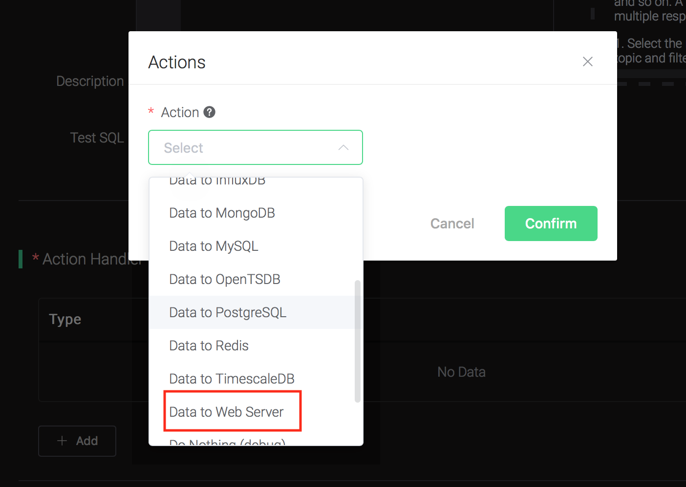
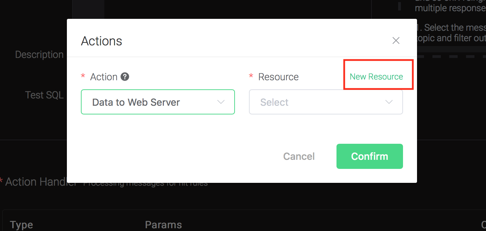
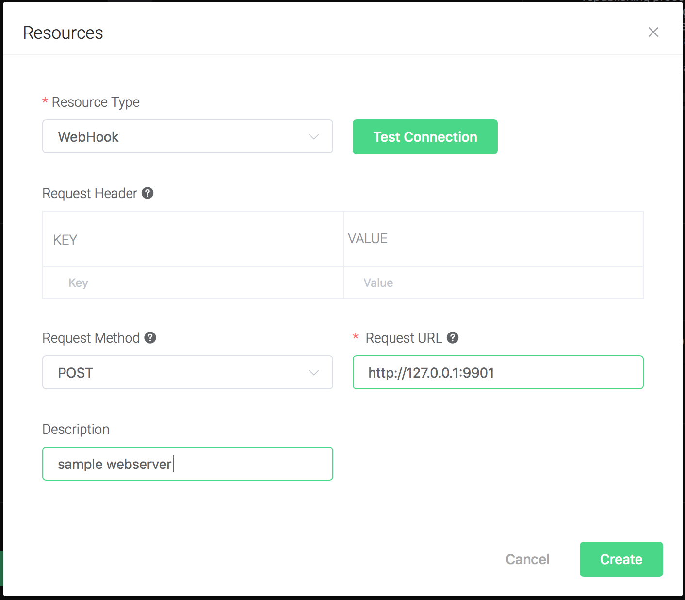
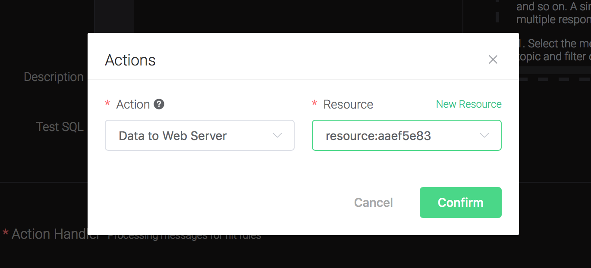
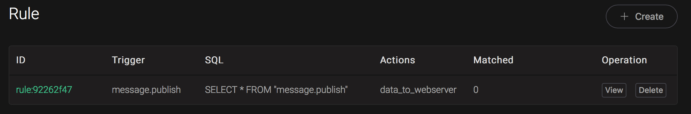
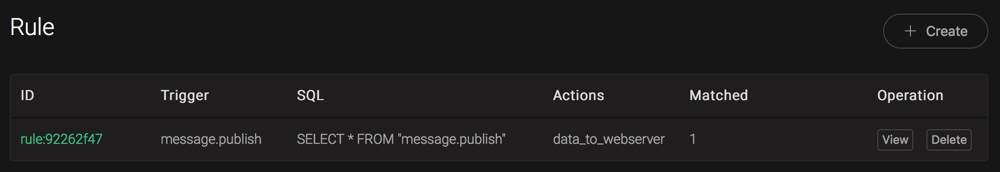

# Example - Create a Test Rule


::: tip
Only the following operations are applicable in EMQX:
- Check (debug)
- Send data to a web service
- Bridge data to a MQTT Broker


The rest are exclusive to EMQX Enterprise.
:::




## Check (debug)

Create a rule for testing: print the content of the message and all the
args of the action, when a MQTT message is sent to topic 't/a'.

- The filter SQL is: SELECT \* FROM "message.publish" WHERE topic = 't/a';
- The action is: "print the content of the message and all the args of the action", the action we need is 'inspect'.

<!-- end list -->

```bash
$ ./bin/emqx_ctl rules create \
  "SELECT * FROM \"message.publish\" WHERE topic = 't/a'" \
  '[{"name":"inspect", "params": {"a": 1}}]' \
  -d 'Rule for debug'

Rule rule:803de6db created
```

The CLI above created a rule with ID='Rule rule:803de6db'.

The first two args are mandatory:

- SQL: SELECT \* FROM "message.publish" WHERE topic = 't/a'
- Action List: \[{"name":"inspect", "params": {"a": 1}}\]. Action List is of type JSON Array. "name" is the name of the action, "params" is the parameters of the action. Note that the action `inspect` does not need a resource.

The last arg is an optional description of the rule: 'Rule for debug'.

If a MQTT message "hello" is sent to topic 't/a', the rule "Rule rule:803de6db" will be matched, and then action "inspect" will be
triggered, the following info will be printed to the emqx console:

```bash
$ tail -f log/erlang.log.1

(emqx@127.0.0.1)1> [inspect]
Selected Data: #{clientid => <<"shawn">>,event => 'message.publish',
                    flags => #{dup => false,retain => false},
                    id => <<"5898704A55D6AF4430000083D0002">>,
                    payload => <<"hello">>,
                    peername => <<"127.0.0.1:61770">>,qos => 1,
                    timestamp => 1558587875090,topic => <<"t/a">>,
                    username => undefined}
Envs: #{event => 'message.publish',
        flags => #{dup => false,retain => false},
        from => <<"shawn">>,
        headers =>
            #{allow_publish => true,
                peername => {{127,0,0,1},61770},
                username => undefined},
        id => <<0,5,137,135,4,165,93,106,244,67,0,0,8,61,0,2>>,
        payload => <<"hello">>,qos => 1,
        timestamp => {1558,587875,89754},
        topic => <<"t/a">>}
Action Init Params: #{<<"a">> => 1}
```

- `Selected Data` listed the fields that were selected by the SQL. All available fields will be listed here, as we used `select *`.
- `Envs` is the environment variables that can be used internally in the action.
- `Action Init Params` is the parameter we passed to the action.


## Send Data to WebHook

Setup a Web Service, here we set up a simple web service using the Linux tool `nc`:
```bash
$ while true; do echo -e "HTTP/1.1 200 OK\n\n $(date)" | nc -l 127.0.0.1 9901; done;
```

Create a rule:

Go to [EMQX Dashboard](http://127.0.0.1:18083/#/rules), select the "rule" tab on the menu to the left.

Select "message.publish", then type in the following SQL:

```sql
SELECT
    *
FROM
    "message.publish"
```


Bind an action:

Click on the "+ Add" button under "Action Handler", and then select "Data to Web Server" in the pop-up dialog window.



Bind a resource to the action:

Since the dropdown list "Resource" is empty for now, we create a new resource by clicking on the "New Resource" to the top right, and then select "WebHook":



Configure the resource:

Fill in the "Request URL" and "Request Header"(Optional):
```
http://127.0.0.1:9901
```
And click on the "Testing Connection" button to make sure the connection can be created successfully, and then click on the "Create" button.



Back to the "Actions" dialog, and then click on the "Confirm" button.



Back to the creating rule page, then click on "Create" button. The rule we created will be show in the rule list:



We have finished, testing the rule by sending an MQTT message to
    emqx:

```bash
Topic: "t/1"

QoS: 1

Payload: "Hello web server"
```

Then inspect the Web Service table, verify a new record has been
received:


And from the rule list, verify that the "Matched" column has increased to 1:


